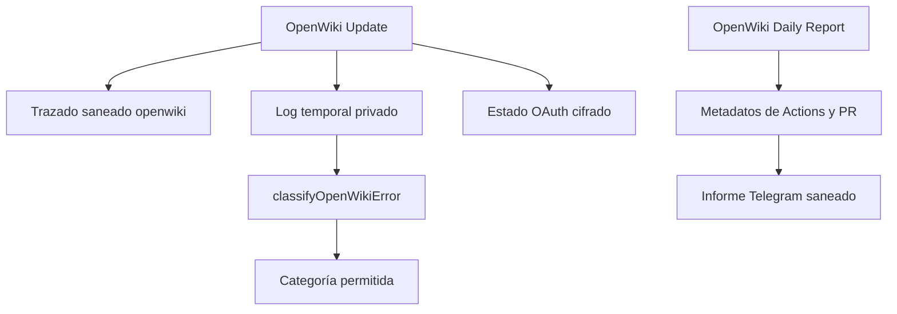

# Evidencia de comportamiento en ejecución

Esta página consolida evidencia de runtime que puede cambiar cómo se modifica Gymnasia. La extracción LangSmith disponible corresponde al proyecto de automatización `openwiki`, no al chat móvil: no permite atribuir sus métricas a OpenAI, Anthropic o Google de la aplicación. Los contratos de esos proveedores se contrastan aquí solo como **correlación con código**, no como telemetría de producción.

Por privacidad no se publican entradas, salidas, metadata de ejecución, logs, URLs de trazas, secretos ni PII. El contenido de un run se considera no confiable; solo se conservan agregados de raíces, llamadas, duración y tokens. Consulte [Runtime del agente y herramientas](../agent/runtime.md), [Streaming del proveedor](../agent/provider-streaming.md) y [Automatización privada de OpenWiki](openwiki-automation.md) para sus contratos estáticos.

## Alcance y lectura de la muestra

**Observado — extracción del 25 de agosto de 2026.** El proyecto LangSmith `openwiki` contiene 3 raíces del bucket `error`, 0 `outlier` y 1 `baseline`. La muestra está ponderada por anomalías: esos buckets no son tasas de fallo, volumen ni latencia de flota. La mediana `baseline` es solamente una referencia de operación normal; al tener una sola raíz no describe variabilidad.

**Correlacionado — configuración de trazado.** `Run OpenWiki` fija `LANGCHAIN_PROJECT=openwiki`, usa el endpoint europeo y oculta inputs, outputs y metadata. Un `workflow_dispatch` puede desactivar el trazado únicamente en esa ejecución diagnóstica. El archivo de configuración también registra los proyectos de agente móvil, pero esta extracción no contiene sus métricas.



*El workflow separa el trazado saneado, el log temporal que se clasifica localmente y el informe diario derivado de metadatos de GitHub.*

## Hallazgos y oportunidades de runtime

1. **Prioridad máxima — los errores muestreados terminaron antes de herramientas.**
   - **Observado:** las 3 raíces `error` finalizaron en `ChatOpenAI`/`model_request` con 0 tokens registrados. Dos presentaron firma abstracta 401/OAuth y una 429/cuota; duraron entre 734 y 1.515 ms. No aparecen middleware, herramientas ni reintentos de herramientas en estas raíces.
   - **Correlacionado con código:** el paso `Run OpenWiki` restaura primero OAuth cifrado y, si el comando falla, expone exclusivamente una categoría permitida. `classifyOpenWikiError` da prioridad a OAuth fuerte, clasifica 429 como `rate-limit` y devuelve `unknown` si no puede leer el fichero, sin imprimirlo.
   - **Consecuencia práctica:** ante una incidencia con esta forma, compruebe primero la restauración/renovación OAuth y la cuota del proveedor; no cambie prompts, índice o tools basándose en estos tres errores.
   - **Hipótesis:** reportar una fuente abstracta de restauración (`artifact`, `seed` o recuperación) junto a la categoría podría acortar el diagnóstico sin exponer logs. Requiere una prueba adversarial de saneamiento antes de añadirse.

2. **Prioridad alta — una ejecución baseline no equivale a una llamada de modelo.**
   - **Observado:** la única raíz `baseline` correcta duró **286 767 ms** (4 min 46,767 s), que es la mediana baseline de esta extracción. Incluyó varias llamadas `ChatOpenAI` exitosas de aproximadamente 6,6–7,1 s y rondas de herramientas. Raíz y LLM registraron 0 tokens; eso es telemetría ausente o no registrada, no evidencia de consumo nulo. No hubo outliers correctos.
   - **Correlacionado con código:** la automatización ejecuta `openwiki code --update`, no una petición de modelo única, y su job puede durar hasta 120 minutos. En el producto, los bucles de OpenAI, Anthropic y Google también permiten hasta diez rondas de tools y ejecutan las llamadas de cada ronda secuencialmente.
   - **Consecuencia práctica:** trate modificaciones que añadan una ronda o una herramienta como potencialmente multiplicativas en latencia. Esta muestra no permite calcular coste de tokens ni atribuir la latencia total a una tool o proveedor móvil.
   - **Hipótesis:** contar de forma saneada llamadas de modelo y llamadas por nombre de herramienta por raíz permitiría detectar exploración redundante sin registrar argumentos o resultados.

3. **Prioridad media — no usar el informe diario para recuperar ni depurar contenido.**
   - **Observado:** la extracción no muestra fallback de modelo, reintentos de herramientas ni un outlier correcto; tampoco permite asignar la latencia baseline a una herramienta concreta.
   - **Correlacionado con código:** el informe lee el último workflow run, sus jobs y opcionalmente la PR `openwiki/update`; no ejecuta OpenWiki. Solo se habilita en un repositorio privado con configuración de Telegram y el generador limita enlaces incorporados a HTTPS de `github.com`.
   - **Consecuencia práctica:** no añada logs de OpenWiki ni contenido de trazas al informe. Si falta una señal operacional, añada un agregado explícito y una prueba que demuestre que campos o URLs no confiables no llegan a Telegram.
   - **Hipótesis:** una muestra futura con reintentos o un outlier podría justificar instrumentar ese punto; la actual no justifica alterar el orden de middleware ni introducir reintentos.

## Métricas volátiles — extracción del 25 de agosto de 2026

| Bucket | Raíces | Latencia y llamadas observadas | Tokens/coste atribuible |
| --- | ---: | --- | --- |
| `baseline` | 1 | Mediana de raíz: 286 767 ms; varias llamadas `ChatOpenAI` de ~6,6–7,1 s y rondas de herramientas. | 0 tokens registrados; no se infiere consumo ni coste. |
| `error` | 3 | 734–1.515 ms por raíz; 2 firmas OAuth/401 y 1 de cuota/429; sin herramientas observadas. | 0 tokens registrados; no se infiere consumo ni coste. |
| `outlier` | 0 | Sin evidencia de outlier correcto. | Sin evidencia de uso. |

Las herramientas visibles de la baseline duraron decenas de milisegundos, pero hubo varias rondas de modelo. La extracción no permite repartir fiablemente la latencia total ni cuantificar llamadas repetidas a la misma herramienta. Al refrescarla, añada nuevos datos sin revocar patrones estructurales por una muestra pequeña.

## Patrones durables contrastados con código

### Límites, continuación y efectos del agente móvil

**Correlacionado con código:** `runOpenAIToolLoop`, `runAnthropicToolLoop` y `runGoogleToolLoop` aplican `MAX_TOOL_ROUNDS = 10`. Ejecutan las tools de una ronda en serie y asignan una ocurrencia por nombre y argumentos JSON canónicos. OpenAI exige `responseId` antes de continuar una ronda con tools; Google rechaza IDs de herramienta repetidos entre rondas y reutiliza resultados cuando reconoce el replay de una interacción no vacía. Estas son barreras de protocolo, no evidencia de que el proyecto móvil las haya alcanzado en la muestra disponible.

Para escrituras, `ToolOperationCoordinator` calcula una identidad estable desde `executionId`, proveedor, nombre, argumentos canónicos y ocurrencia, pero no desde el ID efímero del proveedor. Une ejecuciones simultáneas, reproduce operaciones comprometidas desde memoria o ledger y falla cerrada ante una colisión. Solo registra `committed`; validaciones y fallos previos al commit permanecen reintentables. El ledger persistente caduca a siete días y conserva como máximo 256 operaciones.

**Consecuencia práctica:** al tocar adaptadores, preserve `executionId`, ocurrencia y los IDs de correlación de wire protocol. Al añadir una escritura, marque el commit después del efecto irreversible; no convierta una respuesta de tool o un reintento de transporte en garantía de exactamente una vez.

### Recuperación y persistencia de la automatización

- `OpenWiki Update` se programa a las 08:00 UTC, usa el grupo `openwiki-update` sin cancelar actualizaciones iniciadas y tiene límite de 120 minutos. `OpenWiki Daily Report` se programa cuatro horas después, usa otro grupo, cancela informes solapados y tiene límite de 10 minutos.
- Antes de ejecutar OpenWiki, el update toma el último artefacto OAuth no expirado de la rama predeterminada; si el descifrado falla intenta la semilla de recuperación y aborta si no hay una fuente recuperable. Es restauración de estado, no fallback de modelo.
- La limpieza `always()` borra logs temporales y los archivos OAuth en claro. Los artefactos que se suben son los estados cifrados. El commit requiere que el paso OpenWiki y el cifrado OAuth hayan terminado correctamente; como `Run OpenWiki` captura el código de salida para preservar progreso parcial, puede confirmar páginas terminadas aun si su salida `result` fue `failure`, con un mensaje de commit distinto.
- El informe consulta como máximo 30 ejecuciones recientes y los jobs del run más reciente; las duraciones que reporta son metadatos de Actions redondeados a segundos, no duración de trazas ni coste de modelo.

## Validación focalizada

Para modificar loops, protocolos o idempotencia del agente móvil:

```bash
npm exec -- vitest run --config apps/mobile/vitest.config.mts apps/mobile/agent/providerToolLoop.test.ts apps/mobile/agent/providerPipeline.test.ts apps/mobile/agent/providerTransport.test.ts apps/mobile/agent/toolOperationLedger.test.ts
```

Las pruebas de pipeline reconstruyen SSE de los tres proveedores en cortes arbitrarios, verifican continuación y correlación, y detectan truncamiento y argumentos malformados. Las del ledger prueban replay tras reinicio, unión concurrente, colisiones, expiración, límite y borrado durante una operación.

Para cambiar clasificación, informe, saneamiento o pasos de Actions:

```bash
npm --workspace ops/openwiki-automation-template test
```

Esta suite cubre categorías cerradas y fallo de lectura del clasificador, así como exclusión de campos privados y URLs no confiables del informe. No demuestra disponibilidad de OAuth, cuota, Telegram, GitHub Actions, LangSmith ni los proveedores BYOK: esos límites requieren una ejecución remota controlada.
