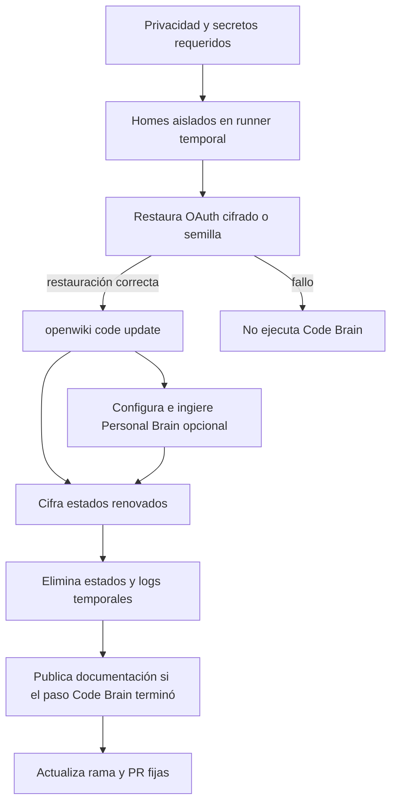

# Comportamiento en ejecución de la automatización OpenWiki

La plantilla `ops/openwiki-automation-template` no es el runtime de Gymnasia: es un runner privado de GitHub Actions para actualizar el **Code Brain** público, mantener un **Personal Brain** privado y enviar un estado diario por Telegram. El workflow rechaza explícitamente un repositorio que no sea privado y no inicia el trabajo si faltan los secretos obligatorios. Sus permisos declarados son de lectura para Actions y contenidos; el token con capacidad de publicar se suministra como secreto solo en el paso que empuja la rama de Gymnasia.

## Ciclo de actualización

`OpenWiki Update` se ejecuta diariamente a las 08:00 UTC o de forma manual. Tiene un máximo de 120 minutos y su grupo de concurrencia no cancela una actualización ya iniciada. Al arrancar, define homes distintos bajo `$RUNNER_TEMP` para Code Brain y Personal Brain; el checkout no conserva credenciales.



*El flujo separa la restauración, el trabajo de ambos brains y la persistencia; una ejecución puede terminar fallida después de publicar progreso documental durable.*

Antes de ejecutar el Code Brain se busca el artefacto OAuth no expirado más reciente cuya ejecución pertenezca a la rama predeterminada. Si no puede descifrarse, se intenta `OPENWIKI_OAUTH_SEED`; si no existe una fuente recuperable, el comando no se ejecuta. El `.env` restaurado y los directorios que lo contienen se crean con permisos restrictivos.

El comando efectivo es `openwiki code --update --language es --print`. Por defecto habilita trazas LangSmith en el proyecto `openwiki`, en el endpoint europeo y con inputs, outputs y metadatos ocultos. El único interruptor para deshabilitarlas es `disable_langsmith_tracing` en un despacho manual de diagnóstico; no es una configuración general del schedule.

## Fallos y resultado observable

El paso de OpenWiki captura stdout y stderr en `$RUNNER_TEMP/openwiki.log` y conserva el control del flujo para poder sanearlo. Si el comando falla, `classify-openwiki-error.mjs` devuelve una sola categoría de una lista cerrada (`oauth`, `managed-markers`, `langsmith`, `rate-limit`, `model`, `context-limit`, `network` o `unknown`). Las señales OAuth fuertes tienen prioridad, `429` se trata como `rate-limit` y un error al leer el log también produce `unknown`; ni el workflow ni el clasificador imprimen el log.

La diferencia importante es entre el **resultado del comando** y el **resultado del paso**. El script del paso absorbe el código de salida del CLI, guarda `result=failure` y deja que los pasos posteriores se ejecuten. Por ello, si el paso `Run OpenWiki` terminó y el cifrado OAuth tuvo éxito, el commit puede publicar páginas ya completadas aun cuando `OPENWIKI_RESULT` sea `failure`; usa entonces el mensaje `docs: preserve partial OpenWiki progress`. Se elimina `openwiki/.run.json`, que es transitorio, y el workflow termina como fallido después de las tareas de persistencia cuando cualquiera de sus condiciones críticas falló. No interprete que una PR de este tipo certifica una actualización completa.

La publicación restaura `AGENTS.md` y `CLAUDE.md` desde `origin/main`, añade solamente `openwiki` y `.openwikiignore`, y empuja `openwiki/update` con `--force-with-lease`. Después crea o actualiza una única PR hacia `main`. Esta secuencia evita publicar la copia materializada de instrucciones o sobrescribir sin comprobar la revisión previa de la rama remota.

## Estado privado y limpieza

El helper OAuth persiste solo los campos ChatGPT permitidos y exige refresh token y account ID. Los cifra con `aes-256-gcm`, una clave derivada por `scrypt` y AAD versionado; cualquier formato no admitido, passphrase incorrecta o modificación autenticada se rechaza. Esto también evita que variables no OAuth que convivieran en un `.env` pasen al artefacto.

El Personal Brain solo se habilita si hay al menos una fuente seleccionada: exportación Linear de solo lectura, clon de `maximofn.com` o Tavily. Cuando hay fuentes, requiere su propia passphrase, restaura el estado privado cifrado o inicia directorios nuevos, copia el OAuth refrescado y configura fuentes locales y/o búsqueda web antes de ejecutar `openwiki ingest all --scheduled --print`. Esta fase no recibe variables de trazado LangSmith. Su estado persistible incluye wiki, conectores, onboarding e instrucciones, se empaqueta y cifra; el helper impone límites de 100 MiB en claro y 140 MiB cifrado antes de leer el archivo.

La limpieza con `always()` elimina los `.env` OAuth en claro, los logs de ambos comandos y ficheros intermedios. Los únicos artefactos cargados son `openwiki-oauth-state.enc` y, cuando corresponde, `openwiki-personal-state.enc`, y solo después de que sus pasos de cifrado hayan terminado correctamente. La limpieza se programa antes de los uploads y antes del commit: que el CLI haya fallado no autoriza publicar logs ni estado en claro.

## Informe diario: observación sin recuperación

`OpenWiki Daily Report` se programa a las 12:00 UTC —cuatro horas después—, tiene un límite de 10 minutos y usa un grupo de concurrencia distinto que cancela informes solapados. Solo continúa si el repositorio es privado y están configurados `TELEGRAM_BOT_TOKEN` y `TELEGRAM_CHAT_ID`.

El informe consulta como máximo 30 ejecuciones de `openwiki-update.yml`, los jobs de la ejecución más reciente y, si hay token de Gymnasia, la PR `openwiki/update`. `buildDailyReport` construye el mensaje desde esos metadatos: estado, duración de jobs, pasos de publicación, fuentes confirmadas y estadísticas de la PR. Filtra las URLs a HTTPS con host `github.com`; no consulta logs ni contenido de OpenWiki. El informe es una superficie de observabilidad y aviso, no reintenta OAuth, OpenWiki ni una publicación.

## Validación y cambios seguros

Ejecute la suite de la plantilla desde `ops/openwiki-automation-template`:

```bash
npm ci
npm test
```

Las pruebas de workflow fijan el aislamiento de rutas del runner, la ausencia de impresión de logs, el interruptor de LangSmith, los límites de publicación y la posibilidad de publicar progreso parcial antes de propagar un fallo. Las pruebas de estado verifican selección restrictiva de OAuth, cifrado autenticado, rechazo de manipulación y permisos `0600`; las del informe prueban la exclusión de campos privados y URLs no confiables. Para cambiar el orden de pasos, preserve especialmente estas invariantes: no ejecutar sin OAuth recuperable, limpiar antes de upload, no subir material en claro y distinguir una publicación parcial de un run correcto.

Consulte [Automatización privada de OpenWiki](openwiki-automation.md) para los secretos y la instalación de la plantilla.
