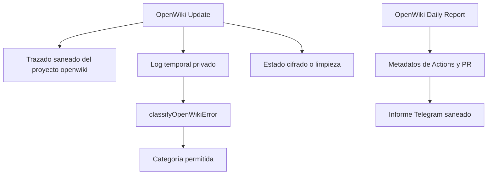

# Evidencia de ejecución de la automatización OpenWiki

Esta página es el complemento de ejecución de [Automatización privada de OpenWiki](openwiki-automation.md), no un sustituto del código ni un informe de rendimiento de flota. Conserva patrones durables y separa los datos volátiles de cada extracción. Por privacidad no publica entradas, salidas, metadatos, logs, URLs de trazas, secretos ni PII; las cifras se limitan a agregados de duración, tokens y llamadas.

## Cómo interpretar la muestra

La última extracción disponible para el proyecto LangSmith `openwiki` se obtuvo el **25 de agosto de 2026**. Es una muestra deliberadamente sesgada por anomalías: contiene 3 raíces del bucket `error`, 0 `outlier` y 1 `baseline`. Por tanto, los conteos por bucket no son tasas de fallo, uso o latencia de la flota. La única referencia de operación normal es la mediana calculada solo sobre `baseline`, y una sola raíz baseline no permite estimar variabilidad.

El workflow configura `LANGCHAIN_PROJECT: openwiki` y envía el trazado al endpoint europeo, pero activa `LANGSMITH_HIDE_INPUTS`, `LANGSMITH_HIDE_OUTPUTS` y `LANGSMITH_HIDE_METADATA`. La ausencia de contenido en esta página es, por diseño, compatible con esa frontera. El proyecto `openwiki` también aparece en la configuración local del conector LangSmith.



*El trazado y el informe tienen límites distintos: el primero oculta contenido de ejecución y el segundo deriva estado de metadatos de Actions, pasos y PR.*

## Hallazgos y oportunidades de ejecución

1. **Prioridad máxima — los errores muestreados terminaron antes de trabajo de herramientas.**
   - **Observado:** las 3 raíces `error` finalizaron en `ChatOpenAI`/`model_request` con 0 tokens registrados. Dos mostraron firma de autenticación expirada (`401`) y una de límite de uso (`429`). Sus duraciones de raíz estuvieron entre 734 y 1.515 ms. No se observaron fallos de middleware, herramientas ni reintentos de herramientas en esta extracción.
   - **Correlacionado:** `openwiki-update.yml` restaura el estado OAuth cifrado antes de ejecutar `openwiki code --update`; si el comando falla, limita el resultado a categorías permitidas y marca `oauth` separadamente de `rate-limit`. `classifyOpenWikiError` prioriza patrones OAuth fuertes y reconoce `429` como `rate-limit`; el test fija ambas familias y el cierre a una categoría sin reproducir logs.
   - **Implicación:** antes de cambiar prompts, índices o herramientas para resolver una incidencia semejante, compruebe la restauración/renovación de OAuth y el presupuesto del proveedor. Al ampliar el clasificador, preserve la separación OAuth/cuota y sus pruebas de no filtración: las rutas de recuperación operativa son diferentes.
   - **Hipótesis:** exponer en el informe únicamente la categoría final y la fuente abstracta de restauración (`artifact`, `seed` o recuperación), sin logs ni tokens, reduciría el diagnóstico manual. Debe verificarse junto con el contrato de informe y sus pruebas de privacidad.

2. **Alta prioridad — la baseline observada no se comportó como una única llamada de modelo.**
   - **Observado:** la única raíz `baseline` correcta duró **286 767 ms** (4 min 46,767 s), que es también la mediana baseline de esta extracción. Incluyó varias llamadas `ChatOpenAI` exitosas de aproximadamente 6,6–7,1 s y rondas de herramientas. Raíz y LLM registraron 0 tokens; esto significa telemetría ausente o no registrada, no consumo nulo. Solo la baseline mostró herramientas y no hubo outliers no erróneos.
   - **Correlacionado:** el job dispone de un límite de 120 minutos y ejecuta el agente mediante `openwiki code --update`, no una petición directa única. El workflow persiste estado OAuth incluso tras rutas posteriores y solo publica documentación si OpenWiki tuvo éxito y el cifrado OAuth también lo tuvo; por ello una modificación del agente puede afectar tanto el tiempo de actualización como la oportunidad de publicación.
   - **Implicación:** trate cambios de herramientas, conectores, middleware o instrucciones como potencialmente multiplicativos en rondas de modelo. Mantenga el descubrimiento dirigido y lecturas acotadas; esta extracción no justifica calcular coste de tokens ni optimizarlo porque todos los tokens registrados son cero.
   - **Hipótesis:** contar de forma saneada llamadas de modelo y llamadas agrupadas por tipo de herramienta por raíz permitiría detectar exploración redundante sin capturar argumentos o resultados y sin reemplazar `LANGSMITH_HIDE_*`.

3. **Prioridad media — no hay señal para convertir el informe diario en mecanismo de recuperación.**
   - **Observado:** no aparecieron reintentos de herramientas, fallbacks de modelo ni outliers correctos en esta extracción; tampoco hay base en ella para atribuir el tiempo baseline a una herramienta concreta.
   - **Correlacionado:** `buildDailyReport` construye el mensaje con el último run, metadatos de jobs y una PR; solo permite URLs HTTPS de `github.com` y selecciona campos concretos. Para OAuth ofrece guía de recuperación, pero no reejecuta OpenWiki. Sus pruebas introducen campos privados y URLs no permitidas para comprobar que no entran en el informe.
   - **Implicación:** no añada logs de OpenWiki ni contenido de trazas al informe para diagnosticar estos casos. Si se necesitan nuevas señales, añada un campo agregado y una prueba adversarial que demuestre que entradas no confiables no se propagan a Telegram.
   - **Hipótesis:** una futura muestra con una herramienta reintentada o un outlier correcto debería decidir si conviene instrumentar ese punto; esta muestra no respalda cambiar orden de middleware ni introducir reintentos.

## Coste y latencia — datos volátiles de la extracción del 25 de agosto de 2026

| Bucket | Raíces | Latencia y llamadas observadas | Tokens/coste atribuible |
| --- | ---: | --- | --- |
| `baseline` | 1 | Mediana de raíz: 286 767 ms; varias llamadas `ChatOpenAI` de ~6,6–7,1 s y rondas de herramientas. | 0 tokens registrados; no se puede inferir consumo ni coste. |
| `error` | 3 | 734–1.515 ms por raíz; 2 firmas OAuth/401 y 1 de cuota/429; sin herramientas observadas. | 0 tokens registrados; no se puede inferir consumo ni coste. |
| `outlier` | 0 | Sin evidencia de outlier correcto. | Sin evidencia de uso. |

Las herramientas visibles de la baseline duraron decenas de milisegundos, pero hubo varias rondas de modelo; la extracción no permite repartir de forma fiable la latencia total entre herramientas o modelo. Tampoco aporta evidencia de llamadas repetidas a una misma herramienta: no se publica una cifra de repetición cuando el agregado no la permite respaldar. Estas métricas deben refrescarse de forma aditiva; una muestra pequeña no revoca los patrones anteriores por sí sola.

## Límites operativos que deben conservarse

- El workflow de actualización se programa a las 08:00 UTC y el informe a las 12:00 UTC; ambos tienen concurrencia propia. El informe consulta hasta 30 ejecuciones recientes, obtiene los jobs del run más reciente y, si existe el token correspondiente, la PR `openwiki/update`.
- El informe tiene un límite de 10 minutos y la actualización de 120. El formateador redondea duraciones de metadatos de Actions a segundos; no confunda esas duraciones con las de traza ni con coste de modelo.
- La actualización permite un despacho diagnóstico con `disable_langsmith_tracing`; desactiva trazado para esa ejecución, no aporta fallback de modelo. Un diagnóstico sin trazas debe conservar las mismas barreras de secretos y el clasificador sigue operando solo sobre el log temporal.
- El log y los estados en claro se eliminan en una ruta `always()` antes de persistir artefactos. Solo se suben estados cifrados y la publicación de documentación requiere éxito del comando y cifrado OAuth correcto.

## Validación al cambiar esta zona

Ejecute la suite de la plantilla antes de modificar clasificación, informe, pasos de Actions o saneamiento:

```bash
npm --workspace ops/openwiki-automation-template test
```

Las pruebas de `build-daily-report` verifican estados de éxito, ausencia de cambios documentales, historial de fallos y que campos privados o URLs no confiables no se filtren. Las del clasificador comprueban las familias admitidas, su prioridad y que tanto logs como rutas de lectura fallida produzcan solamente una categoría. Esta señal local no demuestra disponibilidad de OAuth, cuota de proveedor, Telegram, GitHub Actions ni LangSmith; para esos límites hace falta una ejecución remota controlada.

Consulte [Automatización privada de OpenWiki](openwiki-automation.md) para el ciclo de secretos, artefactos y PR, [Compilación, publicación y pruebas](build-release-and-testing.md) para el marco de validación y [Inicio rápido](../quickstart.md) para el límite entre esta automatización y el runtime del producto.
