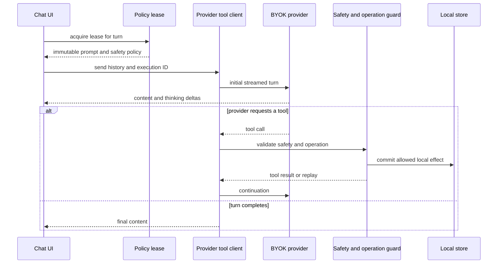

# Comportamiento en ejecución y oportunidades

Esta es la vista operativa del agente de `apps/mobile`, no del runner que materializa la wiki. El punto de entrada conversacional construye el contexto del turno, adquiere una política, llama al proveedor BYOK y, si este solicita herramientas, aplica efectos locales bajo guardas e idempotencia. Para los formatos SSE y las continuaciones de cada proveedor, consulte [Streaming de proveedores](../agent/provider-streaming.md); para configuración y secretos BYOK, [Configuración BYOK de proveedores](../agent/provider-configuration.md); para el contrato completo del agente, [Runtime del agente y herramientas](../agent/runtime.md).

## Alcance y privacidad de la muestra

La configuración de OpenWiki declara los proyectos LangSmith `gymnasia-app-agent` y `gymnasia-food-agent` en el endpoint europeo. No hay un dump LangSmith extraído y legible en los recursos disponibles para esta actualización; por tanto, **no se publican conteos, URLs de trazas, latencias, tokens, costes, llamadas repetidas ni secuencias**. La configuración no prueba tráfico ni comportamiento observado.

Nunca copie prompts, entradas, salidas, argumentos de tools, razonamiento ni contenido de un run. Si se proporciona el dump ya extraído, registre solo agregados y firmas: ventana y filtros, número de runs, URL de traza cuando sea autorizada, proveedor/ruta, estado, llamadas y mediana de latencia por tool, tokens de entrada/salida y coste cuando existan, además de repeticiones agrupadas por `executionId`, tool y operación. Los buckets **error**, **outlier** y **baseline** son una muestra sesgada por filtros, entorno, proveedor y selección: no son tasas de población ni evidencia causal. La mediana de `baseline` es una referencia normal de esa muestra, no una garantía.

### Observado

No hay observaciones cuantitativas verificables en esta actualización. No se observaron en la muestra disponible fallos, reintentos, límites alcanzados, outliers ni una clase de hallazgo, porque no hay muestra legible que los establezca.

### Correlacionado

Los siguientes límites y rutas proceden del código. Sirven para contrastar una observación futura; no convierten una hipótesis en diagnóstico.



*El diagrama muestra el recorrido de un turno del chat principal y la frontera entre la respuesta remota y un efecto local.*

- **Política por turno.** `acquireAgentPolicyLease` devuelve un objeto congelado que reúne prompt, política de salud-seguridad, contexto y estado de selección. En canal `Local` se construye desde los artefactos integrados; en canales firmados se rechaza una política sanitaria cuyo contrato no pueda fusionarse. `App` usa el lease antes de preparar el mensaje y de aplicar los guardrails.
- **Riesgo sanitario antes y durante el turno.** `callProviderChatAPIWithTools` no contacta al proveedor ante un riesgo bloqueante. Para cada tool vuelve a clasificar `nombre + argumentos` y rechaza tanto una tool desconocida como una incompatible, devolviendo un resultado de bloqueo al loop en vez de mutar estado. El evaluador remoto opcional tiene un timeout de 10 s y, ante fallo o resultado inválido, conserva la decisión local base.
- **Reintentos y latencia visible.** El envío de chat intenta hasta tres veces errores de red, timeout, sobrecarga o estados 429/503/529; espera 2 s y 4 s antes de los reintentos y reinicia el borrador. La interfaz agrupa actualizaciones de streaming con 40 ms. Por ello, varios requests o una espera visible no equivalen por sí solos a varias escrituras ni a la duración de una sola tool.
- **Continuaciones y límite.** OpenAI, Anthropic y Google ejecutan las calls de cada ronda secuencialmente. `MAX_TOOL_ROUNDS` es 10; Google arroja un error si continúa requiriendo tools al alcanzarlo. El flujo OpenAI exige `responseId` para continuar, y Google rechaza IDs de tool reutilizados entre rondas. Cada continuación puede sumar latencia y consumo remoto aunque el handler local sea rápido.
- **Historial por proveedor.** Antes de llamar al cliente, `App` limita a los últimos 20 mensajes el historial de OpenAI y Anthropic, mientras que Google recibe todo el historial reconstruido. Compare proveedor y tamaño efectivo de conversación antes de atribuir tokens de entrada elevados a una tool.
- **Efectos locales.** El ejecutor solo devuelve `committed` si un handler llamó `markEffectCommitted`; validaciones sin efecto y fallos previos al commit no entran en el ledger. Un error del handler se transforma en resultado para el modelo, evitando abortar todo el loop; si el handler ya marcó el efecto, su estado sigue siendo `committed`.
- **Idempotencia de escritura.** Para effects distintos de lectura, el coordinador identifica una operación mediante versión, `executionId`, proveedor, tool, argumentos JSON canónicos y ocurrencia; `providerCallId` no forma parte de la identidad. Reutiliza ejecuciones concurrentes y reproduce un resultado ya comprometido desde memoria o desde el ledger persistente. Las lecturas no se deduplican. El ledger conserva hasta 256 commits durante siete días, falla antes del efecto si no puede leerse y no deshace una mutación si falla la escritura posterior del ledger.

### Hipótesis de diagnóstico

1. **Latencia o coste altos con varias rondas:** contrastar el número de continuaciones y el límite de diez rondas antes de optimizar un handler individual.
2. **Más de un request por mensaje:** separar los reintentos de transporte, el evaluador sanitario consentido y las continuaciones de tools usando `executionId`, proveedor y ocurrencia.
3. **Tool repetida pero un único efecto durable:** comprobar si fue una unión `inFlight` o un replay de memoria/ledger. Una operación `no_effect` o `failed_before_commit` puede ejecutarse de nuevo porque no hay commit que reproducir.
4. **Tokens de entrada crecientes:** comparar la ruta Google con OpenAI/Anthropic y el historial efectivo, no solo el nombre de la tool.
5. **Error después de una escritura:** distinguir fallo previo al commit, fallo de persistencia local y fallo de escritura del ledger. Este último deja un riesgo de deduplicación tras reinicio, no evidencia un rollback.

## Hallazgos y oportunidades de runtime

No hay hallazgos priorizados en esta revisión: falta evidencia de trazas que pueda emparejarse con un archivo, símbolo e implicación operativa. No se infieren outliers, fallos ni oportunidades desde límites estáticos.

Cuando exista evidencia autorizada, cada hallazgo debe contener estrictamente: **Observado** (agregado y URL de traza), **Correlacionado** (archivo y símbolo), **Hipótesis** (si aún no hay causalidad) e **implicación** concreta para quien cambie esa zona. Elimine cualquier observación que no cambie un plan de modificación o validación.

## Cambios seguros y validación focalizada

1. Mantenga un único lease inmutable por turno: no mezcle prompt, guardrail y `PolicyContext` de candidatos distintos.
2. Al añadir una tool, actualice su definición y efecto, el handler y el adaptador de continuación del proveedor. Valide argumentos antes de mutar y marque el commit inmediatamente después del efecto irreversible.
3. No incorpore `providerCallId` a la identidad de operación y no elimine `occurrence`: el primero cambiaría con un reintento remoto y el segundo distingue dos calls idénticas intencionales dentro de un turno.
4. Instrumente agregados de proveedor, ruta, estado, duración, número de rondas y estado de commit; no instrumente contenido sensible ni razonamiento.
5. Si se modifica el streaming o el protocolo, conserve IDs de llamada, bloques y firmas que el proveedor exige para continuar; el transporte y el loop cambian juntos.

Ejecute desde la raíz:

```bash
npx vitest run --config apps/mobile/vitest.config.mts apps/mobile/agent/agentPolicyRuntime.test.ts apps/mobile/agent/providerToolClient.test.ts apps/mobile/agent/providerToolLoop.test.ts apps/mobile/agent/providerPipeline.test.ts apps/mobile/agent/toolExecutor.test.ts apps/mobile/agent/toolOperationLedger.test.ts
```

Estas pruebas fijan contratos locales —lease, continuaciones, límite de tools, resultados de handler e idempotencia—, no disponibilidad, coste ni latencia de proveedores remotos. Para cambios que afecten el recorrido visible, añada `npm run test:agent:e2e` como indica el [Inicio rápido](../quickstart.md).
