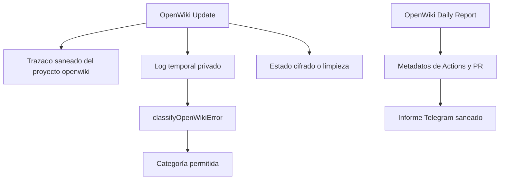

# Evidencia de ejecución de la automatización OpenWiki

Esta página complementa [Automatización privada de OpenWiki](openwiki-automation.md): contrasta sus límites y rutas de recuperación con una instantánea de ejecución, pero no sustituye al código ni describe el runtime de Gymnasia. Por privacidad no publica entradas, salidas, metadatos, logs, URLs de trazas, secretos ni PII; solo conserva agregados de raíces, llamadas, duración y tokens.

## Cómo interpretar la muestra

La última extracción disponible del proyecto LangSmith `openwiki` se obtuvo el **25 de agosto de 2026**. Es una muestra deliberadamente sesgada por anomalías: contiene 3 raíces del bucket `error`, 0 `outlier` y 1 `baseline`. Los conteos de buckets no son tasas de fallo, uso o latencia de la flota. La única referencia de operación normal es la mediana calculada únicamente sobre `baseline`; con una raíz baseline no se puede estimar variabilidad.

En el Code Brain, `Run OpenWiki` define `LANGCHAIN_PROJECT=openwiki`, usa el endpoint europeo y oculta inputs, outputs y metadata; un despacho manual puede desactivar solamente el trazado de esa ejecución. Esta frontera explica por qué la página no contiene contenido de runs y debe preservarse al añadir observabilidad.



*El trazado del Code Brain y el informe diario son superficies separadas: el primero oculta contenido de ejecución y el segundo deriva estado de metadatos de Actions y PR.*

## Hallazgos y oportunidades de ejecución

1. **Prioridad máxima — los errores muestreados terminaron antes de trabajo de herramientas.**
   - **Observado:** las 3 raíces `error` finalizaron en `ChatOpenAI`/`model_request` con 0 tokens registrados. Dos mostraron firma de autenticación expirada (`401`) y una de límite de uso (`429`); las raíces duraron entre 734 y 1.515 ms. No se observaron fallos de middleware, herramientas ni reintentos de herramientas.
   - **Correlacionado:** `Run OpenWiki` restaura primero el OAuth cifrado y, ante un fallo de `openwiki code --update`, reduce el resultado a categorías permitidas y separa `oauth` de otras categorías. `classifyOpenWikiError` prioriza patrones OAuth fuertes, reconoce `429` como `rate-limit` y devuelve `unknown` si no puede leer el log. Sus pruebas fijan esa clasificación y que la salida no reproduzca contenido privado.
   - **Implicación:** ante una incidencia equivalente, compruebe antes la restauración/renovación OAuth y el presupuesto del proveedor que prompts, índices o herramientas. Si amplía el clasificador, conserve la distinción OAuth/cuota y las pruebas de salida cerrada: las rutas de recuperación son distintas.
   - **Hipótesis:** informar solo de la categoría final y de una fuente abstracta de restauración (`artifact`, `seed` o recuperación), sin logs ni tokens, reduciría diagnóstico manual. Debe verificarse contra el contrato y las pruebas de privacidad del informe.

2. **Prioridad alta — la baseline observada no fue una única llamada de modelo.**
   - **Observado:** la única raíz `baseline` correcta duró **286 767 ms** (4 min 46,767 s), que es también la mediana baseline de esta extracción. Incluyó varias llamadas `ChatOpenAI` exitosas de aproximadamente 6,6–7,1 s y rondas de herramientas. Raíz y LLM registraron 0 tokens: esto indica telemetría ausente o no registrada, no consumo nulo. Solo la baseline mostró herramientas y no hubo outliers correctos.
   - **Correlacionado:** el job `update` tiene un límite de 120 minutos y ejecuta `openwiki code --update`, no una petición directa única. Incluso tras rutas posteriores a la actualización, el workflow intenta cifrar el estado OAuth; el commit de documentación requiere tanto éxito de OpenWiki como cifrado OAuth correcto. Por tanto, una modificación que añada rondas puede afectar a la latencia y a la oportunidad de publicación.
   - **Implicación:** trate cambios de herramientas, conectores, middleware o instrucciones como potencialmente multiplicativos en rondas de modelo. Mantenga descubrimiento dirigido y lecturas acotadas; estos datos no permiten calcular coste de tokens ni optimizarlo porque todos los tokens registrados son cero.
   - **Hipótesis:** contar de forma saneada llamadas de modelo y llamadas por tipo de herramienta por raíz permitiría detectar exploración redundante sin capturar argumentos ni resultados y sin sustituir `LANGSMITH_HIDE_*`.

3. **Prioridad media — el informe diario no debe convertirse en mecanismo de recuperación.**
   - **Observado:** la muestra no contiene reintentos de herramientas, fallback de modelo ni outliers correctos; tampoco permite atribuir la latencia baseline a una herramienta concreta.
   - **Correlacionado:** `buildDailyReport` construye el mensaje desde el último run, sus jobs y una PR; no ejecuta OpenWiki. Acepta URLs HTTPS de `github.com` y selecciona campos concretos. Sus pruebas inyectan campos privados y URLs no confiables para comprobar que no entren en el mensaje.
   - **Implicación:** no añada logs de OpenWiki ni contenido de trazas al informe para diagnosticar estos casos. Si hace falta una señal nueva, añada un agregado explícito y una prueba adversarial que demuestre que entradas no confiables no se propagan a Telegram.
   - **Hipótesis:** una futura muestra con una herramienta reintentada o un outlier correcto puede justificar instrumentar ese punto; la muestra actual no justifica cambiar el orden de middleware ni introducir reintentos.

## Coste y latencia — datos volátiles de la extracción del 25 de agosto de 2026

| Bucket | Raíces | Latencia y llamadas observadas | Tokens/coste atribuible |
| --- | ---: | --- | --- |
| `baseline` | 1 | Mediana de raíz: 286 767 ms; varias llamadas `ChatOpenAI` de ~6,6–7,1 s y rondas de herramientas. | 0 tokens registrados; no se puede inferir consumo ni coste. |
| `error` | 3 | 734–1.515 ms por raíz; 2 firmas OAuth/401 y 1 de cuota/429; sin herramientas observadas. | 0 tokens registrados; no se puede inferir consumo ni coste. |
| `outlier` | 0 | Sin evidencia de outlier correcto. | Sin evidencia de uso. |

Las herramientas visibles de la baseline duraron decenas de milisegundos, pero hubo varias rondas de modelo; la extracción no permite repartir fiablemente la latencia total entre herramientas y modelo. Tampoco aporta evidencia para cuantificar llamadas repetidas a una misma herramienta. Refresque estas métricas de forma aditiva: una muestra pequeña no revoca por sí sola los patrones ya respaldados.

## Límites y recuperación que deben conservarse

- `OpenWiki Update` se programa a las 08:00 UTC, tiene `timeout-minutes: 120` y su grupo `openwiki-update` no cancela una actualización ya iniciada. `OpenWiki Daily Report` se programa cuatro horas después, tiene 10 minutos y usa el grupo independiente `openwiki-daily-report`, que sí cancela informes solapados.
- Antes de ejecutar OpenWiki, el update busca el último artefacto OAuth válido de la rama predeterminada; si no puede descifrarlo usa una semilla de recuperación si existe, y si no hay fuente recuperable no ejecuta el comando. El mecanismo es restauración de estado, no un reintento ni fallback de modelo.
- El interruptor `disable_langsmith_tracing` solo inhabilita LangSmith en un despacho diagnóstico. El clasificador sigue trabajando sobre un log temporal y solo expone una categoría permitida; un diagnóstico sin trazas debe conservar las mismas barreras de secretos.
- La limpieza `always()` elimina logs privados y estados OAuth en claro. Solo se cargan artefactos cifrados y la documentación se confirma únicamente si OpenWiki tuvo éxito y también lo tuvo el cifrado OAuth.
- El informe consulta como máximo 30 ejecuciones recientes, obtiene los jobs del run más reciente y, cuando existe el token correspondiente, consulta la PR `openwiki/update`. Sus duraciones son metadatos de Actions redondeados a segundos: no las confunda con las duraciones de traza ni con coste de modelo.

## Validación al cambiar esta zona

Ejecute la suite de la plantilla antes de modificar clasificación, informe, pasos de Actions o saneamiento:

```bash
npm --workspace ops/openwiki-automation-template test
```

Las pruebas de `build-daily-report` cubren éxito, ausencia de cambios documentales, historial de fallos y la exclusión de campos privados o URLs no confiables. Las de `classify-openwiki-error` cubren familias permitidas, precedencia, salida sin eco y fallo de lectura. Esta señal local no demuestra disponibilidad de OAuth, cuota de proveedor, Telegram, GitHub Actions ni LangSmith; esos límites requieren una ejecución remota controlada.

Consulte [Automatización privada de OpenWiki](openwiki-automation.md) para el ciclo de secretos, artefactos y PR; [Compilación, publicación y pruebas](build-release-and-testing.md) para el marco de validación; e [Inicio rápido](../quickstart.md) para el límite entre esta automatización y el runtime del producto.
