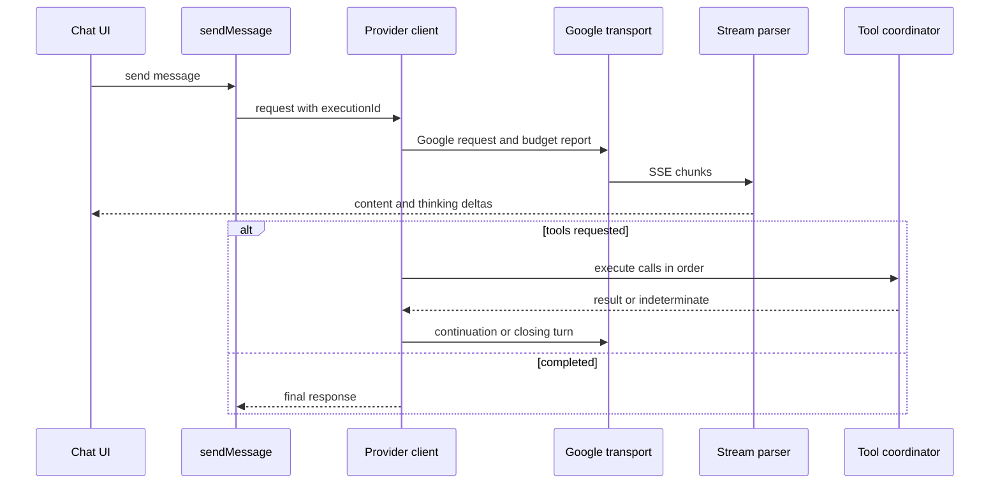

# Comportamiento en ejecución y oportunidades

Esta es una instantánea operativa para cambiar con seguridad el chat de `apps/mobile`, no un informe autónomo de rendimiento. Parte de rutas comprobadas en código y usa LangSmith, cuando la extracción esté disponible, para decidir qué límite, recuperación, fallback o capacidad no ejercida merece investigación. Para contratos estables del turno y de efectos, véase [Runtime del agente y herramientas](../agent/runtime.md); para SSE, parsers y continuaciones, [Streaming de proveedores](../agent/provider-streaming.md). También se relaciona con [Configuración BYOK de proveedores](../agent/provider-configuration.md), [Entrega de políticas](../architecture/policy-delivery.md), [Shell de la aplicación móvil](../mobile/application-shell.md) e [Inicio rápido](../quickstart.md).

## Alcance, privacidad y lectura de la muestra

Nunca reproduzca contenido de runs: ni inputs, outputs, prompts, argumentos o resultados de tools, ni razonamiento. Se admiten únicamente agregados, firmas de error y URL de traza autorizada. Una configuración de LangSmith no demuestra tráfico; la extracción disponible en este árbol no contiene un dump legible de runs. Por tanto, las columnas siguientes quedan explícitamente sin dato y no se infieren del código.

### Bloque volátil: dump de la extracción

| Bucket | Roots / llamadas | Repetidas | Latencia mediana | Tokens entrada / salida | Coste | Ruta / tool / firma |
|---|---:|---:|---:|---:|---:|---|
| `baseline` | No disponible | No disponible | No disponible | No disponible | No disponible | No disponible |
| `error` | No disponible | No disponible | No disponible | No disponible | No disponible | No disponible |
| `outlier` | No disponible | No disponible | No disponible | No disponible | No disponible | No disponible |
| Total de la extracción | No disponible | No disponible | No disponible | No disponible | No disponible | No disponible |

En una extracción autorizada, sustituya solo este bloque por ventana temporal y filtros, conteos de roots y llamadas, repeticiones por `executionId`/ruta/tool/ocurrencia, y totales o medianas de latencia, tokens y coste por bucket, ruta y tool. Los buckets `error` y `outlier` son seleccionados por anomalía y `baseline` por normalidad reciente: son una **muestra sesgada**, no tasas de flota ni prueba de causalidad. Las cifras son volátiles; los mecanismos correlacionados abajo son conocimiento durable.

## Flujo correlacionado con código


```mermaid
sequenceDiagram
    participant UI as Chat UI
    participant App as sendMessage
    participant Client as Provider client
    participant Transport as Google transport
    participant Parser as Stream parser
    participant Tools as Tool coordinator
    UI->>App: send message
    App->>Client: request with executionId
    Client->>Transport: Google request and budget report
    Transport->>Parser: SSE chunks
    Parser-->>UI: content and thinking deltas
    alt tools requested
        Client->>Tools: execute calls in order
        Tools-->>Client: result or indeterminate
        Client->>Transport: continuation or closing turn
    else completed
        Client-->>App: final response
    end
```

*El recorrido representa una petición Google; OpenAI y Anthropic sustituyen el transporte y el parser, pero comparten el orquestador de rondas y el ejecutor inyectado.*

### Observado

No hay medición publicable para atribuir latencia, coste, tokens, error o repetición a un proveedor, ruta, símbolo o tool. En particular, una futura secuencia con varias llamadas por mensaje debe clasificarse antes de diagnosticarla: puede corresponder a reintento del turno, continuación de tools, llamada de cierre o fallback de transporte Google.

### Correlacionado con archivo y símbolo

- **Entrada, política y reintento — `App.sendMessage`.** Antes de llamar al proveedor, el turno adquiere un `AgentPolicyLease`; además, un riesgo sanitario bloqueante evita la red. La llamada principal conserva `userMessage.id` como `executionId`, reintenta como máximo tres veces solo firmas reconocidas de red, timeout, sobrecarga y 429/503/529, espera 2 y 4 segundos y reinicia el borrador entre reintentos. El `createStreamDraftFlusher` agrupa la actualización visible a una ventana de 40 ms. No confunda tres requests remotos con tres efectos locales.
- **Contexto Google — `requestProviderToolChat` y `prepareGoogleInteractionRequest`.** `selectCoachContext` ya entrega una ventana de hasta 20 mensajes a todos los proveedores. El presupuesto genérico declara diez intercambios, 512 KiB sin imágenes y 19 000 000 bytes; la rama Google de Coach eleva solo `maxExchanges` a 20. Después selecciona los intercambios recientes, retira datos de imágenes de los anteriores, y elimina intercambios completos antiguos si exceden los bytes. Si el último intercambio todavía excede el presupuesto, rechaza antes de red. `GoogleContextReport` contiene exclusivamente contadores y razones; su callback no puede ocultar la petición ni el error de presupuesto.
- **SSE y fallback Google — `createGoogleStreamParser` y `requestGoogleInteraction`.** El parser exige creación de interacción, pasos ordenados y cerrados y un estado terminal coherente con las calls; rechaza JSON, IDs, argumentos o secuencias inválidas. En React Native, el transporte repite una vez mediante XHR bufferizado solo si la ruta incremental falla antes de notificar contenido o razonamiento visible. Una repetición de esta clase puede generar dos requests sin justificar duplicar una mutación.
- **Rondas de tools — `runOpenAIToolLoop`, `runAnthropicToolLoop`, `runGoogleToolLoop`.** Las calls se esperan secuencialmente dentro de cada ronda y se ejecutan como máximo diez rondas. Si aún hay calls, se responden como no ejecutadas y se solicita un cierre con tools prohibidas; un cierre que falla, se trunca o vuelve a pedir tools produce `ToolRoundLimitError`. Google rechaza IDs de tool reutilizados entre rondas; OpenAI también rechaza `call_id` duplicados, pero su loop conserva el contexto activo sin requerir un `responseId`.
- **Efecto, commit y recuperación — `createDetailedAgentToolExecutor` y `ToolOperationCoordinator`.** Un handler solo queda `committed` al invocar `markEffectCommitted`; puede señalar `indeterminate`, y una excepción se devuelve como resultado controlado. Para tools con efecto, el coordinador identifica por versión, `executionId`, proveedor, nombre, argumentos canónicos y ocurrencia, no por `providerCallId`; une trabajo simultáneo, prepara el ledger antes de ejecutar y reproduce commits desde memoria o ledger. Si persiste mal el commit, reconcilia con el dominio o devuelve `indeterminate` para no repetir inseguramente. Los commits expiran a los siete días y el ledger se acota a 256 entradas sin sacrificar entradas no resueltas.

### Hipótesis para contrastar con LangSmith

1. **Latencia, tokens o coste altos.** Agrupar por proveedor, ruta, intento, ronda y cierre; para Google añadir los contadores y razones de `GoogleContextReport`. No suponer que se mandó el hilo persistido completo ni que una tool aislada explica el total.
2. **Requests repetidos.** Separar reintento de `sendMessage`, fallback XHR de Google antes del primer delta, continuación de tools y cierre por límite. Solo entonces cotejar identidad de operación y estado de commit.
3. **Errores posteriores a una escritura.** Correlacionar el estado del recibo de dominio y `prepared`/`indeterminate`. `indeterminate` significa que la aplicación no puede confirmar el efecto y evita repetirlo; no prueba rollback.
4. **Presupuesto Google ejercido.** Una concentración de `exchange_limit`, `stale_images`, `non_image_bytes` o `request_bytes` podría señalar pérdida de contexto o presión de adjuntos. Es una hipótesis hasta contar dichos reportes por ruta y modelo.

## Hallazgos y oportunidades de runtime

1. **Alta — instrumentar el presupuesto efectivo Google antes de aumentarlo.** **Observado:** no hay conteo de recortes o rechazos. **Correlacionado con archivo y símbolo:** [`providerToolClient.ts`](repo://apps/mobile/agent/providerToolClient.ts#L328-L365), `requestProviderToolChat`, aplica 20 intercambios, mientras [`googleContextBudget.ts`](repo://apps/mobile/agent/googleContextBudget.ts#L186-L276), `prepareGoogleInteractionRequest`, aplica los límites de bytes y produce el reporte sin contenido. **Hipótesis:** razones frecuentes de bytes indicarían fricción de contexto, no lentitud remota. **Consecuencia:** al cambiar historial, tools o adjuntos, preserve los contadores y pruebe el rechazo pre-red; no eleve 512 KiB o 19 MB por una traza lenta aislada.
2. **Alta — conservar la frontera de idempotencia ante requests repetidos.** **Observado:** no hay repetición medida. **Correlacionado con archivo y símbolo:** [`toolOperationLedger.ts`](repo://apps/mobile/agent/toolOperationLedger.ts#L474-L665), `ToolOperationCoordinator.execute`, une, reproduce y reconcilia efectos, mientras [`App.tsx`](repo://apps/mobile/App.tsx#L4976-L5009), `sendMessage`, reintenta el request. **Hipótesis:** una repetición remota con identidad igual debe acabar como unión, replay o indeterminación, no como segundo efecto. **Consecuencia:** una nueva tool de escritura necesita recibo/reconciliador y debe marcar el commit inmediatamente tras el efecto irreversible; no use `providerCallId` como identidad.
3. **Media — medir el fallback nativo de Google por separado.** **Observado:** la extracción no dice si se ejercita. **Correlacionado con archivo y símbolo:** [`googleStreamTransport.ts`](repo://apps/mobile/agent/googleStreamTransport.ts#L55-L80), `requestGoogleInteraction`, solo usa la segunda ruta antes de un delta visible. **Hipótesis:** outliers sin deltas podrían concentrarse en este fallback. **Consecuencia:** etiquete agregadamente transporte y fase de fallback, sin guardar payload; no habilite reintentos posteriores al primer delta, pues pueden duplicar salida visible.

## Cambios seguros y validación focalizada

- Mantenga un solo `AgentPolicyLease` por turno; no mezcle prompt, guardrail o `PolicyContext` de selecciones distintas.
- Mantenga pares de tool completos en el contexto Google y trate `GoogleContextReport` como telemetría segura: solo contadores y razones.
- Añada tools con validación anterior al efecto, `markEffectCommitted` posterior al efecto irreversible y reconciliación de operaciones `prepared` o `indeterminate`.
- No elimine `occurrence`: distingue calls iguales intencionales. Instrumente proveedor, ruta, intento, ronda, cierre, estado de commit y duración; nunca contenido sensible o razonamiento.

Ejecute desde la raíz:

```bash
npx vitest run --config apps/mobile/vitest.config.mts apps/mobile/agent/googleInteractions.test.ts apps/mobile/agent/providerToolClient.test.ts apps/mobile/agent/providerToolClient.roundLimit.test.ts apps/mobile/agent/providerToolLoop.test.ts apps/mobile/agent/providerPipeline.test.ts apps/mobile/agent/toolExecutor.test.ts apps/mobile/agent/toolOperationLedger.test.ts
```

Estas pruebas cubren presupuestos y rechazo pre-red, contratos de cierre, parser/continuación y commit/reconciliación local. No miden disponibilidad, coste ni latencia de proveedores remotos. Para el recorrido visible, añada `npm run test:agent:e2e` según [Inicio rápido](../quickstart.md).
