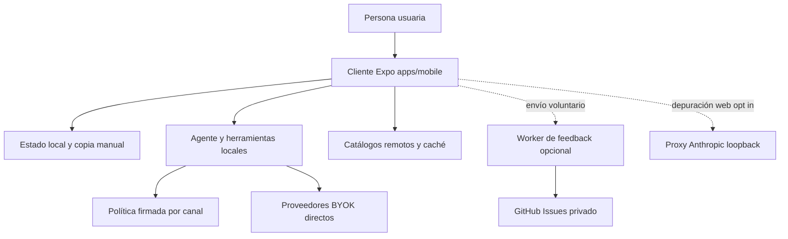

# Inicio rápido y mapa de cambios

Gymnasia tiene una sola superficie de producto: el cliente Expo de `apps/mobile`, compartido por Android, iOS y web. Entrenamiento, dieta, mediciones, conversaciones, preferencias y configuración BYOK pertenecen al dispositivo o navegador; no hay cuentas, API de producto ni sincronización central obligatoria. Una integración de red puede enriquecer una función, pero su ausencia no debe impedir usar los dominios locales.

Empiece por [Arquitectura local-first](architecture/overview.md) para los límites del sistema. Esta página encamina una tarea hacia el contrato que la posee; el código y los tests ejecutables prevalecen sobre la wiki, tickets y planes históricos.

## Arranque local

El repositorio declara workspaces npm. Use `npm ci` para una instalación reproducible desde el lockfile y `npm install` para el trabajo local ordinario.

```bash
npm ci
npm run dev:mobile
```

`apps/mobile/index.js` registra `App` como raíz Expo. Los destinos de desarrollo del workspace fijan `APP_ENV=development`:

```bash
npm --workspace apps/mobile run web
npm --workspace apps/mobile run android
npm --workspace apps/mobile run ios
npm --workspace apps/mobile run build:web
npm --workspace apps/mobile exec tsc --noEmit
```

La configuración exige `APP_ENV` y separa `development`, `staging` y `production` mediante nombre, identificador de aplicación, *namespace* de almacenamiento y canal de política. Development usa `Local` y proveedor `fake` salvo `DEV_PROVIDER_MODE=byok`; Staging y Production usan BYOK. No mezcle datos ni expectativas entre variantes.

Para ejecutar Expo Go físico por túnel, el segundo separador transmite los argumentos al script del workspace:

```bash
npm --workspace apps/mobile run start -- --tunnel --clear
```



*El cliente conserva la autoridad sobre los datos de producto; las flechas remotas son integraciones separadas, no un backend central.*

## Mapa compacto de tareas

Elija el dominio que posee el contrato antes de editar el archivo cercano. Ejecute primero la señal indicada y amplíela al cruzar una frontera.

| Cambio | Leer primero | Validación inicial |
| --- | --- | --- |
| Límites local-first, configuración de variante, persistencia transversal o dependencia remota | [Arquitectura local-first](architecture/overview.md) | `npm test`, typecheck y el guard rail específico. El guardado de datos personales no puede requerir red. |
| Shell, navegación, arranque Expo o diferencia por plataforma | [Shell de aplicación](mobile/application-shell.md) | typecheck, `build:web`, `npm run test:shell:e2e`; pruebe nativo si cambia una capacidad nativa. |
| Almacenes, secretos BYOK, borrado, snapshots o cuarentena | [Estado local, recuperación, borrado y copias](mobile/local-state-and-backup.md) | `npm test`; añada `npm run test:storage-recovery:e2e` o `npm run test:data-deletion:e2e` según el flujo. |
| Copia `.gymnasia`, contraseña, cifrado, ZIP, importación heredada, selector o compartir | [Cifrado portátil e importación](mobile/portable-encryption-and-recovery.md) | `npm test`, `npm run test:storage-recovery:e2e` para flujo web y `npm run test:recovery-cli` al cambiar la utilidad. Compruebe en dispositivo selector o compartir nativos. |
| Entrenamiento, plantillas, series, descansos o historial | [Entrenamiento móvil](mobile/training.md) | La E2E aplicable: `test:train:e2e`, `test:train:series:e2e`, `test:train:series-operations:e2e`, `test:train:compound:e2e` o `test:train:history:e2e`. |
| Dieta, alimentos personales, búsqueda o estimación | [Dieta y estimación de alimentos](mobile/diet-and-food-estimation.md) | `npm run test:diet:e2e` y pruebas del agente si una tool accede al dominio. |
| Mediciones, fotos, gráficos o su copia | [Mediciones](mobile/measurements.md) | Pruebas de dominio y de copia/borrado que cubran los datos modificados. |
| Chat, tools, confirmación, reintento, idempotencia o lease de política | [Runtime del agente](agent/runtime.md) | Vitest focalizado, `npm test` y `npm run test:agent:e2e` si cambia el recorrido visible. |
| Clave, proveedor, modelo, transporte o streaming | [Configuración BYOK](agent/provider-configuration.md) y [Transporte y streaming](agent/provider-streaming.md) | typecheck, pruebas deterministas del adaptador y E2E de agente para el flujo afectado. |
| Prompt, reglas sanitarias, firma, activación o fallback de política | [Gobierno de prompts y política](operations/prompt-policy-governance.md) | `check:health-safety`, `test:health-safety`, `check:prompt-policy`, `test:prompt-policy`, `policy:bundle:check` y `check:policy-trust`. |
| Fichas, imágenes o agregados de catálogos | [Repositorios de contenido](content/repositories.md) | `sync:catalogs`, `check:catalogs`, `test:catalogs` y `test:catalogs:e2e`. |
| Permisos, plugins Expo, notificaciones, build o release Android | [Build, release y validación](operations/build-release-and-testing.md) | `check:android-permissions`, `test:android-permissions`, controles de privacidad y build/prueba nativa. |
| Inventario de datos, texto legal o política publicada | [Build, release y validación](operations/build-release-and-testing.md) | `check:data-inventory`, `test:data-inventory`, `check:legal`, `test:legal` y la E2E aplicable. |
| Proxy CORS de Anthropic | [Proxy Anthropic](services/anthropic-proxy.md) | `npm run test:proxy` y `npm run check:anthropic-proxy`; no lo despliegue. |
| Feedback que crea incidencias | [Worker de feedback](services/feedback-worker.md) | `npm --workspace apps/feedback-worker run test` y pruebas de contrato cliente afectadas. |
| Tablero de tickets, conciliación Linear o despliegue Vercel | [Tablero de arquitectura](services/architecture-board.md) | `test:linear`, `test:board-automation`, `test:board` y `test:board:e2e`. |

## Fronteras que no se deben confundir

### Producto local-first y contenido remoto

El estado de producto y las copias manuales son responsabilidad del cliente. Las claves BYOK tienen otra frontera: en nativo se almacenan con el mecanismo seguro disponible; en web no adquieren garantía de secreto de servidor. La exportación de usuario y la de cuarentena reutilizan el cifrado portable, pero la recuperación identifica un payload `local-store-recovery` de esquema 1; la CLI rechaza sobrescribir destinos y los crea con modo `0600`.

Los catálogos de alimentos, productos, recetas y ejercicios son contenido de referencia. Sus fichas JSON e imágenes son fuente editable; agregados, índices y schemas móviles se generan. La aplicación valida contenido remoto y conserva una copia local aceptada, por lo que una caída de red o un schema inválido no debe borrar datos personales ni bloquear el arranque.

El agente se ejecuta también en el cliente. Adquiere un `AgentPolicyLease` inmutable: `Local` usa snapshots integrados y los canales remotos verifican política firmada con raíces públicas incluidas en la build. El mismo lease mantiene prompt, guardrail sanitario y contexto para el turno; una respuesta de proveedor no autoriza por sí sola una tool con efecto.

Cambiar `prompts/` o `policy/health-safety/` modifica lo que el agente puede recomendar o hacer. Explique el impacto en lenguaje natural y espere aprobación explícita del mantenedor antes de promoción o merge; los checks técnicos no sustituyen esa autorización.

### Integraciones opcionales

OpenAI, Anthropic y Google se llaman desde el cliente con claves BYOK. Anthropic puede llamarse directamente desde web con su cabecera de acceso directo; `EXPO_PUBLIC_API_BASE_URL` está vacío por defecto y solo redirige al proxy cuando se configura expresamente para diagnosticarlo.

```bash
uv sync --project apps/anthropic_proxy --extra dev
apps/anthropic_proxy/.venv/bin/python apps/mobile/cors-proxy.py
curl -sS http://127.0.0.1:8000/health
```

El proxy escucha en loopback, rechaza clientes remotos y no es infraestructura desplegable. El Worker `apps/feedback-worker` es la excepción remota limitada: custodia la credencial de GitHub para convertir feedback voluntario en incidencias privadas. Está vacío en Development y configurado en Staging/Production; si falta, está apagado o falla, el envío queda indisponible sin afectar el producto. No lo convierta en autenticación, base de datos ni sincronización.

### Tablero estático, no runtime del producto

`arquitectura-agente/` es un sitio HTML/CSS/JS estático que el navegador alimenta con `data/board.json`; no contiene backend, token ni API de Linear en ejecución y `App` no lo importa. Linear es la autoridad del seguimiento. La conciliación de GitHub Actions corre cada seis horas: solo propone mediante PR cambios mecánicos seguros de título o estado, y detiene altas o bajas para revisión humana. No hay auto-merge.

Un cambio publicable en `main` activa el despliegue del tablero, que repite sus cuatro gates, comprueba el proyecto Vercel esperado y contrasta el SHA-256 de `board.json` publicado con los bytes locales. Consulte el runbook especializado antes de una recuperación manual.

## Validación proporcional

```bash
# Base habitual para TypeScript móvil
npm test
npm --workspace apps/mobile exec tsc --noEmit
npm --workspace apps/mobile run build:web

# E2E web o CLI: seleccione solo las que cubran el cambio
npm run test:agent:e2e
npm run test:catalogs:e2e
npm run test:train:e2e
npm run test:diet:e2e
npm run test:storage-recovery:e2e
npm run test:recovery-cli

# Fronteras especializadas
npm run test:proxy
npm --workspace apps/feedback-worker run test
npm run check:catalogs
npm run check:android-permissions
```

`npm test` encadena la suite determinista móvil, el dev store y los límites arquitectónicos móviles. Las E2E son scripts explícitos: agente, catálogos, entrenamiento, dieta y recuperación no se ejecutan por ese comando. `build:web` genera `apps/mobile/dist`; las E2E web ejercitan navegador y dependencias controladas, no proveedores reales ni hardware.

Por ello, pruebas deterministas y exportación web **no** demuestran SecureStore nativo, permisos fusionados, instalación, notificaciones, alarmas, audio o ejecución en segundo plano. Un cambio de plugin Expo, permiso, recurso nativo, notificación o distribución requiere su guard rail y una build/prueba nativa representativa, preferiblemente en dispositivo. La guía de release define además los gates y la verificación del artefacto.

## Ejecutable frente a planificación histórica

Son componentes ejecutables actuales el cliente `apps/mobile`, los catálogos cacheables, la política firmada, las llamadas BYOK, el Worker opcional y el proxy loopback de depuración. El tablero estático es un componente de seguimiento separado, no parte de la topología de producto.

Tickets de Linear, roadmaps y documentos que describan una API central, cuentas, Postgres, Supabase o sincronización sin código ejecutable correspondiente son planificación o historia. No deben justificar una dependencia obligatoria de backend.
