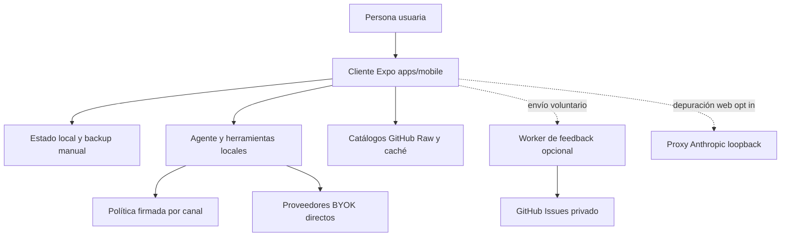

---
okf:
  version: 1
  kind: code-wiki
  status: grounded
  scope: Punto de entrada del repositorio y mapa de tareas
type: guía de inicio
title: Inicio rápido y mapa de cambios
description: Orientación para arrancar Gymnasia, elegir el dominio responsable y seleccionar una validación proporcional. Distingue el cliente Expo local-first de catálogos, proveedores y servicios opcionales.
tags: [quickstart, architecture, mobile, agent, operations]
verified:
  - by: openwiki/0.5.0
    at: 2026-09-07T11:37:28.236Z
sources:
  - id: openwiki-source-8037e2358a2c4f9b2c722a11
    resource: repo://AGENTS.md
  - id: openwiki-source-88e87a6a49f8c4bba044cff2
    resource: repo://apps/anthropic_proxy/README.md
  - id: openwiki-source-45602fc0f28e2e3187ce8790
    resource: repo://apps/feedback-worker/README.md
  - id: openwiki-source-2f2b35de05051a97e2e7987a
    resource: repo://apps/feedback-worker/src/contract.ts
  - id: openwiki-source-00f3917787dfe248860adc3b
    resource: repo://apps/feedback-worker/src/index.ts
  - id: openwiki-source-0c30fc96b9e7c8b57c35473c
    resource: repo://apps/mobile/agent/agentPolicyRuntime.ts
  - id: openwiki-source-0c63120d58188f63614c7f7c
    resource: repo://apps/mobile/agent/signedPolicy.ts
  - id: openwiki-source-a6ba9053969a3e00cd971742
    resource: repo://apps/mobile/app.config.ts
  - id: openwiki-source-12bdb95b5f863aab1ff9964a
    resource: repo://apps/mobile/index.js
  - id: openwiki-source-e86fe7b76c693666bc2cb828
    resource: repo://apps/mobile/package.json
  - id: openwiki-source-5b54a58d1b51cd490b0e7162
    resource: repo://package.json
  - id: openwiki-source-b8a29657a8fc15f77c92ee7d
    resource: repo://policy/signing/current.bundle.json
  - id: openwiki-source-8274b71174283745d37c2eff
    resource: repo://policy/signing/trusted-roots.json
  - id: openwiki-source-23775c3de52f3ab95a13cb8b
    resource: repo://README.md
  - id: openwiki-source-2cc0790639fb245db6d26267
    resource: repo://scripts/catalogs/generate.mjs
generated: { by: "openwiki/0.5.0", at: "2026-09-07T11:37:28.236Z" }
---

# Inicio rápido y mapa de cambios

Gymnasia tiene una única superficie de producto: el cliente Expo de `apps/mobile`, que se ejecuta en Android, iOS y web. Entrenamiento, dieta, mediciones, conversaciones, preferencias y configuración BYOK pertenecen al dispositivo o navegador: no hay cuentas, API de producto ni sincronización central obligatoria. La red puede enriquecer una función concreta, pero su ausencia no debe impedir usar los dominios locales.

Empiece por [Arquitectura local-first](architecture/overview.md) para conocer los límites y use esta página para encaminar una tarea. El código ejecutable, sus contratos y sus pruebas prevalecen sobre esta wiki y sobre propuestas o tableros de planificación.

## Arranque local

El repositorio usa workspaces npm. Para una instalación reproducible, CI usa el lockfile con `npm ci`; para trabajar localmente puede usar `npm install`.

```bash
npm ci
npm run dev:mobile
```

La entrada de Expo es `apps/mobile/index.js`, que registra `App`. Los scripts del workspace fijan `APP_ENV=development` para los destinos ordinarios:

```bash
npm --workspace apps/mobile run web
npm --workspace apps/mobile run android
npm --workspace apps/mobile run ios
npm --workspace apps/mobile run build:web
npm --workspace apps/mobile exec tsc --noEmit
```

`APP_ENV` es obligatorio y `app.config.ts` separa `development`, `staging` y `production` por nombre, identificador de aplicación, espacio de nombres de almacenamiento y canal de política. Development usa por defecto el proveedor `fake` y admite `DEV_PROVIDER_MODE=byok`; Staging y Production usan BYOK. No mezcle datos o expectativas de una variante con otra.

Para Expo Go físico a través de un túnel, use el separador de argumentos del workspace:

```bash
npm --workspace apps/mobile run start -- --tunnel --clear
```



*El cliente es la autoridad de los datos del producto; las flechas remotas son integraciones independientes, no un backend central.*

## Mapa de tareas

Elija primero el dominio que posee el contrato, no el archivo que parezca más cercano. La última columna da la primera señal de validación; amplíela cuando una tarea cruce otra frontera.

| Si va a modificar… | Lea primero | Primeros controles |
| --- | --- | --- |
| Límites local-first, variantes, persistencia general o una nueva dependencia remota | [Arquitectura local-first](architecture/overview.md) | `npm test`, typecheck y el check del límite afectado. No haga que guardar datos personales dependa de red. |
| Arranque, shell, navegación, configuración Expo o comportamiento por plataforma | [Shell de aplicación, plataformas y navegación](mobile/application-shell.md) | typecheck, `build:web`, `npm run test:shell:e2e` y la E2E del flujo afectado; pruebe nativo si toca capacidades nativas. |
| Almacenes locales, recuperación, secretos BYOK, borrado o importación/exportación | [Estado local, recuperación, borrado y copias](mobile/local-state-and-backup.md) | `npm test`, `npm run test:storage-recovery:e2e` o `npm run test:data-deletion:e2e` según corresponda. |
| Plantillas, series, sesiones, descansos o alertas de entrenamiento | [Plantillas, series y ejecución de entrenamientos](mobile/training.md) | La E2E concreta: `npm run test:train:e2e`, `test:train:series:e2e`, `test:train:series-operations:e2e` o `test:train:compound:e2e`. |
| Dieta, objetivos, alimentos personales, búsqueda o estimación asistida | [Dieta y estimación de alimentos](mobile/diet-and-food-estimation.md) | `npm run test:diet:e2e`; añada pruebas del agente si una tool lee o escribe el dominio. |
| Mediciones, fotos de progreso, gráficos o su backup | [Mediciones, fotos de progreso y respaldo](mobile/measurements.md) | Pruebas de dominio y de backup/borrado que cubran los datos cambiados. |
| Chat, policy lease, tools, confirmación, reintentos o idempotencia | [Runtime del agente y herramientas](agent/runtime.md) | Vitest focalizado de `apps/mobile/agent/`, `npm test` y `npm run test:agent:e2e` si cambia el recorrido visible. |
| Claves, proveedores, modelos, conectividad o SSE | [Configuración BYOK de proveedores](agent/provider-configuration.md) y [Transporte, streaming y compatibilidad de modelos](agent/provider-streaming.md) | typecheck, pruebas deterministas del adaptador y E2E de agente cuando cambie el flujo del usuario. |
| Prompt, reglas sanitarias, firma, activación o fallback de política | [Entrega y activación de políticas firmadas](architecture/policy-delivery.md) y [Gobernanza de prompts y política sanitaria](operations/prompt-policy-governance.md) | `npm run check:health-safety`, `npm run test:health-safety`, `npm run check:prompt-policy`, `npm run test:prompt-policy`, `npm run policy:bundle:check` y `npm run check:policy-trust`. |
| Fichas, imágenes, schemas o agregados de alimentos, productos, recetas o ejercicios | [Catálogos nutricionales y de ejercicios](content/repositories.md) y [Generación y validación de imágenes de catálogo](content/image-generation.md) | `npm run sync:catalogs`, `npm run check:catalogs`, `npm run test:catalogs` y `npm run test:catalogs:e2e`. |
| Permisos Android, alarmas, plugins Expo, build o release | [Permisos Android y fiabilidad de avisos](operations/android-permissions.md) y [Build, release y estrategia de validación](operations/build-release-and-testing.md) | `npm run check:android-permissions`, `npm run test:android-permissions`, controles de privacidad y build/prueba nativa. |
| Texto legal, datos tratados, hosts remotos o borrado publicable | [Build, release y estrategia de validación](operations/build-release-and-testing.md) | `npm run check:data-inventory`, `npm run test:data-inventory`, `npm run check:legal`, `npm run test:legal` y la E2E aplicable. |
| Proxy CORS de Anthropic | [Proxy Anthropic de depuración local](services/anthropic-proxy.md) | `npm run test:proxy` y `npm run check:anthropic-proxy`; no lo despliegue. |
| Propuestas o denuncias que crean incidencias | [Worker de feedback e incidencias](services/feedback-worker.md) | `npm --workspace apps/feedback-worker run test` y pruebas de contrato cliente afectadas. |
| VivaGym, comprobación o retirada de actualizaciones | [Integraciones VivaGym y actualizaciones](integrations/vivagym-and-updates.md) | Pruebas del adaptador y degradación cuando la integración no responda. |
| El espejo de tickets, épicas o dependencias | [Tablero de arquitectura y seguimiento](services/architecture-board.md) | `npm run test:board` y `npm run test:board:e2e`; es un sitio estático separado. |

## Fronteras que deben conservarse

### Estado local, contenido remoto y agente

`App` integra dominios locales. El almacenamiento general y las copias son responsabilidad del cliente; una copia manual no es sincronización ni recuperación desde un servidor. Las claves API BYOK tienen una frontera distinta del estado general: en nativo se usa el almacenamiento seguro disponible; en web no adquieren garantías de secreto de servidor.

Los catálogos de `alimentos/`, `productos_comerciales/`, `recetas/` y `ejercicios/` son contenido de referencia. Se editan fichas JSON e imágenes; `all.json`, índices y schemas móviles se generan. La app valida el agregado remoto y retiene una copia local aceptada, de modo que un fallo de GitHub Raw, red o schema no borra datos personales ni convierte el arranque en dependiente de la descarga.

El agente también se ejecuta en el cliente. Para cada límite de conversación adquiere un `AgentPolicyLease` inmutable: el canal `Local` usa el snapshot integrado y los canales remotos verifican política firmada contra raíces públicas incluidas en la build. Prompt, guardrail sanitario y `PolicyContext` deben proceder del mismo lease durante el turno. Las tools leen o escriben el estado local bajo validación y commit explícito; una respuesta del proveedor no autoriza por sí sola un efecto.

Editar `prompts/` o `policy/health-safety/` no es una modificación documental. Cambia lo que el agente puede recomendar o hacer: explique en lenguaje natural el efecto para la persona usuaria y espere la aprobación explícita del mantenedor antes de promoción o merge. Los checks verifican consistencia técnica, pero no sustituyen esa autorización.

### Proveedores, proxy y feedback son opcionales

OpenAI, Anthropic y Google se llaman desde el cliente con claves BYOK. Anthropic también funciona directamente en web mediante su cabecera de acceso directo. `EXPO_PUBLIC_API_BASE_URL` está vacío por defecto: solo una configuración explícita redirige Anthropic al proxy local de depuración.

```bash
uv sync --project apps/anthropic_proxy --extra dev
apps/anthropic_proxy/.venv/bin/python apps/mobile/cors-proxy.py
curl -sS http://127.0.0.1:8000/health
```

El proxy escucha en loopback, rechaza clientes remotos y no se despliega. No lo levante para probar normalmente Anthropic en navegador; úselo solo para diagnosticar la pasarela.

`apps/feedback-worker` es la excepción remota autorizada: custodia el token de GitHub para crear incidencias privadas a partir de feedback voluntario. Su contrato valida y sanea el payload, reserva una clave de idempotencia antes de crear la incidencia y solo comunica éxito con una referencia verificable. Si el endpoint no está configurado, el worker está apagado o la solicitud falla, el envío queda indisponible y la aplicación sigue funcionando. No convierta este Worker en autenticación, base de datos o sincronización de producto.

## Validación proporcional

Ejecute primero el control específico de la tabla y luego la base que corresponda:

```bash
# Base habitual para cambios TypeScript de la app
npm test
npm --workspace apps/mobile exec tsc --noEmit
npm --workspace apps/mobile run build:web

# E2E web controladas, seleccione las que cubran el cambio
npm run test:agent:e2e
npm run test:catalogs:e2e
npm run test:train:e2e
npm run test:diet:e2e
npm run test:storage-recovery:e2e

# Fronteras especializadas
npm run test:proxy
npm --workspace apps/feedback-worker run test
npm run check:catalogs
npm run check:android-permissions
```

`npm test` reúne la suite determinista y los controles del espejo de desarrollo; no implica que se hayan ejecutado todas las E2E ni pruebas de cada workspace. La exportación `build:web` genera `apps/mobile/dist` y es una buena señal de empaquetado web. Las E2E usan navegador y dependencias controladas: prueban una proyección web, no la disponibilidad de proveedores reales ni el hardware.

Por tanto, pruebas deterministas y exportación web **no** demuestran SecureStore nativo, permisos fusionados, instalación, notificaciones, alarmas, audio o ejecución en segundo plano. Un cambio de plugin Expo, permiso, recurso nativo, notificación o distribución requiere el guard rail aplicable y una build/prueba nativa representativa, preferiblemente en dispositivo. La guía de release explica los gates de candidato y la verificación del artefacto; tampoco una build verde sustituye la comprobación manual de las capacidades críticas.

## Ejecutable frente a planificación histórica

Son componentes actuales: `apps/mobile`, sus catálogos publicados y cacheables, la política firmada, las llamadas BYOK directas, el Worker de feedback opcional y el proxy loopback de depuración. El sitio de `arquitectura-agente/` también existe y tiene pruebas, pero es un tablero estático de seguimiento: no lo importa `App` ni participa en el runtime del producto.

Los tickets de Linear, el tablero, roadmaps y documentos que hablen de una API central, cuentas, Postgres, Supabase o sincronización sin código ejecutable correspondiente son planes, seguimiento o historia, no topología desplegada. No los use como justificación para introducir una dependencia obligatoria de backend.
