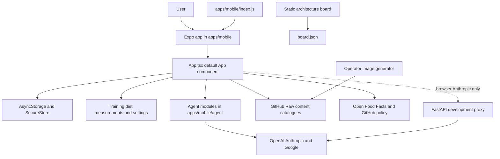

---
okf:
  version: 1
  kind: code-wiki
  status: grounded
  scope: High-level repository entrypoint and task router
type: descripción general
title: Inicio rápido de Gymnasia
description: Punto de entrada de alto nivel a la arquitectura actual de Gymnasia, que prioriza el almacenamiento local, sus puntos de entrada del código fuente, conceptos de la wiki, comandos de inicio, pruebas y límites de seguridad.
tags: [quickstart, architecture, mobile, agent, operations]
sources:
  - package.json
  - apps/mobile/package.json
  - apps/mobile/index.js
  - apps/mobile/App.tsx
  - apps/anthropic_proxy/cors-proxy.py
  - arquitectura-agente/index.html
  - image-generation/generate_images.py
---

# Inicio rápido de Gymnasia

Gymnasia es una aplicación Expo React Native que prioriza el almacenamiento local y cuyo único entorno de ejecución del producto es `apps/mobile`. El mismo árbol de componentes se ejecuta en Android, iOS y React Native Web. Los entrenamientos, la dieta, las mediciones, el chat, los ajustes y la configuración de proveedores del usuario son gestionados por el cliente y se conservan localmente; no existe una API de producto, servidor de cuentas ni servicio de sincronización. La excepción limitada es `apps/feedback-worker`: recibe feedback para crear incidencias verificables, pero no es fuente de estado del producto; consulte [Worker de feedback](services/feedback-worker.md).

Comienza por [Arquitectura actual del entorno de ejecución](architecture/overview.md) y, a continuación, dirígete a la página responsable correspondiente que aparece a continuación. El código fuente y las pruebas son la referencia autoritativa cuando la documentación no coincide con ellos.

## Iniciar la aplicación

Desde la raíz del repositorio, utiliza npm porque el archivo de bloqueo confirmado y la CI son gestionados por npm:

```bash
npm ci
npm run dev:mobile
```

`npm run dev:mobile` delega en `apps/mobile` e inicia Expo. Los destinos explícitos son:

```bash
npm --workspace apps/mobile run web
npm --workspace apps/mobile run android
npm --workspace apps/mobile run ios
npm --workspace apps/mobile run build:web
```

Los comandos de Android/iOS requieren sus cadenas de herramientas nativas; la compilación local para iOS requiere macOS y Xcode. La compilación web escribe en `apps/mobile/dist`.

Las llamadas a Anthropic desde el navegador necesitan un origen de proxy de confianza porque los clientes nativos llaman directamente a Anthropic, pero los navegadores se encuentran con CORS. Inicia el proxy de desarrollo por separado:

```bash
cd apps/anthropic_proxy
uv venv .venv
.venv/bin/pip install fastapi uvicorn
.venv/bin/python cors-proxy.py
```

Después, inicia o exporta la aplicación web con `EXPO_PUBLIC_API_BASE_URL` establecido en ese origen. Esta variable pública de compilación es configuración, nunca un secreto. Consulta [Proxy CORS de Anthropic para navegadores](services/anthropic-proxy.md).

## Mapa de la arquitectura actual



*El producto es un único cliente Expo que prioriza el almacenamiento local; el proxy, el tablero estático y el generador de imágenes son componentes operativos independientes, no un backend del producto.*

## Conceptos principales

- **Límite del sistema:** [Arquitectura actual del entorno de ejecución](architecture/overview.md) representa los componentes desplegables, las dependencias, los límites de confianza y la infraestructura de backend inexistente.
- **Aplicación:** [Shell de la aplicación móvil y web](mobile/application-shell.md), [Estado local y copias de seguridad](mobile/local-state-and-backup.md), [Entrenamiento](mobile/training.md), [Dieta y estimación de alimentos](mobile/diet-and-food-estimation.md) y [Mediciones](mobile/measurements.md).
- **Agente:** [Entorno de ejecución del agente](agent/runtime.md), [Configuración de proveedores](agent/provider-configuration.md) y [Streaming de proveedores y continuación de herramientas](agent/provider-streaming.md).
- **Contenido:** [Repositorios de contenido](content/repositories.md) y [Generación de imágenes](content/image-generation.md).
- **Servicios e integraciones:** [Proxy CORS de Anthropic para navegadores](services/anthropic-proxy.md), [Tablero de arquitectura](services/architecture-board.md), [Worker de feedback e incidencias verificables](services/feedback-worker.md) e [Integración retirada de VivaGym y distribución de APK](integrations/vivagym-and-updates.md).
- **Operaciones:** [Compilación, publicación y pruebas](operations/build-release-and-testing.md) gestiona los manifiestos, las compilaciones, la CI, los comandos E2E, las publicaciones de EAS y los límites de despliegue. [Validación de permisos Android publicables](operations/android-permissions.md) protege el contrato entre Expo, dependencias y Google Play. [Gobierno de cambios sensibles y política de prompt](operations/prompt-policy-governance.md) define las rutas protegidas, los artefactos derivados y la autorización de PR. [Automatización privada de OpenWiki](operations/openwiki-automation.md) y su [Evidencia de ejecución](operations/runtime-behavior.md) cubren el mantenimiento aislado de esta wiki, no el runtime de la aplicación.

## Enrutamiento de tareas

| Intención | Leer primero | Puntos de entrada o símbolos exactos del código fuente | Validación específica |
|---|---|---|---|
| Comprender el sistema o añadir un componente principal | [Descripción general de la arquitectura](architecture/overview.md) | `apps/mobile/index.js`, `apps/mobile/App.tsx::App`, `apps/anthropic_proxy/cors-proxy.py::app` | Comprobación de tipos, pruebas deterministas, compilación web |
| Cambiar la navegación, Inicio, los ajustes, la interfaz de hidratación o el botón Atrás de Android | [Shell de la aplicación](mobile/application-shell.md) | `App`, `TabKey`, `DesktopSidebar`, `SettingsTabKey`, `calculateWorkoutStreak`, `buildHomeWeekProgress` | `npm run test:train:e2e`; `npm run test:agent:e2e` cuando el chat resulte afectado |
| Cambiar el estado persistente, los secretos, el restablecimiento, las trazas o la copia de seguridad/importación | [Estado local y copias de seguridad](mobile/local-state-and-backup.md) | `LocalStore`, `normalizeStore`, `hydrate`, `serializeStoreForAsyncStorage`, `buildBackupPayload`, `applyPendingImport`, `resetLocalData`; `apps/mobile/trace.ts` | Comprobación de tipos más reinicio manual en entorno nativo/web y ciclo de exportación/importación |
| Cambiar rutinas, series, sesiones, descansos, notificaciones o historial | [Entrenamiento](mobile/training.md) | `WorkoutTemplate`, `WorkoutSession`, `startTrainingSession`, `resolveSessionRuntime`, `finishWorkoutSession`, `normalizeWorkoutSession` | `npm run test:train:e2e` y `npm --workspace apps/mobile run build:web` |
| Cambiar comidas, objetivos, alimentos personales, búsqueda por código de barras o estimación mediante IA | [Dieta y estimación de alimentos](mobile/diet-and-food-estimation.md) | `DietItem`, `normalizeDietByDate`, `addMeal`, `callFoodEstimatorAPI`, `requestStructuredNutritionJSON`, `addFoodFromEstimatorJSON` | Pruebas de las herramientas del agente más comprobaciones manuales específicas del estimador/proveedor |
| Cambiar mediciones, fotos, gráficos, grasa corporal o actualizaciones realizadas por el agente | [Mediciones](mobile/measurements.md) | `Measurement`, `normalizeMeasurement`, `addMeasurementFromSettings`, `estimateMeasurementBodyFatPercentage`; `toolExecutor.ts::writeMeasurement` | `toolDefinitions.test.ts`, `toolExecutor.test.ts`, comprobación de tipos, ciclo manual de la interfaz |
| Añadir o cambiar una herramienta del agente o el ciclo de vida del chat | [Entorno de ejecución del agente](agent/runtime.md) | `sendMessage`, `callProviderChatAPIWithTools`, `AGENT_TOOL_DEFINITIONS`, `AGENT_TOOL_HANDLERS`, `createAgentToolExecutor` | Pruebas de definición/ejecución de herramientas y, después, el conjunto determinista completo |
| Cambiar claves, modelos, selección de proveedores, verificación o la URL base web | [Configuración de proveedores](agent/provider-configuration.md) | `Provider`, `AIKey`, `normalizeProviderModel`, `verifyProviderConnection`, `saveProviderApiKey`, `resolveWebApiBaseUrl` | Comprobación de tipos, conjunto determinista, compilación web; verificación manual del proveedor |
| Cambiar el análisis de SSE, las cargas útiles de proveedores, el razonamiento o la continuación de herramientas | [Streaming de proveedores](agent/provider-streaming.md) | `splitSSEEvents`, `createOpenAIStreamParser`, `createAnthropicStreamParser`, `createGoogleStreamParser`, `runOpenAIToolLoop`, `runAnthropicToolLoop`, `runGoogleToolLoop` | `sse.test.ts`, `providerPipeline.test.ts`, `providerToolLoop.test.ts` |
| Añadir o modificar rutas de imágenes de alimentos, productos, recetas, ejercicios o catálogos | [Repositorios de contenido](content/repositories.md) | JSON de hoja del repositorio, `all.json`, `index.json`; `FoodRepoEntry`, `ExerciseRepoEntry`, cargadores de repositorios, `foodRepoImageUri`, `getExerciseImageUrl` | Comprobaciones de JSON/paridad/imágenes y `toolExecutor.test.ts`; E2E pertinente de la interfaz |
| Generar imágenes de alimentos o ejercicios | [Generación de imágenes](content/image-generation.md) | `image-generation/generate_images.py::main`, `EXERCISE_PROMPTS`, `FOOD_PROMPTS` | Ayuda de la CLI, firma/dimensiones de recursos, diferencias del agregado; no existe ningún conjunto automatizado |
| Cambiar el reenvío de Anthropic para navegadores | [Proxy de Anthropic](services/anthropic-proxy.md) | `apps/anthropic_proxy/cors-proxy.py::app`; rutas `/health` y `/chat/providers/anthropic/*` | Comprobaciones directas de rutas más comprobación de tipos del cliente y pruebas deterministas |
| Cambiar el envío de propuestas/denuncias, el contrato de incidencias o su privacidad | [Worker de feedback](services/feedback-worker.md) | `apps/mobile/agent/feedbackIssues.ts::{sanitizeFeedbackDraft,buildIdempotencyKey}`, `apps/feedback-worker/src/index.ts::handleCreateIssue` | `npm --workspace apps/feedback-worker run test` y `feedbackContract.contract.test.ts`; despliegue/migración solo si cruza esa frontera |
| Actualizar los datos, el gráfico, la interfaz o el despliegue del tablero | [Tablero de arquitectura](services/architecture-board.md) | `arquitectura-agente/data/board.json`, `index.html`, `script.js::init`, `indexData`, `computeLevels`, `renderGraph` | `npm run test:board`; añadir `npm run test:board:e2e` para el renderizado |
| Reintroducir VivaGym o cambiar la distribución manual de APK | [Integración retirada de VivaGym y APK](integrations/vivagym-and-updates.md) | `legacySecureStorage.ts`, `.github/workflows/build-apk.yml` | Contrato de retirada, comprobación de tipos e inspección del artefacto Production sin añadir un actualizador al cliente |
| Compilar, probar, publicar o desplegar | [Compilación, publicación y pruebas](operations/build-release-and-testing.md) | Manifiestos raíz/móvil, `apps/mobile/app.json`, `apps/mobile/eas.json`, configuraciones de Vercel para móvil/tablero, `.github/workflows/*` | Seleccionar el comando responsable más específico y ampliar después la validación antes de publicar |
| Cambiar rutas sensibles, `CODEOWNERS`, el ruleset, checks obligatorios o la autorización de una PR | [Gobierno de cambios sensibles](operations/prompt-policy-governance.md) | `.github/prompt-policy.json`, `loadPolicy`, `renderCodeowners`, `createRuleset`, `assertWorkflowPolicy`, `evaluateAuthorization` | `npm run check:prompt-policy && npm run test:prompt-policy` |
| Cambiar permisos Android, una dependencia móvil, alarmas, avisos o configuración nativa publicable | [Validación de permisos Android](operations/android-permissions.md) | `apps/mobile/app.json`, `scripts/android-permissions/policy.json`, `checkAndroidPermissions`, `evaluatePermissionPolicy` | `npm run check:android-permissions && npm run test:android-permissions` |
| Cambiar la actualización automática de la wiki, OAuth, trazado o informes saneados | [Automatización privada de OpenWiki](operations/openwiki-automation.md) | `ops/openwiki-automation-template/.github/workflows/openwiki-update.yml`, `classifyOpenWikiError` | `npm --workspace ops/openwiki-automation-template test`; ejecución remota solo para secretos, Actions o trazado |
| Priorizar un cambio de automatización según producción | [Evidencia de ejecución](operations/runtime-behavior.md) | Muestra LangSmith `openwiki` y los símbolos de automatización enlazados | Pruebas locales de la automatización; no interpretar la muestra sesgada como tasa de flota |

## Puntos de entrada exactos del entorno de ejecución y del operador

| Componente | Punto de entrada | Función |
|---|---|---|
| Aplicación Expo | `apps/mobile/package.json::main` → `apps/mobile/index.js` → `registerRootComponent(App)` → `apps/mobile/App.tsx::default App` | Único entorno de ejecución del producto y composición de la interfaz |
| Contrato del agente | `apps/mobile/agent/toolDefinitions.ts::AGENT_TOOL_DEFINITIONS` y `CHAT_TOOLS` | Definiciones canónicas de las 13 herramientas y esquemas de comunicación de los proveedores |
| Ejecución del agente | `apps/mobile/agent/toolExecutor.ts::createAgentToolExecutor` | Despacha las llamadas a herramientas hacia el estado local y la E/S inyectados |
| Continuación del proveedor | `apps/mobile/agent/providerToolLoop.ts::{runOpenAIToolLoop, runAnthropicToolLoop, runGoogleToolLoop}` | Correlaciona los resultados de las herramientas con los turnos posteriores nativos del proveedor |
| Puente web de Anthropic | `apps/anthropic_proxy/cors-proxy.py::app` y `uvicorn.run` mediante script directo | Adaptador CORS para navegadores, apto para desarrollo |
| Tablero de arquitectura | `arquitectura-agente/index.html`, `script.js::init`, `data/board.json` | Réplica estática e independiente de Linear |
| Generación de imágenes | `image-generation/generate_images.py::main` | Generación, ejecutada por un operador, de recursos de alimentos/ejercicios y reconstrucción del agregado |
| Configuración de publicación | `apps/mobile/app.json`, `apps/mobile/eas.json`, `.github/workflows/build-apk.yml` | Identidad/versión de Expo, perfiles de EAS, compilación y publicación para Android |

## Pruebas específicas

El comando de pruebas raíz es deliberadamente limitado: solo ejecuta `apps/mobile/agent/**/*.test.ts` mediante Vitest. No es una puerta de validación para todo el repositorio.

```bash
# All deterministic agent tests
npm test

# Tool schemas and execution
npx vitest run --config apps/mobile/vitest.config.mts \
  apps/mobile/agent/toolDefinitions.test.ts \
  apps/mobile/agent/toolExecutor.test.ts

# SSE and provider continuations
npx vitest run --config apps/mobile/vitest.config.mts \
  apps/mobile/agent/sse.test.ts \
  apps/mobile/agent/providerPipeline.test.ts \
  apps/mobile/agent/providerToolLoop.test.ts

# Browser journeys
npm run test:agent:e2e
npm run test:train:e2e

# Independent board
npm run test:board
npm run test:board:e2e
```

`npm run test:llm` es solo un marcador de posición y no proporciona ninguna cobertura de evaluación. Los controles de gobierno de rutas sensibles son independientes: `npm run check:prompt-policy` verifica la política, sus artefactos generados y restricciones de workflows; `npm run test:prompt-policy` prueba la clasificación y autorización. Consulta [Gobierno de cambios sensibles](operations/prompt-policy-governance.md) antes de modificar esa frontera. Las pruebas E2E del navegador no demuestran el funcionamiento de SecureStore nativo, las notificaciones, la temporización en segundo plano, el botón Atrás de Android, la instalación de APK ni el comportamiento en iOS.

## Validación mínima

Para trabajos exclusivamente de documentación, valida los metadatos iniciales y los enlaces relativos sin ejecutar compilaciones del producto. Para un cambio normal y transversal en el código fuente móvil, la base compacta es:

```bash
npm test
npm --workspace apps/mobile exec tsc --noEmit
npm --workspace apps/mobile run build:web
```

Añade únicamente el flujo responsable de Playwright o del tablero mientras iteras; ejecuta la secuencia más amplia de [Compilación, publicación y pruebas](operations/build-release-and-testing.md) antes de fusionar o publicar. Los cambios en la configuración nativa, las notificaciones, el comportamiento en segundo plano, SecureStore o los artefactos de publicación requieren una comprobación en un dispositivo o una compilación nativos, ya que un resultado satisfactorio en la web estática no es suficiente.

## Advertencias de seguridad y corrección

- **Priorizar el almacenamiento local significa que no existe recuperación desde el servidor.** Borrar el almacenamiento del navegador o de la aplicación, desinstalarla o cambiar de dispositivo/perfil puede provocar la pérdida de los datos del usuario salvo que exista una copia de seguridad manual. La copia de seguridad/importación consta de varias partes y no es transaccional.
- **El restablecimiento es parcial.** `resetLocalData` no borra todas las preferencias, la memoria personal, los alimentos personales, las cachés, las trazas ni los metadatos. Sí elimina las credenciales seguras, incluidas las dos claves heredadas de la integración retirada. No lo describas como un borrado completo del dispositivo.
- **Los secretos dependen de la plataforma.** Las claves de los proveedores utilizan SecureStore cuando está disponible, pero el mecanismo alternativo para navegadores/plataformas no compatibles puede dejarlas en el almacenamiento local ordinario. El espejo de desarrollo web es opt-in, solo loopback y sanea credenciales antes de escribir `apps/mobile/.dev-store.json`; el archivo conserva otros datos personales y nunca debe confirmarse en el repositorio.
- **El prompt del entrenador es una política remota mutable.** El chat prefiere `prompts/AGENTS.md` de GitHub Raw, después una caché local y, por último, una alternativa integrada. Las copias difieren actualmente, y la clave exacta de memoria personal `debug` se añade como texto privilegiado al prompt.
- **Las escrituras del agente no son transaccionales ni se ejecutan exactamente una vez.** Los reintentos de la solicitud completa pueden repetir los efectos de las herramientas locales; en producción no se invoca el validador declarado de entradas de herramientas; algunas lecturas de contexto pueden estar desactualizadas.
- **La escritura de incidencias de GitHub está desactivada.** Los escritores actuales de alimentos, ejercicios y funcionalidades terminan anticipadamente porque el token codificado está vacío. La herramienta de funcionalidades aún puede informar falsamente de que la operación se realizó correctamente.
- **El proxy de Anthropic es apto únicamente para desarrollo.** Acepta claves en los cuerpos de las solicitudes, permite todos los orígenes y no tiene autenticación, límites de frecuencia ni límites para el cuerpo. No lo expongas públicamente sin modificarlo.
- **Las credenciales heredadas de VivaGym siguen siendo sensibles aunque la función esté retirada.** La versión actual no las lee ni las transmite; solo conserva sus nombres para poder borrarlas durante el restablecimiento. Nunca incluyas valores reales en registros, documentación ni datos de prueba.
- **No existe un actualizador de APK dentro de la aplicación.** Los APK que publique el workflow son artefactos de distribución manual; el cliente no los descubre ni los abre. `REQUEST_INSTALL_PACKAGES` debe seguir bloqueado y la variante de producción se actualiza mediante Google Play.
- **Los permisos Android son un contrato de publicación.** `USE_EXACT_ALARM` debe seguir bloqueado aunque una dependencia intente aportarlo; ejecuta [Validación de permisos Android publicables](operations/android-permissions.md) tras cambiar `app.json` o dependencias y valida el artefacto nativo, no solo la web.
- **El JSON remoto y las imágenes generadas son contratos del entorno de ejecución.** La aplicación convierte las respuestas de los catálogos sin esquemas de tiempo de ejecución; la generación no es determinista, puede ser de pago y no garantiza que los bytes ni las dimensiones de `.webp` coincidan con la extensión o el propósito.

## Límite de la documentación histórica

El código fuente actual, los manifiestos, las pruebas y esta wiki describen un entorno de ejecución Expo que prioriza el almacenamiento local. `docs/architecture/stack-and-systems.md` y `docs/backend/` describen un sistema anterior planificado al estilo de FastAPI/Postgres/Supabase y son planes históricos, no pruebas de servicios desplegados, autenticación, tablas de bases de datos, trabajos, almacenamiento ni sincronización. Los documentos de investigación pueden explicar la intención, pero no prevalecen sobre el código actual ni sobre las pruebas ejecutables.

## Tareas pendientes

No quedan aplazamientos de la wiki bloqueados por falta de pruebas tras esta conciliación. Las carencias de pruebas y refuerzo del producto están documentadas en las páginas responsables de cada concepto, en lugar de duplicarse aquí.
