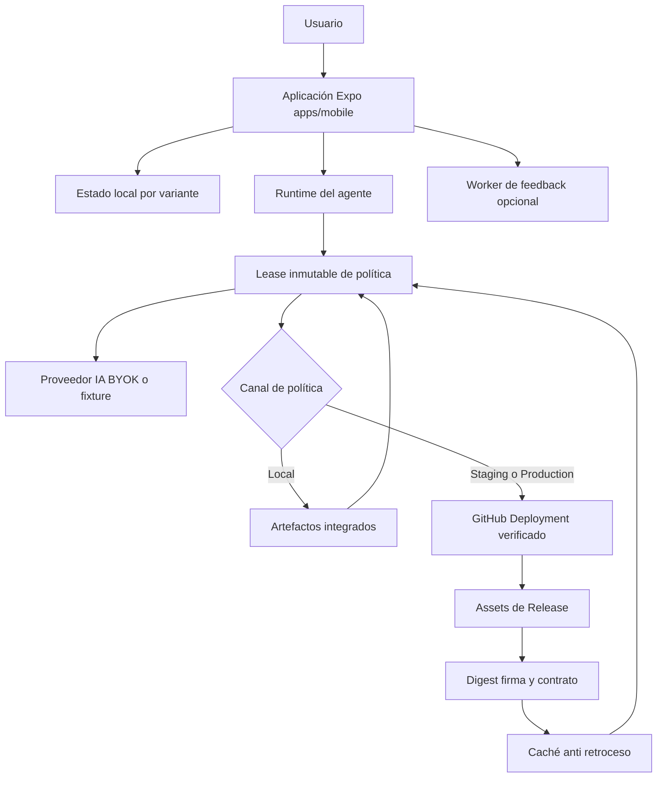
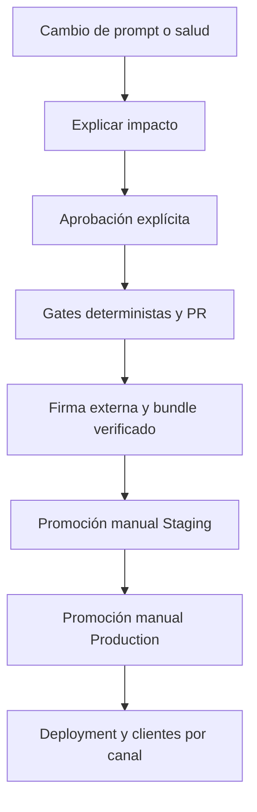

---
okf:
  version: 1
  kind: code-wiki
  status: grounded
  scope: High-level repository entrypoint and task router
type: guía de inicio
title: Inicio rápido de Gymnasia
description: Mapa de entrada para ejecutar Gymnasia y dirigir cambios al dominio responsable. Distingue el runtime local-first de la aplicación del ciclo firmado que gobierna el prompt y la política sanitaria.
tags: [quickstart, architecture, mobile, agent, operations, signed-policy]
verified:
  - by: openwiki/0.4.3
    at: 2026-09-05T11:27:14.639Z
sources:
  - id: openwiki-source-8037e2358a2c4f9b2c722a11
    resource: repo://AGENTS.md
  - id: openwiki-source-0c30fc96b9e7c8b57c35473c
    resource: repo://apps/mobile/agent/agentPolicyRuntime.ts
  - id: openwiki-source-a9edace0149f999b4868ad8d
    resource: repo://apps/mobile/agent/signedPolicyRuntime.ts
  - id: openwiki-source-7a047b00a95eb325eb147887
    resource: repo://apps/mobile/environment.ts
  - id: openwiki-source-12bdb95b5f863aab1ff9964a
    resource: repo://apps/mobile/index.js
  - id: openwiki-source-e86fe7b76c693666bc2cb828
    resource: repo://apps/mobile/package.json
  - id: openwiki-source-1d477406340582311e84da48
    resource: repo://apps/mobile/runtimeEnvironment.ts
  - id: openwiki-source-eb61d67eccd058343c908bca
    resource: repo://apps/mobile/storage/localDataDeletion.ts
  - id: openwiki-source-5b54a58d1b51cd490b0e7162
    resource: repo://package.json
  - id: openwiki-source-23775c3de52f3ab95a13cb8b
    resource: repo://README.md
  - id: openwiki-source-a7c2a4372bd38ad6a4a65c9a
    resource: repo://scripts/policy-promotion/prepare-policy-snapshot.mjs
  - id: openwiki-source-d89cdda8746df6dbfedfcf69
    resource: repo://scripts/policy-promotion/sign-policy.mjs
generated: { by: "openwiki/0.4.3", at: "2026-09-05T11:27:14.639Z" }
---

# Inicio rápido de Gymnasia

Gymnasia es una aplicación Expo React Native cuyo producto vive en `apps/mobile`. `index.js` registra `App` y el cliente conserva localmente los datos de entrenamiento, dieta, mediciones, conversaciones y ajustes; no hay una API de producto autoritativa, cuentas ni sincronización remota. `apps/feedback-worker` es la excepción acotada: recibe propuestas o denuncias para crear incidencias y no posee estado de producto. Consulte primero [Arquitectura actual de ejecución](architecture/overview.md) y use esta página como mapa; código y pruebas prevalecen sobre la wiki.

La política del agente es una frontera distinta del runtime local-first. El prompt y la política sanitaria no se obtienen como texto GitHub Raw en cada envío: los canales no locales usan un bundle firmado, deployment verificado, snapshot integrado y caché anti-retroceso. El chat adquiere un lease inmutable por frontera segura. Para cambiar ese contenido no edite el shell ni intente publicar una URL: siga [Política firmada: selección, caché y promoción](agent/signed-policy-lifecycle.md) y [Gobierno de cambios sensibles y política de prompt](operations/prompt-policy-governance.md).

## Arranque local

Use npm: el bloqueo y los workflows del repositorio lo usan.

```bash
npm ci
npm run dev:mobile
```

`dev:mobile` inicia el script `start` del workspace móvil con `APP_ENV=development`. Para destinos explícitos:

```bash
npm --workspace apps/mobile run web
npm --workspace apps/mobile run android
npm --workspace apps/mobile run ios
npm --workspace apps/mobile run build:web
```

Android e iOS requieren sus herramientas nativas; la ejecución iOS local requiere macOS y Xcode. `build:web` exporta el cliente estático a `apps/mobile/dist`, no crea un backend.

Para depurar Anthropic en navegador, levante además el proxy CORS local y configure `EXPO_PUBLIC_API_BASE_URL` con su origen. Es configuración pública, no un secreto; el proxy no se usa en la app nativa y no debe exponerse como servicio público. Consulte [Proxy CORS de Anthropic para navegadores](services/anthropic-proxy.md).

```bash
uv sync --project apps/anthropic_proxy --extra dev
apps/anthropic_proxy/.venv/bin/python apps/mobile/cors-proxy.py
```

## Límites de ejecución y confianza



*El estado de producto permanece en el cliente; GitHub distribuye política bajo verificación y no es un backend ni una fuente implícitamente confiable de instrucciones.*

`APP_ENV` selecciona una variante coherente: `development` usa canal `Local` y proveedores `fake` por defecto; `staging` y `production` usan respectivamente `Staging` y `Production` con BYOK. La configuración pública se valida para impedir combinaciones híbridas de entorno, canal, namespace o modo de proveedor; las claves de almacenamiento se delimitan por variante fuera de Production.

## Mapa de tareas

| Si va a cambiar… | Lea primero | Frontera y validación inicial |
|---|---|---|
| Shell, navegación, interfaz, hidratación o estado general | [Shell de la aplicación móvil y web](mobile/application-shell.md) | `App.tsx` y estado local; `npm test`, tipos y el E2E responsable. |
| Persistencia, backup/importación, borrado, fotos, secretos o trazas | [Estado local y copia de seguridad](mobile/local-state-and-backup.md) | Actualice propietarios, manifiestos e inventario de datos; pruebe recuperación/borrado y el ciclo manual aplicable. |
| Entrenamientos, sesiones, descansos o notificaciones | [Entrenamiento](mobile/training.md) | Añada `npm run test:train:e2e`; las APIs nativas exigen dispositivo o build nativa. |
| Dieta, catálogos, alimentos personales, código de barras o estimación | [Dieta y estimación de alimentos](mobile/diet-and-food-estimation.md) y [Repositorios de contenido](content/repositories.md) | Valide contratos de catálogo y pruebas de herramienta/estimador; los agregados de catálogo son derivados. |
| Mediciones, fotos, gráficos o escrituras de medición del agente | [Mediciones](mobile/measurements.md) | Ejecute las pruebas de herramienta y backup pertinentes, tipos y un recorrido de UI. |
| Herramientas, ciclo de chat, controles sanitarios en runtime o atribución de mensajes | [Entorno de ejecución del agente](agent/runtime.md) | Preserve un `AgentPolicyLease` por petición, el ledger de efectos y pruebas de runtime/herramientas. |
| Proveedores, BYOK, modelos, verificación o transporte web | [Configuración de proveedores](agent/provider-configuration.md) | Tipos, pruebas deterministas y E2E BYOK; no almacene claves en el agregado ni en backups. |
| SSE, formatos de proveedor o continuación de herramientas | [Streaming de proveedores y continuación de herramientas](agent/provider-streaming.md) | Pruebas de parser, pipeline y tool loop antes de E2E. |
| Prompt, regla sanitaria, bundle, activación, firma, raíz o promoción | [Política firmada: selección, caché y promoción](agent/signed-policy-lifecycle.md) | Es una ruta sensible: explique impacto, espere aprobación explícita y complete gates, firma externa y promoción manual. |
| Rutas sensibles, `CODEOWNERS`, ruleset o workflows de autorización | [Gobierno de cambios sensibles y política de prompt](operations/prompt-policy-governance.md) | `npm run check:prompt-policy && npm run test:prompt-policy`; regenere salidas solo desde su fuente. |
| Build, APK, release, snapshot de Production o selección de pruebas | [Compilación, publicación y pruebas](operations/build-release-and-testing.md) | Elija la matriz por frontera; no sustituya el workflow de APK por una build manual. |
| Permisos Android o dependencia nativa | [Validación de permisos Android publicables](operations/android-permissions.md) | `npm run check:android-permissions && npm run test:android-permissions`, seguido de artefacto/dispositivo. |
| Proxy Anthropic, feedback worker o tablero | [Proxy](services/anthropic-proxy.md), [Worker de feedback](services/feedback-worker.md) o [Tablero](services/architecture-board.md) | Son servicios operativos independientes; ejecute la suite del componente, no los trate como estado de producto. |
| Automatización de esta wiki | [Automatización privada de OpenWiki](operations/openwiki-automation.md) | No confunda sus credenciales, trazas o workflows con el runtime móvil. |

## Ruta segura para prompt y política sanitaria

`prompts/` y `policy/health-safety/` modifican instrucciones privilegiadas y artefactos generados. Antes de tocar esas rutas, explique en lenguaje natural qué se permitía o prohibía antes, qué cambia y la consecuencia para la persona usuaria; después espere la aprobación explícita del mantenedor para **ese** cambio. No promueva, fusione ni use otra rama para evitar esa decisión.

Una vez autorizado, el cambio atraviesa puertas separadas: coherencia de prompt y salud, bundle/activación firmados fuera del repositorio, Staging manual y Production manual. El status de promoción no se completa simplemente porque el código o los tests estén verdes.



*La promoción consume artefactos inmutables verificables; los tests locales no sustituyen la autorización humana ni la aprobación de entorno.*

No edite a mano snapshots, bundles, firmas, activaciones, `CODEOWNERS` o el ruleset generado. No publique claves privadas, tokens, sesiones, firmas operativas, contenido de prompt ni datos de usuario en commits, logs, issues o documentación. Un rollback también es una activación firmada nueva, de secuencia superior, y no borrar la caché del cliente ni reutilizar un deployment antiguo.

## Validación mínima por frontera

Para un cambio móvil ordinario, parta de:

```bash
npm test
npm --workspace apps/mobile exec tsc --noEmit
npm --workspace apps/mobile run build:web
```

Añada el E2E y las pruebas focalizadas de la fila responsable. Un éxito de web no demuestra SecureStore, notificaciones, temporización en segundo plano, botón Atrás, instalación de APK ni iOS.

Para cambios de prompt o snapshot:

```bash
npm run check:chat-prompt
npm run check:health-safety
npm run test:health-safety
npm run check:prompt-policy
npm run test:prompt-policy
```

Los dos primeros grupos comprueban fuentes y artefactos generados; no firman ni promocionan. Para cambios en resolución móvil de política, añada pruebas de deployment, firma, selección y lease:

```bash
npm --workspace apps/mobile exec vitest run --config vitest.config.mts agent/policyDeployment.test.ts agent/signedPolicy.test.ts agent/signedPolicySelection.test.ts agent/agentPolicyRuntime.test.ts
```

La promoción real se realiza únicamente mediante el flujo manual autorizado. Para una build Staging o Production, la preparación del snapshot verifica el deployment y los artefactos del canal antes de generar los módulos incluidos en la app; una compilación de APK y una promoción de política siguen siendo operaciones independientes.

## Recordatorios de privacidad y corrección

- **Local-first no implica recuperación remota.** Borrar almacenamiento, desinstalar o cambiar de dispositivo puede perder datos sin una exportación manual. La importación atraviesa varias particiones y no es una transacción global.
- **BYOK continúa siendo local.** Las credenciales de proveedor no pertenecen al agregado principal ni al backup. En nativo el repositorio seguro evita degradar nuevas claves a texto plano si SecureStore no está disponible; en web no existe el mismo llavero del sistema.
- **La caché de política no es un backup de usuario.** Conserva paquetes públicos verificados y máximos de secuencia para disponibilidad y anti-retroceso; «Borrar todos mis datos» la preserva deliberadamente. No mezcle prompt, mensajes o claves con esa caché.
- **El lease mantiene la coherencia por turno.** Prompt, guardrail, activación y contexto proceden de la misma selección; no recargue ni combine esas partes durante una conversación o a mitad de un turno.
- **El proveedor externo sigue siendo una salida de datos.** Los controles sanitarios locales no convierten a OpenAI, Anthropic o Google en un almacén confiable para información personal.
- **El feedback worker y el proxy son opcionales.** Una indisponibilidad debe degradar la función concreta, no impedir que arranque el producto. El proxy CORS acepta material sensible de depuración y no es apto para exposición pública.

## Límites históricos

`docs/architecture/stack-and-systems.md` y `docs/backend/` describen planes históricos tipo FastAPI, Postgres o Supabase. No demuestran servicios desplegados, autenticación, base de datos, trabajos ni sincronización actuales. Para cambios reales, siga el código, las pruebas y las páginas especializadas enlazadas arriba.
