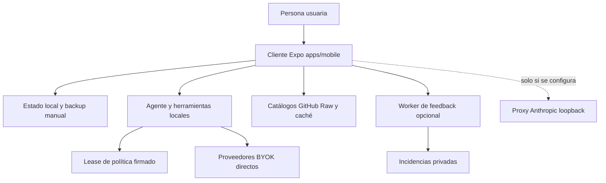

---
okf:
  version: 1
  kind: code-wiki
  status: grounded
  scope: High-level repository entrypoint and task router
type: guía de inicio
title: Inicio rápido de Gymnasia
description: Mapa de tareas para orientarse en la aplicación Expo local-first, su política firmada, el agente, los catálogos y las excepciones remotas opcionales. Indica los puntos de entrada y la validación proporcional antes de cambiar cada frontera.
tags: [quickstart, architecture, mobile, agent, operations]
verified:
  - by: openwiki/0.4.3
    at: 2026-09-06T10:32:53.606Z
sources:
  - id: openwiki-source-8037e2358a2c4f9b2c722a11
    resource: repo://AGENTS.md
  - id: openwiki-source-88e87a6a49f8c4bba044cff2
    resource: repo://apps/anthropic_proxy/README.md
  - id: openwiki-source-45602fc0f28e2e3187ce8790
    resource: repo://apps/feedback-worker/README.md
  - id: openwiki-source-2f2b35de05051a97e2e7987a
    resource: repo://apps/feedback-worker/src/contract.ts
  - id: openwiki-source-00f3917787dfe248860adc3b
    resource: repo://apps/feedback-worker/src/index.ts
  - id: openwiki-source-0c30fc96b9e7c8b57c35473c
    resource: repo://apps/mobile/agent/agentPolicyRuntime.ts
  - id: openwiki-source-0c63120d58188f63614c7f7c
    resource: repo://apps/mobile/agent/signedPolicy.ts
  - id: openwiki-source-a6ba9053969a3e00cd971742
    resource: repo://apps/mobile/app.config.ts
  - id: openwiki-source-12bdb95b5f863aab1ff9964a
    resource: repo://apps/mobile/index.js
  - id: openwiki-source-e86fe7b76c693666bc2cb828
    resource: repo://apps/mobile/package.json
  - id: openwiki-source-5b54a58d1b51cd490b0e7162
    resource: repo://package.json
  - id: openwiki-source-b8a29657a8fc15f77c92ee7d
    resource: repo://policy/signing/current.bundle.json
  - id: openwiki-source-8274b71174283745d37c2eff
    resource: repo://policy/signing/trusted-roots.json
  - id: openwiki-source-23775c3de52f3ab95a13cb8b
    resource: repo://README.md
  - id: openwiki-source-2cc0790639fb245db6d26267
    resource: repo://scripts/catalogs/generate.mjs
generated: { by: "openwiki/0.4.3", at: "2026-09-06T10:32:53.606Z" }
---

# Inicio rápido de Gymnasia

Gymnasia es una aplicación Expo React Native cuyo producto vive en `apps/mobile` y se ejecuta en Android, iOS y web. El estado de entrenamiento, dieta, mediciones, conversaciones, preferencias y configuración BYOK pertenece al cliente: no hay cuentas, API de producto ni sincronización central obligatoria. La red complementa funciones concretas; si un servicio opcional falla, no debe impedir que el producto local funcione.

Empiece por [Arquitectura actual de ejecución](architecture/overview.md) y use este documento como mapa. El código y sus pruebas son la fuente de verdad cuando contradigan la wiki o documentos de planificación.

## Arranque y comprobación base

El monorepo usa workspaces npm y CI instala el lockfile con npm. Desde la raíz:

```bash
npm ci
npm run dev:mobile
```

Para escoger un destino explícito:

```bash
npm --workspace apps/mobile run web
npm --workspace apps/mobile run android
npm --workspace apps/mobile run ios
npm --workspace apps/mobile run build:web
```

`apps/mobile/package.json` fija `index.js` como entrada y `index.js` registra `App` con Expo. Los scripts de desarrollo fijan `APP_ENV=development`; la configuración de Expo exige un entorno válido y separa `development`, `staging` y `production`, incluidos identificador de aplicación, namespace de almacenamiento y canal de política. La exportación web genera `apps/mobile/dist`; es una comprobación de empaquetado web, no una prueba de permisos, SecureStore, notificaciones, alarmas ni comportamiento nativo.



*El cliente conserva el estado del producto. Política, catálogos, proveedores, feedback y el proxy son fronteras independientes, no un backend central.*

## Elegir la página responsable

| Si la tarea consiste en… | Lea primero | Puntos de cambio y validación inicial |
| --- | --- | --- |
| Entender límites, variantes, dependencias remotas o introducir un componente | [Arquitectura actual de ejecución](architecture/overview.md) | Preservar que `apps/mobile` sea local-first y que toda nueva dependencia remota sea opcional. Ejecutar `npm test`, tipado y la comprobación del componente afectado. |
| Cambiar navegación, shell, ajustes o comportamiento común de la interfaz | [Shell de aplicación móvil y web](mobile/application-shell.md) | `apps/mobile/App.tsx`; usar la E2E de la superficie afectada y `npm --workspace apps/mobile run build:web`. |
| Cambiar persistencia, hidratación, secretos BYOK, borrado, importación o backup | [Estado local y copia de seguridad](mobile/local-state-and-backup.md) | Mantener la separación AsyncStorage/SecureStore, el saneamiento y la recuperación. Ejecutar `npm test`, tipado y la E2E de recuperación o borrado pertinente. |
| Cambiar rutinas, sesiones, series, descansos, avisos o historial | [Entrenamiento](mobile/training.md) | Validar el contrato del dominio y `npm run test:train:e2e`; los cambios nativos requieren además dispositivo o build nativa. |
| Cambiar comidas, objetivos, alimentos personales, productos o estimación | [Dieta y estimación de alimentos](mobile/diet-and-food-estimation.md) | Mantener separado el estado personal de los catálogos; usar las pruebas del agente si interviene una tool y la E2E de dieta correspondiente. |
| Cambiar medidas, fotos de progreso, gráficos o herramientas que las escriben | [Mediciones](mobile/measurements.md) | Revisar normalización, backup y borrado; ejecutar pruebas de tool y el recorrido visible afectado. |
| Cambiar el ciclo de chat, herramientas, reintentos o deduplicación de efectos | [Entorno de ejecución del agente](agent/runtime.md) | Preservar el lease inmutable, el límite de tools y el ledger de escrituras. Ejecutar las pruebas Vitest focalizadas y `npm test`. |
| Cambiar proveedor, modelo, clave, verificación o transporte SSE | [Configuración de proveedores](agent/provider-configuration.md) y [Streaming de proveedores](agent/provider-streaming.md) | La configuración es BYOK y no debe convertir claves web en secretos de servidor. Ejecutar tipado, `npm test` y `npm run test:agent:e2e` cuando cambie el flujo visible. |
| Cambiar prompt, salud-seguridad, firma, activación, caché o degradación de política | [Entrega y verificación de política](architecture/policy-delivery.md) | Es una frontera privilegiada: explicar el cambio y esperar aprobación explícita antes de promover. Ejecutar `npm run check:health-safety`, `npm run policy:bundle:check`, `npm run check:policy-trust` y `npm run test:prompt-policy`. |
| Añadir fichas, imágenes, schemas o agregados de alimentos, productos, recetas o ejercicios | [Catálogos locales y artefactos generados](content/repositories.md) | Editar fichas y recursos, no los agregados a mano. Ejecutar `npm run sync:catalogs`, `npm run check:catalogs`, `npm run test:catalogs` y, para consumo móvil, `npm run test:catalogs:e2e`. |
| Cambiar el proxy de Anthropic | [Proxy CORS de Anthropic](services/anthropic-proxy.md) | Es una herramienta loopback de desarrollo y opt-in. Ejecutar `npm run test:proxy` y `npm run check:anthropic-proxy`; no convertirlo en infraestructura desplegada. |
| Cambiar propuestas, denuncias o creación de incidencias | [Worker de feedback](services/feedback-worker.md) | Conservar esquema cerrado, saneamiento, idempotencia y éxito verificable. Ejecutar `npm --workspace apps/feedback-worker run test` y la prueba de contrato móvil. |
| Cambiar CI, EAS, permisos Android, release o pruebas | [Compilación, publicación y validación](operations/build-release-and-testing.md) | Seleccionar la puerta más específica. Un E2E web no prueba Android/iOS; una release exige sus controles y verificación de artefacto. |
| Interpretar la automatización privada de esta wiki | [Evidencia de ejecución de OpenWiki](operations/runtime-behavior.md) | Es automatización documental separada del runtime del producto; validar la plantilla con `npm --workspace ops/openwiki-automation-template test`. |

## Fronteras que no deben confundirse

### Política firmada y agente

El agente se ejecuta en la aplicación. Antes de un límite de conversación adquiere un `AgentPolicyLease`: en desarrollo usa la política integrada; Staging y Production verifican el bundle y activación firmados contra raíces públicas incluidas en la build, y pueden degradar a caché o snapshot verificado. Prompt, guardrail sanitario y `PolicyContext` deben proceder del mismo lease durante una petición. Consulte [Entorno de ejecución del agente](agent/runtime.md) para el chat, las tools y su ledger; consulte [Entrega y verificación de política](architecture/policy-delivery.md) para la cadena de firma, selección y promoción.

No trate una edición en `prompts/` o `policy/health-safety/` como documentación: cambia lo que el agente puede recomendar o ejecutar. Describa el impacto en lenguaje natural y espere aprobación explícita del mantenedor antes de promoción o merge.

### Datos móviles y catálogos

`LocalStore` y los almacenes auxiliares pertenecen al dispositivo o navegador. Los backups son manuales y no implican recuperación desde un servidor. Los cuatro catálogos versionados son contenido de referencia remoto: la aplicación valida `all.json`, conserva caché local y no debe borrar datos personales si la actualización remota falla. Sus fichas JSON e imágenes son fuentes editables; agregados, índices y schemas generados son salidas deterministas.

### Proveedores y servicios opcionales

OpenAI, Anthropic y Google usan claves BYOK y se invocan desde el cliente. Anthropic funciona directamente también en web mediante la cabecera de acceso directo; el proxy solo se usa si se define expresamente `EXPO_PUBLIC_API_BASE_URL`. Para depurarlo localmente:

```bash
uv sync --project apps/anthropic_proxy --extra dev
apps/anthropic_proxy/.venv/bin/python apps/mobile/cors-proxy.py
curl -sS http://127.0.0.1:8000/health
```

El único servicio remoto autorizado es `apps/feedback-worker`, que custodia una credencial de GitHub para crear incidencias. Es opcional: sin endpoint, con el interruptor apagado o ante un error, la aplicación comunica que el envío no está disponible y sigue operando. No agregue una base de datos, autenticación o backend adicional sin una autorización explícita.

## Validación proporcional

Use la señal más estrecha que cubra el cambio y amplíela cuando cruce una frontera:

```bash
# Base para código móvil transversal
npm test
npm --workspace apps/mobile exec tsc --noEmit
npm --workspace apps/mobile run build:web

# E2E web controladas
npm run test:agent:e2e
npm run test:catalogs:e2e
npm run test:train:e2e

# Fronteras especializadas
npm run test:proxy
npm --workspace apps/feedback-worker run test
npm run check:catalogs
npm run check:android-permissions
```

Las pruebas deterministas no requieren claves ni red. Las E2E interceptan dependencias y prueban una proyección web; no demuestran SecureStore nativo, permisos fusionados, instalación, alarmas ni ejecución en segundo plano. Para cambios de plugins Expo, permisos, recursos nativos, notificaciones o distribución, siga [Compilación, publicación y validación](operations/build-release-and-testing.md) y añada build nativa y comprobación en dispositivo.

## Componentes actuales frente a planes históricos

Son componentes actuales: el cliente Expo, la política firmada por canal, los catálogos publicados, las llamadas BYOK directas, el Worker de feedback opcional, el proxy loopback de desarrollo y el tablero estático de `arquitectura-agente/`. El tablero no participa en `App`; el proxy no se despliega; y los proveedores falsos o el espejo web de desarrollo no son servicios de producción.

Documentos que describan una API central, cuentas, Postgres, Supabase o sincronización sin que exista código ejecutable correspondiente son planes históricos, no arquitectura desplegada. No los use como base para añadir una dependencia obligatoria al producto.
