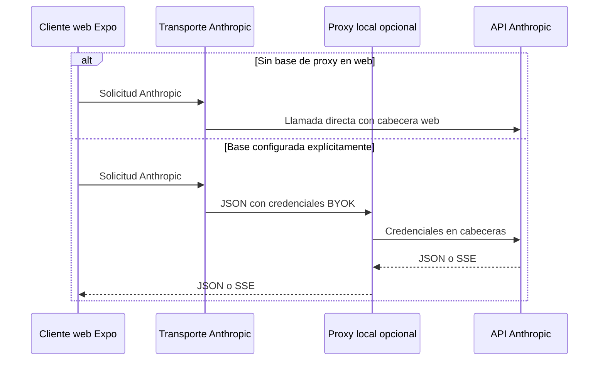
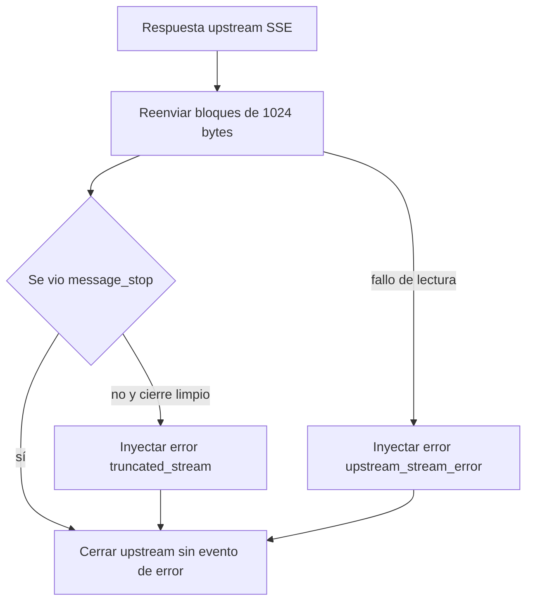

# Proxy local de Anthropic

## Propósito y frontera de confianza

`apps/anthropic_proxy/cors-proxy.py` es una utilidad FastAPI local para comprobar desde el navegador el contrato de Anthropic. No posee base de datos, sesiones, identidad de Gymnasia ni almacén de claves; recibe una clave BYOK solamente durante cada solicitud para remitirla a Anthropic. No es un backend de producto ni una ruta que se deba desplegar.

La aplicación no necesita este proceso para usar Anthropic. En web, el transporte directo añade `anthropic-dangerous-direct-browser-access: true`, que habilita la lectura CORS de la respuesta; en nativo no se necesita esa cabecera. Solo web puede elegir el proxy, y únicamente cuando `EXPO_PUBLIC_API_BASE_URL` contiene una base no vacía. El valor predeterminado es vacío, por lo que una exportación estática publicada no intenta contactar el `localhost` de quien la abre. No hay *fallback* automático al proxy cuando falla el acceso directo.



*El recorrido normal es directo; la pasarela es una rama explícita de depuración para la web.*

La clave y el contenido de la conversación siguen cruzando una frontera de navegador hacia Anthropic en el recorrido directo. Al activar el proxy, esos mismos datos pasan además por un proceso local; por tanto, CORS permisivo no equivale a que sea seguro publicar el proceso ni compartirlo entre personas.

## Controles contra exposición

Al ejecutarse como script, el proxy toma `ANTHROPIC_PROXY_HOST` y `ANTHROPIC_PROXY_PORT`; sus valores predeterminados son `127.0.0.1` y `8000`. Si se pide un host que no sea loopback, termina con código `2` en vez de corregir la configuración silenciosamente. Un middleware añade una defensa en profundidad: rechaza con `403` a un cliente cuya IP sea demostrablemente remota antes de validar el cuerpo o contactar el upstream.

La comprobación acepta host ausente o no interpretable como IP para soportar el cliente de pruebas y sockets Unix. Es una compatibilidad de ejecución, no una garantía de que esos casos sean remotos seguros. El middleware es importante incluso si alguien lanza Uvicorn con una interfaz amplia, pero no reemplaza controles de red ni transforma esta herramienta en un servicio autenticado. CORS permite cualquier origen, método y cabecera dentro de ese límite loopback para que el navegador de desarrollo pueda leer las respuestas.

El guard rail `npm run check:anthropic-proxy` falla si encuentra infraestructura de despliegue en el directorio del proxy, un workflow que lo arranque o publique, o un destino fijo del proxy en el inventario de red. Un intermediario compartido requeriría una excepción explícita de backend y un diseño propio de autenticación, custodia de secretos, límites y operaciones; no debe derivarse de este archivo local.

## Arranque y configuración

El proyecto Python no se empaqueta: es un único archivo que se ejecuta directamente. Prepare el entorno y arránquelo mediante el enlace simbólico móvil que usa el runbook:

```bash
uv sync --project apps/anthropic_proxy --extra dev
apps/anthropic_proxy/.venv/bin/python apps/mobile/cors-proxy.py
curl -sS http://127.0.0.1:8000/health
```

`apps/mobile/cors-proxy.py` apunta a la implementación canónica. Mantenerla en un solo archivo es intencionado: al arrancar por ese enlace, `sys.path[0]` es `apps/mobile`, de modo que un módulo hermano del directorio del proxy rompería el arranque aunque las pruebas que cargan la ruta real pasaran.

Para seleccionar la pasarela en web, defina antes de iniciar o exportar:

```bash
EXPO_PUBLIC_API_BASE_URL=http://127.0.0.1:8000
```

La app recorta espacios y barras finales. Si la base configurada no responde, muestra una instrucción para comprobarla o eliminar la variable y así volver al acceso directo. `ANTHROPIC_PROXY_UPSTREAM_BASE_URL` sustituye `https://api.anthropic.com` y está destinado a pruebas contra un servidor falso; el arranque avisa cuando se usa. La versión enviada a Anthropic está fijada en `2023-06-01`.

## Contrato y tratamiento de credenciales

| Ruta local | Entrada | Llamada upstream | Respuesta y plazo |
|---|---|---|---|
| `GET /health` | — | ninguna | `200 {"ok": true}` |
| `POST /chat/providers/anthropic/verify` | `api_key`, `model?`, `workspace_id?` | `POST /v1/messages` mínimo | `{ "ok": true, "model": ... }`, 15 s |
| `POST /chat/providers/anthropic/models` | `api_key`, `workspace_id?` | `GET /v1/models` paginado | catálogo agregado, 15 s por página |
| `POST /chat/providers/anthropic/messages` | subconjunto de Messages más credenciales | `POST /v1/messages` | JSON o SSE, 120 s |

Las tres rutas upstream convierten `api_key` en `x-api-key` y, si existe, `workspace_id` en `anthropic-workspace-id`; también fijan `anthropic-version` y `content-type`. El constructor único de `upstream_body` excluye ambos campos del JSON reenviado, una invariante que evita que una ruta los reintroduzca por descuido. Para streaming añade `accept: text/event-stream`.

`/verify` y `/models` son contratos del proxy y rechazan campos desconocidos. `/messages` valida lo que necesita para proteger el puente —modelo, `max_tokens`, lista no vacía de mensajes y `stream`— pero permite y reenvía extensiones de Messages, como `thinking`, `system` y herramientas. Esta diferencia conserva compatibilidad hacia delante cuando Anthropic añade parámetros.

Los límites incluyen clave de 400 caracteres, modelo de 200, hasta 500 mensajes, un máximo de 200.000 tokens de salida y un cuerpo declarado de hasta 4 MiB. El límite de tamaño se decide desde `content-length` antes de procesar el cuerpo. Un JSON inválido, una credencial ausente o campos incompatibles devuelven `422`; `content-length` inválido devuelve `400` y uno demasiado grande `413`. El detalle de validación se acota y elimina el valor de entrada para no devolver una clave incluida en el cuerpo rechazado. CORS cubre también esos errores, de modo que el navegador puede leerlos.

## Modelos, streaming y errores upstream

### Catálogo que no aparenta estar completo

La ruta de modelos pide páginas de 100 resultados y recorre como máximo 20. Deduplica por `id` y usa `last_id` como cursor. Si la primera página falla o tiene una forma no válida, devuelve el error; si falla una posterior, conserva los modelos acumulados pero marca `pagination.partial` e incluye el motivo. También marca `pagination.truncated` ante límite de páginas, cursor ausente o repetido, o una página que no aporta modelos nuevos. En ambos casos `has_more` permanece en `true`: el cliente no debe presentar ese resultado como catálogo exhaustivo.

### Cierre verificable de SSE

Para Messages sin `stream`, el proxy analiza el JSON upstream y cierra la respuesta. Para `stream: true`, entrega una `StreamingResponse` SSE con `Cache-Control: no-cache` y `X-Accel-Buffering: no`, lee bloques de 1024 bytes y cierra siempre el upstream.



*Una vez enviados los encabezados `200`, el error de finalización se comunica dentro del SSE.*

El detector conserva 32 bytes de solapamiento para reconocer `message_stop` si queda dividido entre dos bloques. Si el upstream falla durante la lectura o termina sin ese marcador, el proxy ya no puede sustituir el estado HTTP: inyecta un evento `error` con `upstream_stream_error` o `truncated_stream`. El parser Anthropic móvil convierte un evento o una carga de tipo `error` en excepción, evitando que una respuesta parcial se muestre como éxito.

Los errores HTTP upstream que ya son JSON conservan su estado y cuerpo. Un error HTTP no JSON se envuelve como `upstream_non_json`; timeout como `504 upstream_timeout`; problema de conectividad como `502 upstream_unreachable`; y JSON de éxito ilegible como `502 upstream_invalid_json`. Antes de devolver texto no estructurado o excepciones, el proxy elimina el secreto literal de la solicitud y patrones conocidos de claves, y limita el mensaje a 2.000 caracteres. Esa redacción reduce fugas por respuestas, pero no convierte al proxy en custodio apto para credenciales compartidas.

## Validación enfocada

Ejecute la suite aislada desde la raíz:

```bash
npm run test:proxy
npm run check:anthropic-proxy
```

La suite Pytest sustituye `urlopen` por un upstream controlado, sin red ni claves reales. Cubre rutas básicas, cabeceras, retirada de credenciales del cuerpo, validación, CORS, errores upstream, paginación y streaming. Las pruebas de propiedades generan cuerpos y páginas arbitrarias para sostener tres invariantes: ningún cuerpo causa un `500` sin clasificar, la clave no viaja en el cuerpo upstream y la paginación termina, no duplica y señala una lista incompleta.

`test_e2e.py` no sustituye el proceso: levanta el proxy y un servidor HTTP local que simula Anthropic, y usa solicitudes HTTP reales. Comprueba health, verify, tres páginas de modelos, mensajes JSON, preflight CORS y la inyección de error en un SSE truncado. La CI ejecuta esta suite en un job Python separado; el job Node no instala sus dependencias.

## Relación con otras áreas

- [Configuración del proveedor](../agent/provider-configuration.md) describe BYOK, la selección explícita web del proxy, verificación y catálogo.
- [Transmisión del proveedor](../agent/provider-streaming.md) documenta el parser SSE que recibe el error inyectado y rechaza un stream truncado.
- [Visión general de arquitectura](../architecture/overview.md) sitúa la herramienta fuera de los servicios necesarios para la aplicación local-first.

## Cambios seguros

1. No convierta el host, CORS permisivo o una URL de prueba en una ruta publicada; mantenga tanto el fallo de arranque como el rechazo de clientes remotos y el guard rail.
2. Si cambia el contrato, mantenga juntos el constructor de cuerpo que elimina credenciales, las cabeceras upstream y los consumidores móviles de verify, models y messages.
3. Para extender Messages, preserve los campos desconocidos salvo que exista un límite de seguridad demostrado; para rutas propias, siga rechazándolos.
4. Si modifica streaming, cambie de forma coordinada la condición terminal del proxy y el parser cliente, y pruebe cortes en límites arbitrarios.
5. Ejecute la suite Python, el guard rail y las pruebas de transporte móvil antes de aceptar un cambio de frontera.
