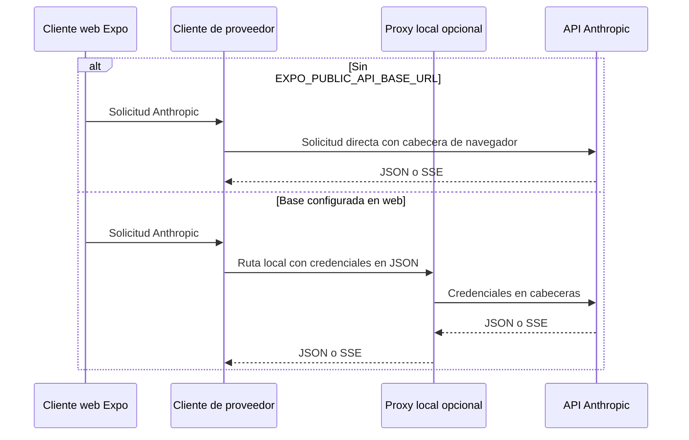

# Proxy Anthropic de depuración local

## Propósito y límite arquitectónico

`apps/anthropic_proxy/cors-proxy.py` es una utilidad FastAPI para diagnosticar, desde la web de desarrollo, el contrato que Gymnasia puede usar para Anthropic. No es un backend de producto: no guarda datos, sesiones ni claves, y no debe convertirse en un intermediario compartido de claves BYOK.

La aplicación es **local-first y no depende de este proceso**. En web, si no se configura una pasarela, sus solicitudes directas a Anthropic incluyen `anthropic-dangerous-direct-browser-access`, que permite al navegador leer la respuesta CORS. En plataformas nativas tampoco hay barrera CORS. `EXPO_PUBLIC_API_BASE_URL` tiene por defecto el valor vacío para que la exportación web estática no contacte accidentalmente el `localhost` de otra persona.

Solo cuando esa variable contiene una base no vacía y la plataforma es web, `App.tsx` entrega al cliente las rutas locales de mensajes y verificación. Esta selección también alcanza el catálogo de modelos a través de la configuración del proveedor. Por tanto, configurar una base caída cambia deliberadamente el comportamiento: la interfaz no hace fallback silencioso al acceso directo; hay que arrancar el proxy o retirar la variable.



*La pasarela solo es una rama explícita de depuración; el recorrido normal de Anthropic en web es directo.*

La implementación canónica es un único archivo. `apps/mobile/cors-proxy.py` es el enlace simbólico que usa el arranque documentado. Al invocarlo, `sys.path[0]` sería `apps/mobile`, no el directorio del proxy; por eso añadir importaciones de módulos hermanos rompería el entrypoint aunque las pruebas, que cargan el archivo real, siguieran pasando.

## Límite de exposición: solo loopback y sin despliegue

El proceso escucha por defecto en `127.0.0.1:8000`. `ANTHROPIC_PROXY_HOST` y `ANTHROPIC_PROXY_PORT` permiten cambiar host y puerto, pero un host que no sea loopback hace que el script termine con código 2. La protección se repite por solicitud: el middleware devuelve `403` antes de validar o contactar el upstream cuando la IP del cliente es demostrablemente remota. Se admiten host ausente o no interpretable como IP para `TestClient` y sockets Unix; eso no demuestra que sean clientes remotos.

CORS permite cualquier origen, método y cabecera para servir al navegador local, pero no rebaja el requisito de cliente loopback. Esta combinación no es un diseño para exponer mediante `0.0.0.0`, contenedores o túneles: incluso si se logra iniciar el servidor de otra forma, la petición remota se rechaza.

Además de la barrera de ejecución, `npm run check:anthropic-proxy` impide que el repositorio declare un despliegue accidental. Busca ficheros de infraestructura en el directorio del proxy, líneas de workflows que lo arranquen o publiquen y un proxy como destino fijo en el inventario de red. Un puente compartido futuro requiere una excepción explícita de backend y un diseño de seguridad propio; no debe evolucionar este proceso local hacia ese papel.

## Inicio y configuración

Prepare el entorno Python del proyecto y ejecute el enlace móvil:

```bash
uv sync --project apps/anthropic_proxy --extra dev
apps/anthropic_proxy/.venv/bin/python apps/mobile/cors-proxy.py
curl -sS http://127.0.0.1:8000/health
```

Para seleccionar la pasarela en la web, defina antes de iniciar o exportar:

```bash
EXPO_PUBLIC_API_BASE_URL=http://127.0.0.1:8000
```

La aplicación recorta espacios y barras finales de esa variable. `ANTHROPIC_PROXY_UPSTREAM_BASE_URL` sustituye `https://api.anthropic.com` y está destinado a un Anthropic falso local; el script avisa en consola cuando se usa. La versión que el proxy envía al upstream permanece fijada en `2023-06-01`.

## Contrato HTTP y privacidad de credenciales

| Ruta local | Entrada | Operación ascendente | Tiempo de espera |
|---|---|---|---|
| `GET /health` | ninguna | ninguna | — |
| `POST /chat/providers/anthropic/verify` | `api_key`, `workspace_id?`, `model?` | `POST /v1/messages` mínimo | 15 s |
| `POST /chat/providers/anthropic/models` | `api_key`, `workspace_id?` | `GET /v1/models` paginado | 15 s por página |
| `POST /chat/providers/anthropic/messages` | credenciales y Messages | `POST /v1/messages` | 120 s |

Las rutas ascendentes convierten `api_key` en `x-api-key` y, si existe, `workspace_id` en `anthropic-workspace-id`. `upstream_body` excluye ambos campos centralmente antes de serializar el JSON, de modo que las credenciales no se reenvían en el cuerpo. Las cabeceras incluyen `anthropic-version` y `content-type`; las solicitudes de stream añaden `accept: text/event-stream`.

`/verify` y `/models` son contratos controlados por el proxy y prohíben campos desconocidos. `/messages` valida lo esencial —modelo, `max_tokens`, mensajes no vacíos y `stream`— pero permite campos adicionales de Messages para seguir siendo compatible con herramientas, sistema, razonamiento y extensiones futuras. Los límites son: clave de 400 caracteres, modelo de 200, hasta 500 mensajes, hasta 200.000 tokens de salida y cuerpo declarado de 4 MiB. `content-length` inválido produce `400`; si supera el límite, `413`, antes de procesar el cuerpo.

Los errores de validación tienen estado `422`, forma `error.message` legible y detalles acotados que no reflejan los valores rechazados. Los errores HTTP JSON de Anthropic conservan estado y cuerpo; un cuerpo de error no JSON se encapsula como `upstream_non_json`. Timeouts, problemas de red y JSON de éxito ilegible se clasifican como `504 upstream_timeout`, `502 upstream_unreachable` y `502 upstream_invalid_json`. Antes de devolver texto de excepciones o upstream no estructurado, el proxy redacciona la clave de la solicitud y patrones conocidos de secretos, y trunca el mensaje.

## Catálogo de modelos: completo o marcado como incompleto

El proxy pide páginas de hasta 100 modelos y como máximo 20, deduplicando por `id` y usando `last_id` como cursor. Si la primera página falla o no tiene la forma esperada, devuelve el error. Si falla después de haber acumulado resultados, devuelve lo reunido con `pagination.partial` y un resumen de error; si alcanza el límite, falta o repite cursor, o una página no añade modelos, marca `pagination.truncated`.

El resultado nunca presenta una lista incompleta como completa: cuando existe truncado o fallo parcial, `has_more` es `true` y `pagination` informa páginas obtenidas, truncado, parcial y error. El cliente móvil aplica el mismo principio al consultar Anthropic directamente, mientras que el cliente web reconoce el envoltorio ya agregado por el proxy y conserva su aviso de catálogo incompleto.

## Streaming y cierre

En Messages sin streaming, el proxy lee JSON y cierra la respuesta upstream. Con `stream: true`, devuelve `StreamingResponse` SSE con `Cache-Control: no-cache` y `X-Accel-Buffering: no`, retransmite bloques de 1024 bytes y cierra siempre el upstream.

Un stream ya iniciado no puede cambiar su estado HTTP de `200` si el upstream falla. El proxy detecta `message_stop` en los bytes retransmitidos, conservando 32 bytes de solapamiento para que un marcador partido entre bloques no parezca ausente. Si falla la lectura, inyecta un evento SSE `error` de tipo `upstream_stream_error`; si el flujo termina sin el marcador, inyecta `truncated_stream`. El parser móvil trata un evento o carga de tipo `error` como excepción: una respuesta parcial no puede terminar como una conversación satisfactoria.

## Validación independiente en CI

La orden local de la suite es:

```bash
npm run test:proxy
```

Ese atajo ejecuta el script de pruebas del workspace `apps/anthropic_proxy`. La mayoría de pruebas sustituyen `urlopen` por un upstream registrable: no usan red ni claves reales y validan rutas, cabeceras, eliminación de credenciales, CORS, validación, paginación, errores y streaming. Las pruebas de propiedades generan cuerpos y páginas para mantener invariantes: ningún cuerpo causa un `500` sin clasificar, la clave no viaja en el cuerpo ascendente y la paginación termina, no duplica y señala resultados incompletos.

`test_e2e.py` complementa esos dobles: inicia el proxy como proceso real, lo apunta a un servidor HTTP Anthropic falso en loopback y realiza solicitudes HTTP reales. Cubre health, verificación, tres páginas de catálogo, mensajes JSON, preflight CORS y la inyección de error en un SSE truncado.

En `.github/workflows/agent-tests.yml`, el job `anthropic-proxy` es independiente del job Node y no ejecuta `npm ci`: instala `uv` y corre `uv run --project apps/anthropic_proxy --extra dev pytest apps/anthropic_proxy`. Así la cobertura del proxy conserva su entorno Python aislado y se ejecuta cuando cambian sus rutas incluidas en el workflow.

## Relación con otras áreas

- [Configuración del proveedor](../agent/provider-configuration.md) explica la selección, verificación y catálogo de modelos que usan estas rutas solo en la rama de pasarela web.
- [Transmisión del proveedor](../agent/provider-streaming.md) describe el parser SSE y el tratamiento de errores que hace visible un stream truncado.
- [Visión general de arquitectura](../architecture/overview.md) sitúa esta herramienta fuera de los componentes necesarios para operar la aplicación.
- [Compilación, release y pruebas](../operations/build-release-and-testing.md) cubre la ejecución de validaciones en CI.

## Fuente de verdad

- `apps/anthropic_proxy/cors-proxy.py`: contrato, validación, límites, aislamiento loopback, upstream y streaming.
- `apps/mobile/App.tsx`, `apps/mobile/agent/providerTransport.ts`, `apps/mobile/agent/providerVerification.ts` y `apps/mobile/agent/anthropicModels.ts`: selección explícita de proxy y acceso directo.
- `apps/anthropic_proxy/tests/` y `.github/workflows/agent-tests.yml`: pruebas deterministas, E2E local y job Python de CI.
- `scripts/anthropic-proxy/check.mjs`: guard rail contra el despliegue de la herramienta.
