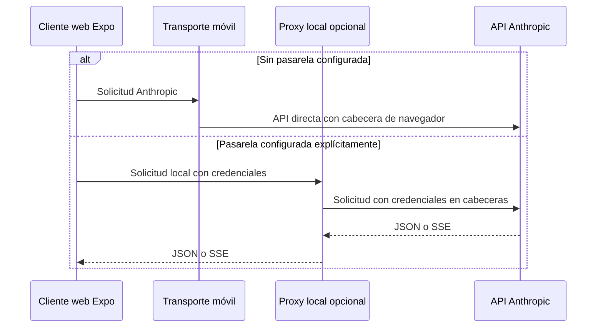

# Proxy Anthropic de depuración local

## Propósito y límite arquitectónico

`apps/anthropic_proxy/cors-proxy.py` es una utilidad FastAPI de escritorio para diagnosticar el contrato de pasarela de Anthropic desde el navegador. No es un backend de producto: la única superficie de producto es `apps/mobile`, que funciona sin un backend obligatorio; el único servicio de apoyo autorizado es el worker de incidencias. El proxy no tiene persistencia, sesiones, identidad de aplicación ni almacén de credenciales.

**No se despliega y no es necesario para Anthropic en web.** El transporte de la aplicación añade la cabecera `anthropic-dangerous-direct-browser-access` en las llamadas web directas; con ella Anthropic permite que el navegador lea la respuesta CORS. Por ello, tanto la web como las plataformas nativas pueden llamar directamente a `https://api.anthropic.com`. La pasarela solo se selecciona si se configura expresamente `EXPO_PUBLIC_API_BASE_URL`; su valor predeterminado es vacío para que una exportación web estática no intente contactar el `localhost` de quien la abre.

`apps/mobile/cors-proxy.py` es el enlace simbólico usado por el runbook hacia la implementación canónica. El proxy se mantiene deliberadamente en un único archivo: al arrancarlo mediante ese enlace, `sys.path[0]` es el directorio móvil, por lo que importar módulos hermanos del directorio del proxy rompería el arranque aunque las pruebas que cargan el archivo real pasaran.



*La pasarela es una rama explícita de depuración; el recorrido normal de Anthropic en web es directo.*

## Aislamiento local y controles de despliegue

Al ejecutarse como script, lee `ANTHROPIC_PROXY_HOST` y `ANTHROPIC_PROXY_PORT`, con valores predeterminados `127.0.0.1` y `8000`. Si el host solicitado no es loopback, termina con código 2 en vez de corregirlo silenciosamente. Además, un middleware comprueba cada cliente: una IP demostrablemente no local recibe `403` antes de validación o de cualquier contacto con Anthropic. Hosts ausentes o no interpretables como IP se aceptan para permitir el cliente de pruebas y sockets Unix; no constituyen una prueba de acceso remoto.

La defensa no depende solo de cómo se lanzó Uvicorn. Incluso si un operador intenta `--host 0.0.0.0`, un contenedor o un túnel, el middleware rechaza a clientes con IP remota. CORS sigue permitiendo cualquier origen, método y cabecera, pero solo dentro de ese límite de cliente loopback: es apropiado para el navegador local de desarrollo, no para publicar el proceso.

`npm run check:anthropic-proxy` aplica el límite en el repositorio: falla si detecta infraestructura de despliegue junto al proxy, workflows que lo arranquen o publiquen, o un endpoint del proxy declarado como destino fijo en el inventario de red. Un puente compartido futuro requeriría una excepción explícita de backend y un diseño de seguridad propio; no debe derivarse de esta herramienta.

## Inicio y configuración deliberada

Prepare el entorno una vez y ejecute el intérprete del proyecto a través del enlace móvil:

```bash
uv sync --project apps/anthropic_proxy --extra dev
apps/anthropic_proxy/.venv/bin/python apps/mobile/cors-proxy.py
curl -sS http://127.0.0.1:8000/health
```

Para depurar la pasarela, configure `EXPO_PUBLIC_API_BASE_URL=http://127.0.0.1:8000` antes de arrancar o exportar la web. La aplicación normaliza esa variable —elimina espacios y barras finales— y únicamente construye rutas de proxy cuando queda una base no vacía. Si se configura una base pero el proceso no responde, la interfaz indica que se compruebe o se elimine la variable para volver al acceso directo.

`ANTHROPIC_PROXY_UPSTREAM_BASE_URL` sustituye el upstream fijo `https://api.anthropic.com`; se reserva para pruebas contra un servidor Anthropic falso y el script avisa al usarlo. La versión enviada a Anthropic está fijada en `2023-06-01`.

## Contrato y recorrido de solicitud

| Ruta local | Entrada validada | Operación ascendente | Resultado |
|---|---|---|---|
| `GET /health` | ninguna | ninguna | `200 {"ok": true}` |
| `POST /chat/providers/anthropic/verify` | `api_key`, `workspace_id?`, `model?` | `POST /v1/messages` con mensaje mínimo | `{"ok": true, "model": ...}` |
| `POST /chat/providers/anthropic/models` | `api_key`, `workspace_id?` | `GET /v1/models` paginado | catálogo agregado y estado de paginación |
| `POST /chat/providers/anthropic/messages` | credenciales y subconjunto obligatorio de Messages | `POST /v1/messages` | JSON o SSE |

Las tres rutas ascendentes convierten `api_key` en `x-api-key` y, cuando existe, `workspace_id` en `anthropic-workspace-id`; `upstream_body` excluye ambos campos del JSON reenviado. También fija `anthropic-version`, `content-type` y, para streaming, `accept: text/event-stream`.

`/verify` y `/models` son contratos propios y rechazan campos desconocidos. `/messages` es una pasarela compatible hacia delante: exige `model`, `max_tokens`, una lista no vacía de mensajes válidos y `stream`, pero permite y retransmite campos adicionales de Messages como herramientas, sistema o razonamiento. Las credenciales están limitadas a 400 caracteres; los modelos a 200, los mensajes a 500, la salida a 200.000 tokens y el cuerpo declarado a 4 MiB. El límite de tamaño se evalúa desde `content-length` antes de procesar el cuerpo.

### Catálogo de modelos completo o señalado

La ruta de modelos solicita páginas de hasta 100 elementos y recorre como máximo 20. Deduplica por `id` y utiliza `last_id` como cursor. Si la primera página falla o tiene una forma inválida, devuelve el error; si falla una página posterior, devuelve los modelos ya acumulados pero marca `pagination.partial` y adjunta el motivo. También marca `pagination.truncated` si se alcanza el límite, falta o se repite el cursor, o una página no agrega modelos. Así una lista incompleta conserva `has_more: true` y no se presenta como catálogo completo.

## Streaming, cierre y errores

Para Messages no transmitido, el proxy abre el upstream con un límite de 120 segundos, analiza el JSON y cierra la respuesta. Para `stream: true`, devuelve una `StreamingResponse` SSE con `Cache-Control: no-cache` y `X-Accel-Buffering: no`; lee bloques de 1024 bytes y siempre cierra la respuesta ascendente. Los límites de los fragmentos no son límites de eventos SSE: el consumidor debe separar eventos por el protocolo SSE.

El proxy busca `message_stop` en los bytes reenviados para distinguir un final correcto de un stream truncado. Conserva 32 bytes de solapamiento entre lecturas, de modo que un marcador dividido entre bloques no se confunda con un corte. Si la lectura falla o el upstream termina sin marcador, ya no puede cambiar el `200` cuyos encabezados se enviaron: inyecta un evento SSE `error` con `upstream_stream_error` o `truncated_stream`. El parser móvil convierte cualquier evento o carga con tipo `error` en una excepción, por lo que no muestra una respuesta parcial como satisfactoria.

Los errores de entrada —JSON inválido, campos ausentes o incompatibles— se devuelven como `422` con `error.message` legible y detalles acotados que no reproducen valores del cuerpo. Un `content-length` inválido da `400`; uno que excede 4 MiB, `413`. La capa CORS envuelve también errores de validación y de tamaño para que el navegador pueda leerlos.

Los errores HTTP JSON de Anthropic preservan su estado y cuerpo. Un error HTTP no JSON se envuelve como `upstream_non_json`; timeouts se distinguen como `504 upstream_timeout`; problemas de conectividad como `502 upstream_unreachable`; y JSON de éxito ilegible como `502 upstream_invalid_json`. Antes de devolver texto de excepciones o de upstream no estructurado, el proxy sustituye la clave de la solicitud y patrones de secretos conocidos, y limita el mensaje a 2.000 caracteres. Esta redacción reduce fugas por respuestas, pero no convierte el proceso local ni su infraestructura en un custodio apropiado para credenciales compartidas.

## Pruebas enfocadas

Ejecute la suite aislada, sin red ni claves reales:

```bash
npm run test:proxy
```

La suite Pytest sustituye `urlopen` por un upstream registrable para comprobar las rutas básicas, cabeceras, retirada de credenciales, errores, validación, CORS, paginación y streaming. Las pruebas de propiedades generan cuerpos y páginas arbitrarias para preservar dos invariantes: no hay `500` no clasificado y una clave no se reenvía en el cuerpo; también prueban que la paginación termina, no duplica y señala datos incompletos.

`test_e2e.py` complementa esos dobles con un proceso real del proxy, un servidor HTTP local que simula Anthropic y solicitudes HTTP reales. Cubre el arranque documentado, health, verificación, tres páginas de modelos, JSON, preflight CORS y el aviso inyectado en un SSE truncado. La CI ejecuta esta suite Python en un job independiente del conjunto Node, y los tests del guard rail validan que el repositorio no admita una vía de despliegue accidental.

## Relación con otras áreas

- [Configuración del proveedor](../agent/provider-configuration.md) describe la selección, verificación y catálogo de modelos que consumen estas rutas solo cuando se activa la pasarela.
- [Transmisión del proveedor](../agent/provider-streaming.md) explica el parser y el bucle que consumen el SSE, incluido el tratamiento de errores de stream.
- [Visión general de arquitectura](../architecture/overview.md) y [Comportamiento de ejecución](../operations/runtime-behavior.md) sitúan esta utilidad fuera de los servicios necesarios para operar la aplicación.

## Fuente de verdad

- `apps/anthropic_proxy/cors-proxy.py`: contrato, validación, límites, aislamiento loopback, llamadas ascendentes y streaming.
- `apps/mobile/agent/providerTransport.ts`, `apps/mobile/agent/providerVerification.ts` y `apps/mobile/App.tsx`: acceso directo de Anthropic en web y selección explícita de la pasarela.
- `apps/anthropic_proxy/tests/` y `.github/workflows/agent-tests.yml`: cobertura determinista, E2E local y ejecución en CI.
- `scripts/anthropic-proxy/check.mjs`: guard rail que impide declarar despliegue para la herramienta.
