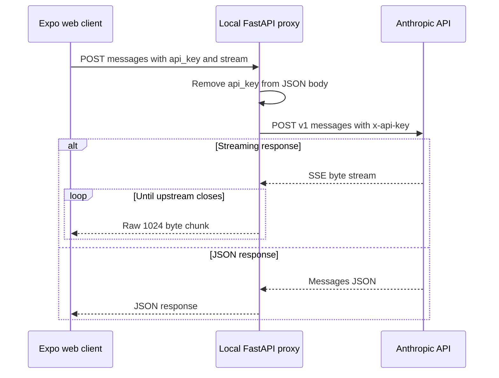

# Proxy CORS de Anthropic para navegador

## Propósito y alcance

`apps/anthropic_proxy/cors-proxy.py` es un pequeño servicio FastAPI que se utiliza únicamente cuando la aplicación Expo se ejecuta en un navegador y es necesario llamar a Anthropic a través del límite CORS del navegador del proveedor. No es un backend de producto: no tiene base de datos, identidad de usuario, gestión de sesiones, almacén de claves del proveedor, limitador de frecuencia ni API del dominio de la aplicación. Android e iOS nativos llaman directamente a Anthropic.

`apps/mobile/cors-proxy.py` es la ruta del espacio de trabajo móvil utilizada por el comando de inicio documentado y se resuelve a la misma implementación canónica. Realice los cambios del servicio en `apps/anthropic_proxy/cors-proxy.py`, no como una segunda implementación independiente.

Cuando `cors-proxy.py` se ejecuta directamente, su llamada a `uvicorn.run` vincula el servicio a la dirección de bucle local `127.0.0.1` en el puerto `8000`. Esa dirección de vinculación es una configuración de escucha del lado del servidor, no la base de la API del cliente del navegador. La cadena de documentación del módulo de origen todavía denomina a `http://127.0.0.1:8000` el valor predeterminado de `EXPO_PUBLIC_API_BASE_URL`, pero esa afirmación está obsoleta: el valor predeterminado del cliente es la cadena vacía y la exportación web de producción es estática, sin un origen de proxy predeterminado. Iniciar la aplicación mediante un comando externo de `uvicorn` puede utilizar una dirección de vinculación diferente según las opciones de dicho comando.

## Contrato de los endpoints

Todas las llamadas ascendentes a Anthropic utilizan `https://api.anthropic.com` y la versión fija de la API indicada por `ANTHROPIC_API_VERSION`. Los valores secretos se omiten intencionadamente de esta página.

| Endpoint local | Entrada | Correspondencia ascendente | Éxito | Tiempo de espera |
|---|---|---|---|---:|
| `GET /health` | Ninguna | Sin solicitud ascendente | JSON `200` con `ok: true` | Ninguno |
| `POST /chat/providers/anthropic/verify` | JSON que contiene `api_key` y, opcionalmente, `model` | `POST /v1/messages`; la clave se convierte en `x-api-key`; el cuerpo es un mensaje de prueba de un token | JSON `200` que contiene `ok: true` y el modelo devuelto o solicitado | 15 s |
| `POST /chat/providers/anthropic/models` | JSON que contiene `api_key` | `GET /v1/models`; la clave se convierte en `x-api-key` | El JSON de Anthropic se devuelve sin cambios | 15 s |
| `POST /chat/providers/anthropic/messages` | JSON de Messages de Anthropic más `api_key` en el nivel superior | `POST /v1/messages`; `api_key` se elimina del cuerpo y se convierte en `x-api-key` | JSON sin transmisión o fragmentos SSE idénticos byte por byte | 120 s para abrir la respuesta ascendente |

La ruta de mensajes decide su modo de respuesta a partir del valor de verdad del campo `stream` del cuerpo. Para las solicitudes con transmisión, añade `Accept: text/event-stream`, lee la respuesta ascendente en fragmentos de 1024 bytes y devuelve `StreamingResponse` con `text/event-stream`, `Cache-Control: no-cache` y `X-Accel-Buffering: no`. Cierra la respuesta ascendente cuando finaliza la iteración. Para las solicitudes sin transmisión, analiza como JSON el cuerpo ascendente completo y cierra la respuesta.

El proxy no comprende el protocolo de chat/herramientas de nivel superior. Los modelos, las instrucciones del sistema, las herramientas, las imágenes, las opciones de razonamiento, los mensajes de continuación y los presupuestos de tokens los proporciona el cliente móvil/web y la ruta de mensajes los reenvía.



*La clave del navegador atraviesa el proxy local, se convierte en una cabecera ascendente y no se reenvía en el cuerpo de la solicitud a Anthropic.*

## Enrutamiento y configuración del cliente

El cliente del navegador construye las tres rutas del proxy de Anthropic con `buildWebProxyUrl`. `resolveWebApiBaseUrl` lee el nombre de configuración pública en tiempo de compilación `EXPO_PUBLIC_API_BASE_URL`, elimina sus espacios en blanco y quita las barras diagonales finales. Si está vacío, `buildWebProxyUrl` devuelve una ruta relativa. Debido a que el despliegue web estático no tiene un backend correspondiente, un valor vacío solo resulta útil cuando otro servidor del mismo origen proporciona estas rutas; de lo contrario, las llamadas fallan y la interfaz de usuario explica que se requiere un proxy.

Los consumidores relevantes en `apps/mobile/App.tsx` son:

- `fetchAnthropicModelsViaWebProxy`: descubrimiento de modelos mediante `/models`.
- `verifyAnthropicViaWebProxy`: guardado/verificación del proveedor mediante `/verify`.
- `callAnthropicViaWebProxy`: llamada a Messages sin transmisión.
- `callProviderChatAPIWithTools`: turnos transmitidos del agente y continuaciones del bucle de herramientas mediante `/messages` en la web.
- El estimador de alimentos: turnos transmitidos de imágenes/herramientas y extracción estructurada de información nutricional sin transmisión mediante `/messages` en la web.

En plataformas nativas, el descubrimiento de modelos y el tráfico de Messages utilizan directamente `https://api.anthropic.com` con las cabeceras del proveedor. Por lo tanto, el proxy es un adaptador de plataforma, no una dependencia universal.

El inicio local, sin colocar ninguna clave en el entorno del servicio, es:

```bash
cd apps/anthropic_proxy
uv venv .venv
.venv/bin/pip install fastapi uvicorn
.venv/bin/python cors-proxy.py
```

Configure `EXPO_PUBLIC_API_BASE_URL` con el origen del proxy de confianza antes de iniciar o exportar el cliente web. El servicio en sí no tiene ningún cargador de archivos de configuración ni ninguna variable de entorno relacionada con claves.

## Límites de confianza, seguridad y plataforma

El navegador envía la clave de API de Anthropic del usuario en formato JSON a través del salto de red hasta este servicio. En consecuencia, el operador del proxy, el host, la memoria del proceso, los registros de acceso, el proxy inverso y el transporte están incluidos en el límite de confianza de la clave. El código no conserva intencionadamente las claves, pero la ausencia de persistencia no equivale a mantenerlas en secreto frente a la infraestructura.

Los controles actuales son intencionadamente propios de un entorno de desarrollo:

- El modo script solo se vincula al bucle local, lo que reduce la exposición en el equipo local.
- El destino está fijado en Anthropic; quienes realizan las llamadas no pueden elegir una URL ascendente arbitraria.
- La clave se elimina del cuerpo JSON de Messages reenviado.
- No hay autenticación ni autorización de la aplicación.
- CORS permite todos los orígenes, métodos y cabeceras.
- Los cuerpos de las solicitudes no tienen un límite de tamaño explícito. Las cargas de imágenes pueden ser grandes.
- No hay limitación de frecuencia, límite de concurrencia, política de auditoría, middleware de ocultación ni protección contra abusos.
- HTTP sin cifrar solo es aceptable para el desarrollo en bucle local. Un despliegue remoto expondría las claves a menos que se aplique TLS de extremo a extremo.
- El texto de las excepciones ascendentes se devuelve a quien realiza la llamada y puede revelar detalles operativos. Nunca debe registrarse ni copiarse junto con cuerpos de solicitudes que contengan claves.

No exponga esta implementación sin modificaciones a la Internet pública. Un puente de producción necesitaría orígenes restringidos, clientes autenticados, TLS, límites de solicitudes/cuerpos, limitación de frecuencia, registro estructurado seguro con ocultación de claves/cuerpos, mensajes de error controlados, tiempos de espera a nivel de despliegue y responsabilidad explícita sobre el gasto del proveedor. Es preferible un diseño en el que los usuarios del navegador no entreguen credenciales de proveedor de larga duración a un proxy compartido que no sea de confianza.

## Comportamiento ante fallos

- Las respuestas `HTTPError` de Anthropic conservan el código de estado ascendente. Un cuerpo de error JSON se transfiere directamente; un cuerpo que no sea JSON se encapsula como `error.message`.
- Otras excepciones, incluidos los fallos de DNS/conectividad, los fallos de tiempo de espera, el JSON de éxito mal formado y los errores de configuración de la transmisión, se convierten en un JSON `502` con `error.message`.
- Los cuerpos entrantes no válidos o que no sean JSON se gestionan mediante el comportamiento de FastAPI/tiempo de ejecución, en lugar de mediante un esquema específico de la ruta; no hay modelos de solicitud de Pydantic.
- Una clave ausente se convierte en un valor `x-api-key` vacío y se deja que Anthropic la rechace.
- La ruta de verificación demuestra que una solicitud mínima de Messages se completa correctamente. No demuestra que todas las características, esquemas de herramientas, tamaños de imagen, presupuestos de tokens o solicitudes futuras vayan a completarse correctamente.
- La ruta de modelos solo reenvía el primer documento JSON devuelto; no sigue la paginación de Anthropic.
- Una vez iniciada una respuesta transmitida, una excepción durante la iteración no se convierte mediante el `try` externo de la ruta en un error JSON limpio. El cliente puede observar un flujo SSE truncado.
- La transmisión conserva los bytes, pero no necesariamente los límites de los fragmentos ascendentes. El analizador del cliente debe delimitar los SSE mediante los separadores de eventos, en lugar de suponer que hay un evento por fragmento.

Los auxiliares del navegador analizan los errores del proveedor cuando es posible. Un `Failed to fetch` a nivel de red se traduce en las instrucciones que indican que se requiere un proxy. El comportamiento de transmisión y análisis de nivel superior se documenta en [Transmisión del proveedor](../agent/provider-streaming.md), mientras que el comportamiento de guardado/selección de modelos del proveedor se encuentra en [Configuración del proveedor](../agent/provider-configuration.md).

## Validación, pruebas y carencias

No hay un conjunto de pruebas automatizadas específico para el servicio FastAPI ni un comando de pruebas del proxy en los manifiestos del espacio de trabajo. Las pruebas del analizador/bucle de herramientas del agente utilizan fixtures deterministas y proveedores falsos; no inician este proxy ni prueban CORS, `urllib` de Python, la transferencia directa de SSE reales, los tiempos de espera o Anthropic.

Validación mínima después de cambiar el servicio:

1. Inicie el proxy y confirme que `GET /health` devuelve `200` sin credenciales.
2. Desde un origen de navegador de prueba permitido, envíe intencionadamente credenciales no válidas a `/verify`, `/models` y a `/messages` tanto con transmisión como sin ella; verifique la propagación del estado/error sin imprimir los cuerpos de las solicitudes ni las claves.
3. Con una credencial de prueba desechable y autorizada, verifique el descubrimiento de modelos, la llamada mínima de verificación, un mensaje sin transmisión y un mensaje transmitido con varios eventos. Inspeccione únicamente metadatos ocultados.
4. Ejecute `npm --workspace apps/mobile exec tsc --noEmit` y `npm test` para detectar regresiones en el contrato del cliente y en el analizador.
5. Pruebe el bucle de herramientas del chat web y el flujo del estimador de alimentos con el proxy local, incluida la cancelación, un error ascendente antes de las cabeceras y una transmisión interrumpida deliberadamente.

Una carencia importante de cobertura es un conjunto de pruebas de cliente de FastAPI con un servicio ascendente simulado para las cuatro rutas, errores ascendentes JSON y no JSON, correspondencia de tiempos de espera, eliminación de claves, cabeceras obligatorias, cierre de transmisiones y política CORS. Tampoco existe validación del despliegue porque este servicio no está definido actualmente como destino de despliegue de producción.

## Fuente de verdad

- `apps/anthropic_proxy/cors-proxy.py`: servicio completo y comportamiento de las rutas.
- `apps/mobile/App.tsx`: `resolveWebApiBaseUrl`, `buildWebProxyUrl`, consumidores de verificación/modelos/mensajes de Anthropic y separación entre entornos nativos y web.
- `README.md`: inicio del desarrollo local e intención de la plataforma.