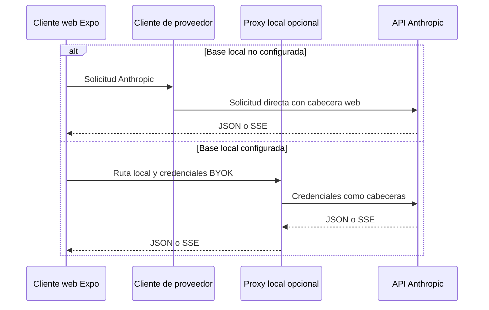

# Proxy local de Anthropic

## Propósito y frontera de seguridad

`apps/anthropic_proxy/cors-proxy.py` es una utilidad local de diagnóstico para probar desde la web una pasarela compatible con Anthropic. No mantiene sesiones, identidad de aplicación, persistencia ni almacén de credenciales. No es un backend de la aplicación móvil ni un servicio de producción: una pasarela compartida recibiría claves BYOK de otras personas y ampliaría innecesariamente la superficie que puede exponerlas.

La aplicación no necesita este proceso para hablar con Anthropic. Con `EXPO_PUBLIC_API_BASE_URL` vacío —el predeterminado—, la web llama directamente a Anthropic con `anthropic-dangerous-direct-browser-access`, que habilita que el navegador lea la respuesta CORS; en nativo esa cabecera no se envía. Solo una base no vacía **y** la plataforma web seleccionan el proxy para conversación normal, bucles con herramientas, verificación y catálogo. La base se recorta y pierde las barras finales; mantenerla vacía en la web estática evita conectar por accidente al `localhost` de quien abra la aplicación.


```mermaid
sequenceDiagram
    participant Browser as Cliente web Expo
    participant Client as Cliente de proveedor
    participant Proxy as Proxy local opcional
    participant Anthropic as API Anthropic
    alt Base local no configurada
        Browser->>Client: Solicitud Anthropic
        Client->>Anthropic: Solicitud directa con cabecera web
        Anthropic-->>Browser: JSON o SSE
    else Base local configurada
        Browser->>Proxy: Ruta local y credenciales BYOK
        Proxy->>Anthropic: Credenciales como cabeceras
        Anthropic-->>Proxy: JSON o SSE
        Proxy-->>Browser: JSON o SSE
    end
```

*La ruta normal de Anthropic en web es directa; el proxy solo existe en la rama local configurada a propósito.*

## Límite de red y CORS

El proceso arranca en `127.0.0.1:8000`. `ANTHROPIC_PROXY_HOST` y `ANTHROPIC_PROXY_PORT` permiten cambiar host y puerto, pero un valor de host que sea una IP no loopback termina el proceso con código 2. El middleware aplica el mismo límite por solicitud: una IP que pueda demostrarse remota recibe `403` antes de validar o contactar el upstream. La defensa se mantiene aunque alguien intente lanzar Uvicorn en una interfaz amplia, desde un contenedor o detrás de un túnel.

Un host ausente o que no se puede interpretar como IP se acepta para no romper `TestClient` ni sockets Unix; no es una autorización para publicar el servicio. CORS permite cualquier origen, método y cabecera para que un navegador local pueda hacer el preflight, pero ese permiso no anula el cerrojo de cliente loopback. Por tanto, **no se debe exponer el puerto ni usarlo como puente de credenciales entre máquinas**.

El guard rail `npm run check:anthropic-proxy` rechaza infraestructura de despliegue dentro del directorio del proxy, workflows que lo arranquen o publiquen y un destino fijo del proxy en el inventario de red. Una necesidad real de backend compartido requiere una excepción explícita y un diseño propio de autenticación, aislamiento de secretos y operación; no debe reutilizar este archivo local como atajo.

## Arranque deliberado

```bash
uv sync --project apps/anthropic_proxy --extra dev
apps/anthropic_proxy/.venv/bin/python apps/mobile/cors-proxy.py
curl -sS http://127.0.0.1:8000/health
```

`apps/mobile/cors-proxy.py` es el enlace a la implementación canónica. Esta se mantiene deliberadamente en un solo archivo: al invocarla por el enlace, `sys.path[0]` es `apps/mobile`; un módulo hermano del directorio del proxy fallaría en el arranque documentado aunque las pruebas que cargan la ruta canónica pasaran.

Para activar la rama local en web, establezca `EXPO_PUBLIC_API_BASE_URL=http://127.0.0.1:8000`. Si está configurada pero el proceso no responde, los clientes de chat, streaming y catálogo informan del proxy inalcanzable; quite la variable para volver a la ruta directa. `ANTHROPIC_PROXY_UPSTREAM_BASE_URL` sustituye `https://api.anthropic.com` exclusivamente para pruebas contra un upstream local falso y el arranque lo anuncia. No introduzca una clave en documentación, scripts compartidos, registros ni respuestas de ejemplo.

## Contrato de solicitud y credenciales

| Ruta local | Responsabilidad | Upstream | Tiempo de espera |
|---|---|---|---|
| `GET /health` | Comprueba que el proceso responde. | Ninguno | — |
| `POST /chat/providers/anthropic/verify` | Verifica clave y modelo mediante una solicitud mínima. | `POST /v1/messages` | 15 s |
| `POST /chat/providers/anthropic/models` | Agrega el catálogo paginado de modelos. | `GET /v1/models` | 15 s por página |
| `POST /chat/providers/anthropic/messages` | Reenvía una solicitud Messages normal o SSE. | `POST /v1/messages` | 120 s |

Las tres rutas autenticadas reciben temporalmente `api_key` y, opcionalmente, `workspace_id` en el cuerpo local. El proxy los transforma respectivamente en `x-api-key` y `anthropic-workspace-id`; `upstream_body` excluye ambos del JSON saliente, un invariante centralizado para que ninguna ruta los reenvíe por descuido. Además fija `anthropic-version` a `2023-06-01` y, cuando `stream` es verdadero, solicita `text/event-stream`.

`/verify` y `/models` rechazan campos desconocidos porque son contratos definidos por el proxy. `/messages` exige modelo, `max_tokens`, mensajes válidos y `stream`, pero permite y reenvía extensiones de Messages —por ejemplo `system`, `thinking`, `tools` y `tool_choice`— para no bloquear parámetros futuros de Anthropic. La entrada limita la clave a 400 caracteres, el modelo a 200, los mensajes a 500 y el máximo de salida a 200.000 tokens.

Antes de leer el contenido, el middleware devuelve `400` ante `content-length` inválido y `413` si declara más de 4 MiB. JSON inválido, credenciales ausentes o tipos incompatibles devuelven `422`. La forma de validación conserva un texto en `error.message` y detalles acotados sin el campo `input`, que podría repetir una clave. CORS es el middleware más externo, por lo que el navegador puede leer también los errores de tamaño y validación.

## Catálogo, SSE y semántica de error

### Catálogo de modelos

La ruta de modelos solicita páginas de 100 elementos, con un máximo de 20, deduplica por `id` y avanza mediante `last_id`. Si falla la primera página o su forma no tiene `data` interpretable, devuelve el fallo. Si falla una posterior, devuelve lo acumulado con `pagination.partial` y la causa. Marca `pagination.truncated` al alcanzar el máximo, recibir un cursor ausente o repetido, o una página que no añade modelos. En ambos casos conserva `has_more: true`: una lista incompleta no puede aparentar ser un catálogo completo.

`fetchAnthropicModelsViaWebProxy` entrega ese envoltorio a `collectAnthropicModels`; el parser reconoce `pagination`, no intenta pedir otra página del proxy y propaga `partial` o `truncated` como una advertencia para la interfaz. La ruta directa usa el mismo recolector paginado contra Anthropic, de modo que web y nativo conservan la semántica de catálogo incompleto. La UI además protege el resultado con un token de operación para que una búsqueda anterior no actualice credenciales o un desplegable ya cambiados.

### Mensajes y streaming

Las respuestas no transmitidas esperan hasta 120 segundos, se interpretan como JSON y cierran siempre la respuesta ascendente. Con `stream: true`, el proxy conserva SSE mediante `StreamingResponse`, entrega `Cache-Control: no-cache` y `X-Accel-Buffering: no`, lee bloques de 1024 bytes y cierra el upstream incluso ante desconexión o excepción.

Una vez que salen las cabeceras SSE no puede transformarse un corte en un estado HTTP de error. El proxy detecta `message_stop` en los bytes reenviados, con 32 bytes de solapamiento para no perder un marcador dividido entre bloques. Si falla la lectura, inyecta un evento SSE `error` de tipo `upstream_stream_error`; si el upstream termina sin marcador, inyecta `truncated_stream`. El parser móvil convierte ese evento en excepción. Además, el bucle de herramientas solo ejecuta llamadas del turno final completo: un stream truncado no puede ejecutar argumentos parciales ni producir una continuación aparentemente válida.

Los errores HTTP JSON de Anthropic conservan estado y contenido. Un error HTTP no JSON se normaliza como `upstream_non_json`; timeout como `504 upstream_timeout`; conectividad como `502 upstream_unreachable`; y éxito no interpretable como `502 upstream_invalid_json`. Antes de devolver excepciones o texto ascendente no estructurado, el proxy elimina la clave de esta petición y patrones conocidos de secretos, y limita el mensaje a 2.000 caracteres. Esa redacción mitiga fugas accidentales, pero no hace seguro publicar el proceso ni compartir credenciales BYOK.

## Pruebas y cambios seguros

Ejecute la suite aislada desde la raíz:

```bash
npm run test:proxy
npm run check:anthropic-proxy
```

Las pruebas del proxy sustituyen `urlopen` por un upstream registrable: no requieren red ni claves reales. Cubren las rutas, conversión de credenciales a cabeceras, validación y CORS, paginación, clasificación y redacción de fallos, y cierre e inyección de errores SSE. Las pruebas de propiedades generan entradas y páginas arbitrarias para comprobar que no aparece un `500` sin clasificar, que una clave no viaja en el cuerpo y que la paginación termina, no duplica y marca una lista incompleta.

`test_e2e.py` complementa los dobles con procesos y HTTP reales pero locales: levanta el proxy, un servidor loopback que imita Anthropic, y comprueba health, verificación, páginas, JSON, preflight CORS y un stream truncado. `providerPipeline.test.ts` cubre el otro extremo del contrato: fragmenta SSE como lo haría la red y verifica que un turno Anthropic truncado se rechaza antes de ejecutar herramientas. Cambiar el formato de errores o la detección del final exige revisar ambos lados.

## Relación con otras áreas

- [Configuración BYOK de proveedores](../agent/provider-configuration.md) describe la persistencia de credenciales, verificación y selección de modelos.
- [Streaming y continuaciones de proveedores](../agent/provider-streaming.md) explica el parser SSE y el bucle que recibe los errores inyectados por este proxy.
- [Runtime del agente](../agent/runtime.md) sitúa el bucle de herramientas que no debe avanzar con un stream incompleto.
- [Comportamiento del runtime](../operations/runtime-behavior.md) reúne las expectativas operativas de los procesos locales.

## Fuente de verdad

- `apps/anthropic_proxy/cors-proxy.py`: límite local, CORS, contrato, validación, upstream, paginación, errores y streaming.
- `apps/mobile/App.tsx`, `apps/mobile/agent/providerCatalog.ts`, `apps/mobile/agent/providerVerification.ts` y los clientes de chat: selección explícita entre acceso directo y proxy local.
- `apps/mobile/agent/providerPipeline.test.ts`: el consumidor no permite que un SSE truncado ejecute herramientas.
- `apps/anthropic_proxy/tests/` y `.github/workflows/agent-tests.yml`: comportamiento cubierto y ejecución aislada en CI.
- `scripts/anthropic-proxy/check.mjs`: prevención de una ruta de despliegue accidental.
