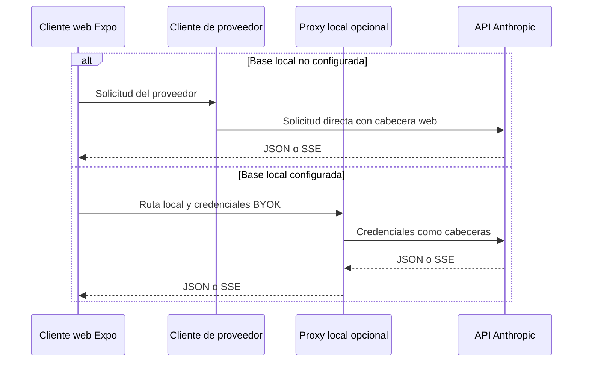

# Proxy local de Anthropic

## Propósito y frontera de seguridad

`apps/anthropic_proxy/cors-proxy.py` es una utilidad local de diagnóstico para probar desde la web una pasarela compatible con Anthropic. No mantiene sesiones, identidad de aplicación, persistencia ni almacén de credenciales. No es un backend de la aplicación móvil, ni debe convertirse en uno: una pasarela compartida recibiría claves BYOK de otras personas y ampliaría innecesariamente la superficie que puede exponerlas.

La aplicación no necesita este proceso para hablar con Anthropic. Cuando `EXPO_PUBLIC_API_BASE_URL` está vacío —su valor predeterminado—, en web llama directamente a Anthropic e incluye `anthropic-dangerous-direct-browser-access`, que habilita la lectura CORS de la respuesta; en nativo no se envía esa cabecera. Configurar una base no vacía es una decisión explícita y solo en web: entonces conversación, verificación y descubrimiento de modelos usan las rutas locales del proxy. La base se recorta y se eliminan sus barras finales; al publicar una web estática, el valor vacío evita que intente conectar al `localhost` de quien la abra.


```mermaid
sequenceDiagram
    participant Browser as Cliente web Expo
    participant App as Cliente de proveedor
    participant Proxy as Proxy local opcional
    participant Anthropic as API Anthropic
    alt Base local no configurada
        Browser->>App: Solicitud del proveedor
        App->>Anthropic: Solicitud directa con cabecera web
        Anthropic-->>Browser: JSON o SSE
    else Base local configurada
        Browser->>Proxy: Ruta local y credenciales BYOK
        Proxy->>Anthropic: Credenciales como cabeceras
        Anthropic-->>Proxy: JSON o SSE
        Proxy-->>Browser: JSON o SSE
    end
```

*La ruta normal de Anthropic en web es directa; el proxy solo existe en la rama local configurada a propósito.*

## Límite de red y CORS

El proceso arranca por defecto en `127.0.0.1:8000`. `ANTHROPIC_PROXY_HOST` y `ANTHROPIC_PROXY_PORT` permiten modificar host y puerto, pero un host que no sea loopback termina el proceso con código 2. El middleware aplica el mismo límite por solicitud: una IP que pueda demostrarse remota recibe `403` antes de validación o de contactar el upstream. La defensa sigue activa aunque se intente lanzar Uvicorn con una interfaz más amplia, desde un contenedor o detrás de un túnel.

Un host ausente o que no se puede interpretar como IP se acepta para no romper `TestClient` ni sockets Unix; no es una autorización para publicar el servicio. CORS permite cualquier origen, método y cabecera para que un navegador local pueda realizar el preflight, pero ese permiso de origen no invalida el cerrojo de cliente loopback. Por tanto, **no se debe exponer el puerto ni usarlo como puente de credenciales entre máquinas**.

El guard rail `npm run check:anthropic-proxy` busca y rechaza infraestructura de despliegue dentro del directorio del proxy, workflows que lo arranquen o publiquen y un destino fijo del proxy en el inventario de red. Una necesidad real de backend compartido requiere una excepción explícita y un diseño de autenticación, aislamiento de secretos y operación propios; no debe reutilizarse este archivo local como atajo.

## Arranque deliberado

Instale el entorno Python del proyecto y ejecútelo como lo hace el runbook:

```bash
uv sync --project apps/anthropic_proxy --extra dev
apps/anthropic_proxy/.venv/bin/python apps/mobile/cors-proxy.py
curl -sS http://127.0.0.1:8000/health
```

`apps/mobile/cors-proxy.py` es el enlace a la implementación canónica. Esta se conserva deliberadamente en un único archivo: al invocarla mediante ese enlace, `sys.path[0]` es `apps/mobile`, por lo que un módulo hermano del directorio del proxy fallaría en el arranque documentado aunque las pruebas que cargan la ruta canónica pasaran.

Para activar la rama local al compilar o arrancar la web, establezca `EXPO_PUBLIC_API_BASE_URL=http://127.0.0.1:8000`. Si está configurada pero el proceso no responde, el cliente indica que se compruebe el proxy o se elimine la variable para regresar a la ruta directa. `ANTHROPIC_PROXY_UPSTREAM_BASE_URL` reemplaza `https://api.anthropic.com` exclusivamente para pruebas contra un upstream local falso; el proceso avisa cuando se usa. No introduzca una clave en documentación, scripts compartidos, registros o respuestas de ejemplo.

## Contrato y flujo de credenciales

| Ruta local | Responsabilidad | Upstream |
|---|---|---|
| `GET /health` | Comprueba que el proceso responde; no contacta Anthropic. | Ninguno |
| `POST /chat/providers/anthropic/verify` | Verifica una clave con una solicitud mínima. | `POST /v1/messages` |
| `POST /chat/providers/anthropic/models` | Agrega el catálogo paginado de modelos. | `GET /v1/models` |
| `POST /chat/providers/anthropic/messages` | Reenvía una solicitud Messages normal o SSE. | `POST /v1/messages` |

Las tres rutas autenticadas reciben temporalmente `api_key` y, de forma opcional, `workspace_id` en el cuerpo local. El proxy los transforma en `x-api-key` y `anthropic-workspace-id`, respectivamente, y el constructor común excluye ambos del cuerpo que sale hacia Anthropic. También fija `anthropic-version` a `2023-06-01`; para streaming solicita `text/event-stream`. Esta separación es un invariante de seguridad, no una mera convención de las rutas.

`/verify` y `/models` tienen contratos propios y rechazan campos desconocidos. `/messages` exige los campos básicos conocidos —modelo, límite de salida, mensajes válidos y `stream`—, pero admite y reenvía extensiones de Messages, incluidas herramientas y configuración de razonamiento. Así el proxy no bloquea un parámetro futuro de Anthropic por haber validado una lista cerrada. La entrada limita la clave a 400 caracteres, el identificador de modelo a 200, los mensajes a 500 y el límite de salida a 200.000 tokens.

Antes de procesar el contenido, el middleware rechaza un `content-length` inválido con `400` y uno declarado por encima de 4 MiB con `413`. Los JSON inválidos, credenciales ausentes y tipos incompatibles reciben `422`, con un mensaje y detalles limitados que no repiten valores del cuerpo potencialmente secreto. CORS queda por fuera de esos manejadores, de modo que el navegador puede leer también los errores de validación y de tamaño.

## Catálogo, streaming y fallos

### Catálogo de modelos

La ruta de modelos pide páginas de 100 elementos y como máximo 20, deduplica por `id` y avanza con `last_id`. Si falla la primera página o su forma no es interpretable, devuelve el error. Si falla una página posterior, devuelve lo acumulado y señala `pagination.partial` con la causa. También señala `pagination.truncated` si alcanza el máximo, el cursor falta o se repite, o una página no añade modelos. En ambos casos conserva `has_more` para que una lista incompleta no parezca un catálogo completo.

El cliente móvil aplica el mismo criterio al acceder directamente a Anthropic; cuando la web usa el proxy, reconoce su envoltorio agregado y muestra una advertencia si el catálogo está marcado como parcial o truncado. El descubrimiento conserva un token de operación: si cambian las credenciales o se inicia otra búsqueda, una respuesta anterior no actualiza el desplegable.

### Mensajes y SSE

Las respuestas no transmitidas esperan hasta 120 segundos, se interpretan como JSON y cierran la respuesta ascendente. Para `stream: true`, el proxy conserva SSE, entrega una `StreamingResponse` con `Cache-Control: no-cache` y `X-Accel-Buffering: no`, lee bloques de 1024 bytes y cierra el upstream siempre.

Una vez enviadas las cabeceras SSE, un corte ya no puede convertirse en un estado HTTP de error. Por ello el proxy detecta `message_stop` en los bytes que reenvía y conserva 32 bytes de solapamiento para no perder un marcador dividido entre bloques. Si el upstream lanza durante la lectura o termina sin el marcador, inyecta un evento SSE de error con el tipo correspondiente. `createAnthropicStreamParser` trata ese evento como excepción: el bucle de conversación no acepta una respuesta parcial como correcta.

Los errores HTTP JSON de Anthropic conservan su estado y contenido estructurado. Un error HTTP no JSON se normaliza como `upstream_non_json`; un timeout es `504 upstream_timeout`, un problema de conectividad es `502 upstream_unreachable` y una respuesta de éxito no interpretable es `502 upstream_invalid_json`. Antes de devolver texto no estructurado o excepciones, el proxy elimina la clave de la solicitud y patrones conocidos de secretos, y limita el mensaje a 2.000 caracteres. Esta redacción reduce fugas accidentales, pero no hace seguro exponer el proceso ni compartir las credenciales BYOK.

## Pruebas y CI

Ejecute la suite aislada desde la raíz:

```bash
npm run test:proxy
```

Las pruebas unitarias sustituyen `urlopen` por un upstream registrable: no requieren red ni claves reales. Cubren las rutas, la transformación de credenciales a cabeceras, validación y CORS, paginación, clasificación y redacción de fallos, y cierre y errores de SSE. Las pruebas de propiedades generan entradas y páginas arbitrarias para comprobar que no aparece un `500` no clasificado, que una clave no viaja en el cuerpo y que la paginación termina, no duplica y marca una lista incompleta.

`test_e2e.py` complementa esos dobles con procesos y HTTP reales, pero completamente locales: levanta el proxy, un servidor loopback que imita Anthropic y solicita health, verificación, varias páginas, JSON, preflight CORS y un stream truncado. En CI, `.github/workflows/agent-tests.yml` ejecuta la suite en el job Python independiente `anthropic-proxy`, con `uv` y sin `npm ci`.

## Relación con otras áreas

- [Configuración BYOK de proveedores](../agent/provider-configuration.md) describe la persistencia de credenciales, el guardado que invoca verificación y la selección de modelos.
- [Streaming y continuaciones de proveedores](../agent/provider-streaming.md) explica el parser SSE y el bucle que recibe los errores inyectados por este proxy.
- [Build, release y estrategia de validación](../operations/build-release-and-testing.md) sitúa los comandos y los jobs de CI junto al resto de gates del repositorio.

## Fuente de verdad

- `apps/anthropic_proxy/cors-proxy.py`: límite local, CORS, contrato, validación, upstream, paginación, errores y streaming.
- `apps/mobile/App.tsx`, `apps/mobile/agent/providerVerification.ts`, `apps/mobile/agent/providerCatalog.ts` y los clientes de chat: selección explícita entre acceso directo y proxy local.
- `apps/anthropic_proxy/tests/` y `.github/workflows/agent-tests.yml`: comportamiento cubierto y ejecución aislada en CI.
- `scripts/anthropic-proxy/check.mjs`: prevención de una ruta de despliegue accidental.
