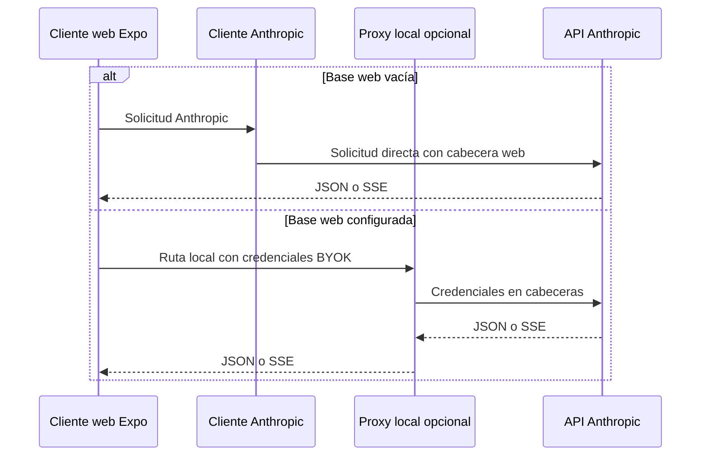

# Proxy Anthropic de depuración web

## Propósito y límite de seguridad

`apps/anthropic_proxy/cors-proxy.py` es una utilidad FastAPI local para diagnosticar desde un navegador el contrato de Anthropic. No tiene sesiones, identidad de aplicación, persistencia ni almacén de claves. **No es un backend de Gymnasia ni un candidato a despliegue**: una instancia compartida intermediaría claves BYOK de otras personas sin aportar una capacidad que la aplicación necesite.

La ruta normal no depende de este proceso. En web, si `EXPO_PUBLIC_API_BASE_URL` está vacío —el valor predeterminado— la app contacta `https://api.anthropic.com` directamente y añade `anthropic-dangerous-direct-browser-access: true`; esa cabecera permite que el navegador lea la respuesta CORS. En nativo no se añade porque no hay un origen web que validar. Una base no vacía solo tiene efecto en web: se recorta y se eliminan sus barras finales, y el cliente construye las rutas locales del proxy. Así una publicación web estática no intenta contactar accidentalmente el `localhost` de quien la abra.


```mermaid
sequenceDiagram
    participant Browser as Cliente web Expo
    participant Client as Cliente Anthropic
    participant Proxy as Proxy local opcional
    participant Anthropic as API Anthropic
    alt Base web vacía
        Browser->>Client: Solicitud Anthropic
        Client->>Anthropic: Solicitud directa con cabecera web
        Anthropic-->>Browser: JSON o SSE
    else Base web configurada
        Browser->>Proxy: Ruta local con credenciales BYOK
        Proxy->>Anthropic: Credenciales en cabeceras
        Anthropic-->>Proxy: JSON o SSE
        Proxy-->>Browser: JSON o SSE
    end
```

*La selección es explícita: Anthropic directo es el comportamiento normal y el proxy solo existe para la rama web local configurada.*

La misma decisión llega a las conversaciones sin streaming, al bucle SSE de conversación con herramientas, al estimador de comida, a la verificación al guardar un proveedor y al descubrimiento de modelos. En la rama proxy las credenciales se serializan en el cuerpo local; en la rama directa se generan las cabeceras de Anthropic en el cliente. Si el proxy configurado no responde, los clientes presentan una indicación para arrancarlo o retirar `EXPO_PUBLIC_API_BASE_URL` y volver al acceso directo.

## Límite de red y operación

El proceso escucha por defecto en `127.0.0.1:8000`. `ANTHROPIC_PROXY_PORT` cambia el puerto y `ANTHROPIC_PROXY_HOST` puede seleccionar una dirección loopback, pero una IP no local hace que el proceso termine con código 2. Hay una segunda barrera por solicitud: un cliente que se puede demostrar remoto recibe `403` antes de validación o de contactar el upstream, incluso si se lanzó Uvicorn en una interfaz amplia, desde un contenedor o tras un túnel. Un host ausente o no interpretable como IP se acepta para `TestClient` y sockets Unix; no autoriza a publicar el servicio.

CORS permite cualquier origen, método y cabecera para que la web local pueda completar el preflight. No equivale a una autorización de red: el cerrojo de cliente loopback sigue siendo el control que impide usar el servicio como puente remoto de secretos.

`npm run check:anthropic-proxy` impide añadir infraestructura de despliegue en `apps/anthropic_proxy`, workflows que arranquen o publiquen el proxy, o un destino fijo suyo en el inventario de red. Un backend compartido requeriría una excepción explícita y un diseño propio de autenticación, aislamiento de secretos y operación; no debe reutilizarse este archivo local como atajo.

### Arranque deliberado

```bash
uv sync --project apps/anthropic_proxy --extra dev
apps/anthropic_proxy/.venv/bin/python apps/mobile/cors-proxy.py
curl -sS http://127.0.0.1:8000/health
```

`apps/mobile/cors-proxy.py` enlaza a la implementación canónica. Esta se mantiene en un único archivo intencionadamente: al ejecutarlo a través del enlace, `sys.path[0]` es `apps/mobile`; un módulo hermano del directorio del proxy haría fallar el arranque documentado aunque las pruebas que cargan la ruta canónica pasaran.

Para seleccionar el proxy en una ejecución web local, defina `EXPO_PUBLIC_API_BASE_URL=http://127.0.0.1:8000`. `ANTHROPIC_PROXY_UPSTREAM_BASE_URL` sustituye `https://api.anthropic.com` solo para pruebas contra un upstream local falso; el proceso avisa por consola cuando está activo. No ponga claves en variables compartidas, documentación, trazas ni respuestas de ejemplo.

## Contrato HTTP y secreto en tránsito

| Ruta local | Responsabilidad | Upstream | Tiempo de espera |
|---|---|---|---|
| `GET /health` | Confirma que responde el proceso; no llama a Anthropic. | Ninguno | — |
| `POST /chat/providers/anthropic/verify` | Comprueba una clave con una petición mínima. | `POST /v1/messages` | 15 s |
| `POST /chat/providers/anthropic/models` | Agrega el catálogo de modelos paginado. | `GET /v1/models` | 15 s por página |
| `POST /chat/providers/anthropic/messages` | Reenvía una petición Messages normal o SSE. | `POST /v1/messages` | 120 s |

Las tres rutas autenticadas reciben `api_key` y, opcionalmente, `workspace_id` en el cuerpo local. El constructor común los excluye siempre del cuerpo ascendente y los transforma respectivamente en `x-api-key` y `anthropic-workspace-id`; también fija `anthropic-version` a `2023-06-01`. Para streaming añade `accept: text/event-stream`. Que las credenciales no salgan en JSON es un invariante central, no una convención de cada handler.

`/verify` y `/models` son contratos del proxy y rechazan campos desconocidos. `/messages` exige y valida los campos conocidos —modelo, `max_tokens`, mensajes y `stream`— pero acepta y reenvía extensiones de Messages, como `system`, `thinking`, herramientas y parámetros futuros. Los límites son 400 caracteres para la clave, 200 para el modelo, 500 mensajes y 200.000 tokens de salida.

Antes de analizar el cuerpo, un `content-length` inválido devuelve `400` y uno declarado por encima de 4 MiB devuelve `413`. JSON inválido, clave ausente o tipos incompatibles devuelven `422`. Sus detalles se acotan y eliminan el valor de entrada que Pydantic habría repetido, para no devolver una clave en un error de validación. CORS es el middleware exterior, por lo que el navegador puede leer también estos fallos.

## Catálogo, errores y streaming

### Catálogo de modelos

La ruta de modelos pide páginas de 100 elementos, como máximo 20, deduplica por `id` y avanza con `last_id`. Si falla la primera página o su forma no se puede interpretar, responde con el error. Si falla una posterior, devuelve lo acumulado marcado con `pagination.partial` y su causa. Marca `pagination.truncated` si alcanza el tope, falta o se repite el cursor, o una página no añade modelos. En ambos casos deja `has_more` en `true`: una lista incompleta no puede aparentar ser completa.

El cliente móvil aplica la misma política al acceder directamente a Anthropic. En web, `collectAnthropicModels` reconoce el envoltorio agregado del proxy y muestra una advertencia cuando `partial` o `truncated` están activos; no vuelve a paginar ese envoltorio. El coordinador de operaciones de configuración descarta respuestas de descubrimiento que ya no correspondan a la revisión vigente de credenciales o configuración.

### Respuestas y fallos previos al stream

Las respuestas no transmitidas se leen como JSON y cierran siempre el upstream. Los errores HTTP de Anthropic con JSON conservan estado y cuerpo; un error HTTP no JSON se normaliza como `upstream_non_json`. Timeout, conectividad y JSON de éxito no interpretable se traducen respectivamente a `504 upstream_timeout`, `502 upstream_unreachable` y `502 upstream_invalid_json`. Antes de devolver texto de upstream o excepciones, el proxy redacta la clave actual y patrones conocidos de secretos, y limita el mensaje a 2.000 caracteres.

### SSE truncado

Para `stream: true`, el proxy entrega `StreamingResponse` con `Cache-Control: no-cache` y `X-Accel-Buffering: no`, lee bloques de 1024 bytes y cierra el upstream incluso ante un corte. Una vez enviadas las cabeceras SSE no puede cambiar el estado HTTP; por eso busca `message_stop` en los bytes reenviados y conserva 32 bytes de solapamiento entre bloques. Si la lectura lanza, inyecta un evento `error` de tipo `upstream_stream_error`; si finaliza sin el marcador, inyecta `truncated_stream`.

`createAnthropicStreamParser` convierte esos eventos de error en una excepción. Así el bucle de conversación no acepta una respuesta parcial como si estuviera completada.

## Pruebas que protegen el contrato

Ejecute la suite aislada desde la raíz:

```bash
npm run test:proxy
npm run check:anthropic-proxy
```

Las pruebas unitarias sustituyen `urlopen`, por lo que no requieren red ni claves reales. Cubren el límite loopback, CORS y preflight, transformación de credenciales, validación y redacción, errores de upstream, paginación y el cierre e inyección de errores SSE. Las pruebas de propiedades generan cuerpos y páginas arbitrarias para asegurar que no surge un `500` sin clasificar, que una clave no llega al cuerpo ascendente y que la paginación termina, no duplica y marca los resultados incompletos.

`test_e2e.py` añade el recorrido con procesos y HTTP reales, pero permanece local: levanta el proxy, un servidor loopback que imita Anthropic, y prueba health, verificación, varias páginas, JSON, preflight y un stream truncado. Es la prueba representativa para cambios que afecten al arranque, a las cabeceras reales o al troceado de SSE.

## Relación con otras áreas

- [Configuración BYOK de proveedores](../agent/provider-configuration.md) explica persistencia, verificación y selección de modelos.
- [Streaming y continuaciones de proveedores](../agent/provider-streaming.md) describe el parser SSE que recibe el error inyectado.
- [Visión general de arquitectura](../architecture/overview.md) sitúa el cliente móvil y sus límites de servicios.
- [Inicio rápido](../quickstart.md) contiene el contexto de ejecución local de la aplicación.

## Fuente de verdad

- `apps/anthropic_proxy/cors-proxy.py`: límite loopback, CORS, contrato, upstream, redacción, paginación y SSE.
- `apps/mobile/App.tsx`, `agent/providerChatClient.ts`, `agent/providerToolClient.ts`, `agent/providerVerification.ts` y `agent/providerCatalog.ts`: selección entre acceso directo y proxy local.
- `apps/anthropic_proxy/tests/`: invariantes y recorrido local de extremo a extremo.
- `scripts/anthropic-proxy/check.mjs`: prevención de despliegue accidental.
