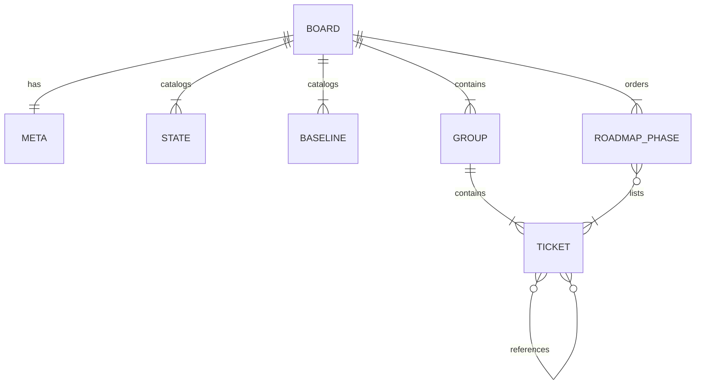
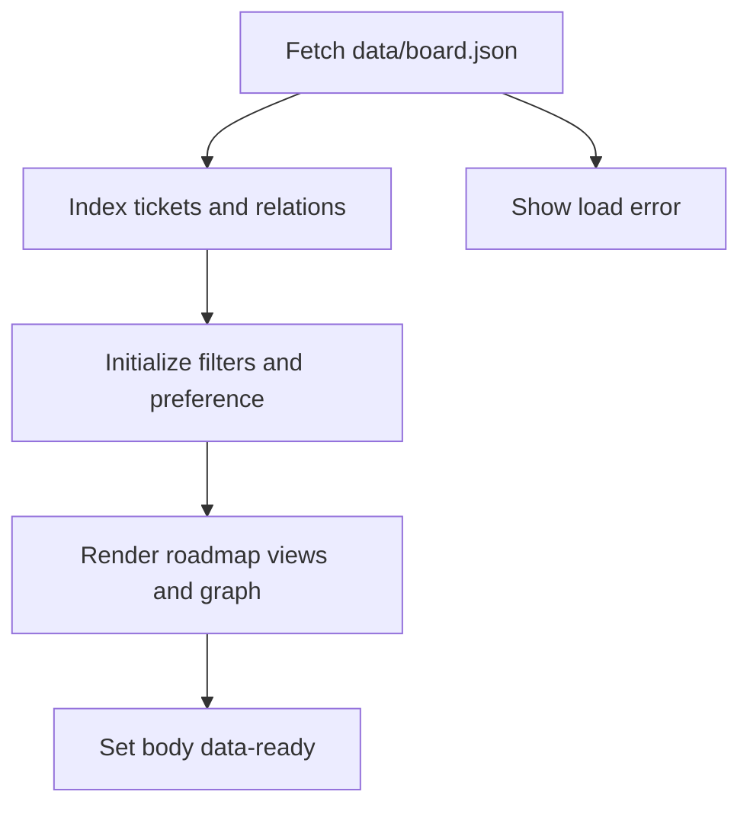
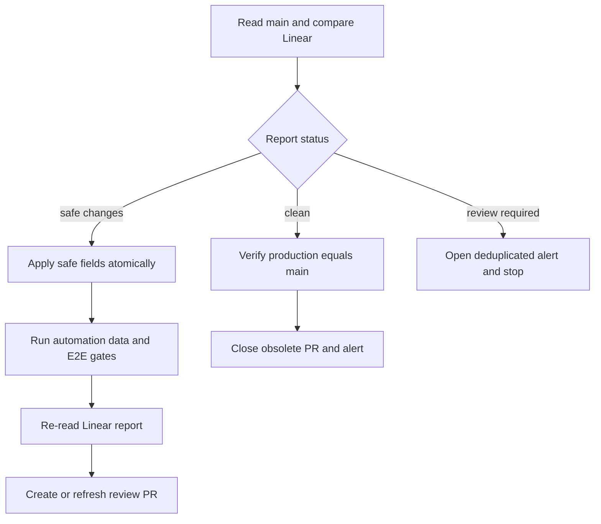
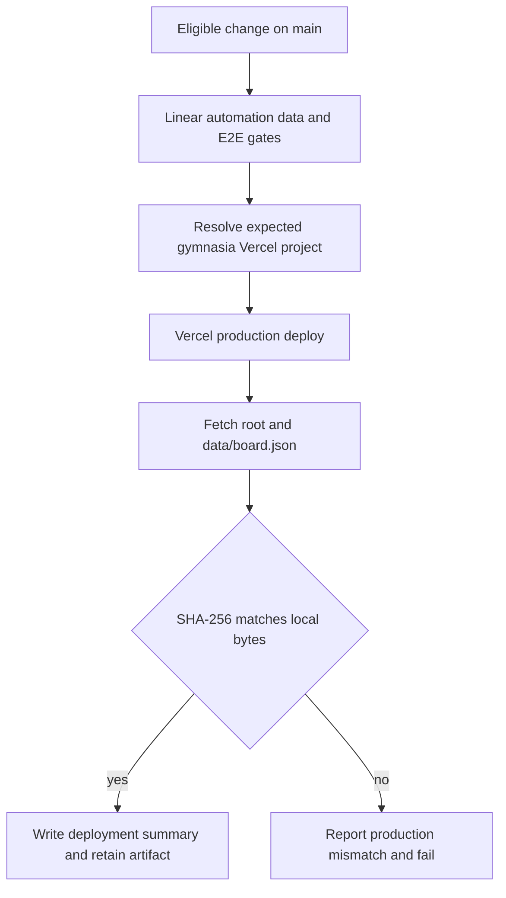

# Tablero de arquitectura y seguimiento

## Alcance y límites

`arquitectura-agente/` es un sitio estático en español que visualiza el espejo de los tickets del equipo GYM de Linear. En ejecución, el navegador únicamente obtiene `data/board.json`; no contiene API de Linear, token, backend, cron ni base de datos. Linear sigue siendo la autoridad ante una discrepancia, pero el espejo ya no depende de una actualización exclusivamente manual: GitHub Actions lo concilia cada seis horas y propone únicamente cambios mecánicos revisables.

No es un runtime del producto. No se importa desde la aplicación Expo, no guarda datos de personas usuarias y no participa en BYOK, políticas firmadas, catálogos ni feedback. Los tickets y sus descripciones pueden registrar planes históricos o trabajo futuro; no demuestran que esos componentes sean ejecutables o estén desplegados.

| Límite | Responsabilidad |
| --- | --- |
| `arquitectura-agente/data/board.json` | Contenido y topología que proyecta el sitio; es el único archivo de datos que modifica la sincronización. |
| `arquitectura-agente/index.html`, `script.js`, `styles.css` | Cascarón, renderizado vanilla y presentación del sitio estático. |
| `.claude/skills/linear-tickets/scripts/linear.py` | Lee Linear, clasifica la deriva y hace sustituciones quirúrgicas en memoria antes de una escritura atómica. |
| `.github/workflows/board-*.yml` | Puertas de integridad, conciliación, propuesta de PR y publicación de producción. |
| `scripts/board-automation/` | Contratos de alertas deduplicadas, cuerpo de PR y verificación criptográfica de producción. |

Como el cliente usa `fetch("data/board.json")`, abrir `index.html` con `file://` no es un modo admitido; use un servidor HTTP estático.

## Modelo y proyecciones del JSON

El objeto raíz contiene `meta`, los catálogos `states` y `baselines`, `groups` y `recommendedOrder`. Un grupo `kind: "epic"` representa una épica de Linear y puede tener estado y relaciones; un `kind: "group"` es una agrupación local. Los tickets tienen identificador, título, estado, resumen y relaciones; `baseline` y `article` HTTPS son opcionales. `meta.ignore` excluye IDs de la conciliación y no puede solaparse con un nodo mostrado.



*El JSON concentra los datos fuente de las tres vistas, la hoja de ruta y las relaciones.*

`dependsOn` significa que el destino bloquea al nodo que lo declara; el grafo lo dibuja bloqueador → bloqueado. `related` solo aporta contexto. Toda referencia debe resolver a un ticket o una épica existente; no se admiten autorreferencias ni ciclos. La validación también impide que un ticket `done` dependa de un bloqueador abierto.

`recommendedOrder` es una recomendación editorial, no otro workflow: los tickets abiertos de épicas deben aparecer exactamente una vez y después de cualquier bloqueador también planificado. Por eso una alta o baja de inventario requiere decisión humana: además del título y estado, puede necesitar grupo, resumen, relaciones y fase.

## Sitio cliente y comportamiento visible

Al cargar el DOM, `script.js` lee el JSON con `cache: "no-cache"`. Si falla HTTP o el parseo, muestra el error de carga sin datos alternativos. Si tiene éxito, construye índices de tickets, bloqueadores y relaciones, inicializa filtros y preferencia de hoja de ruta, renderiza y finalmente marca `body[data-ready="true"]`.



*Una única lectura local alimenta todas las vistas; el navegador no escribe de vuelta a Linear.*

La vista predeterminada **Épicas** conserva expansión durante la sesión y calcula el progreso sobre todos los tickets no cancelados del grupo. **Estado** genera columnas según el orden de `states`; es una proyección kanban sin arrastrar ni mutar datos. Búsqueda y chips de estado se combinan con AND. La vista se refleja en `#epics`, `#states` o `#deps` y hashes inválidos se normalizan a `#epics`.

«Por dónde seguir» elimina de la presentación tickets `done` y `canceled`, oculta fases vacías y renumera las restantes. Su plegado persiste como `gymnasia.board.roadmapCollapsed` en `localStorage`, pero el sitio continúa si el almacenamiento no está disponible.

El grafo incluye extremos de dependencias y, al activar el control correspondiente, relaciones informativas. Calcula niveles a partir de la ruta bloqueante más larga y deduplica relaciones simétricas. La protección de recursión evita que un JSON cíclico bloquee el renderizado, pero no convierte ese JSON en válido: la barrera es `test:board`.

## Conciliación: cambios seguros frente a revisión humana

`linear.py board` consulta hasta 250 tickets del equipo y construye un informe JSON estable (`schemaVersion: 1`) que separa cambios de `states`, `titles`, tickets que faltan en el tablero y entradas que faltan en Linear. Ignora `meta.ignore` y convierte el estado Linear `In Review` a `in_progress`, porque el espejo solo tiene cinco columnas.

- `clean`: no hay deriva.
- `safe_changes`: solo cambiaron estado o título.
- `review_required`: hay altas o bajas de inventario; no se debe hacer una aplicación parcial.

`--format json` produce el informe sin fallar por la deriva. En uso humano, `board` sin aplicar termina con código 1 si hay diferencias. El legado `--apply` actualiza solo estados y `meta.updated`; `--apply-safe` actualiza además títulos, pero rechaza por completo la escritura si el informe exige revisión. Antes de escribir, las sustituciones se hacen y se verifican en memoria; `atomic_write_text` hace `fsync`, conserva permisos y reemplaza el archivo con `os.replace`.



*La conciliación parte de `main`; las altas y bajas se detienen antes de modificar el espejo, y ningún camino fusiona automáticamente la PR.*

`.github/workflows/board-reconcile.yml` se ejecuta por cron a los 17 minutos de cada seis horas o manualmente, y obtiene explícitamente `refs/heads/main`. Si hay revisión humana, publica la alerta y cierra PRs automáticas obsoletas. Para cambios seguros instala dependencias y Chromium, aplica con `--apply-safe`, vuelve a consultar Linear para asegurar que quedó `clean`, ejecuta los controles del tablero y solo entonces crea o actualiza `automation/board-sync`. El push usa `--force-with-lease`; la PR queda para revisión y el workflow no contiene auto-merge.

La automatización mantiene un único issue titulado `[board-sync] El tablero necesita atención`. Busca por un marcador estable, cierra duplicados y usa una huella SHA-256 del payload para no repetir el mismo comentario. Una comprobación sana comenta y cierra las alertas abiertas cuando Linear, `main` y producción vuelven a coincidir.

## Puertas y despliegue a Vercel

`board-ci.yml` se ejecuta en PRs y en cambios relevantes que llegan a `main`; tiene únicamente `contents: read`, no recibe secretos y ejecuta `test:linear`, `test:board-automation`, `test:board` y `test:board:e2e`. El checkout se realiza mediante `git init` y un fetch superficial, evitando recorrer gitlinks heredados.

Un cambio publicable en `main` o una ejecución manual activa `board-deploy.yml`. Su grupo de concurrencia `board-production` cancela despliegues anteriores en curso. El job vuelve a ejecutar las cuatro puertas antes de desplegar. Después usa `vercel@59.16.0 pull --environment=production` y comprueba que la configuración resuelta tenga el nombre `gymnasia` y los IDs de proyecto y organización esperados: evita publicar por error en otro proyecto de Vercel.



*La publicación solo se considera correcta cuando el sitio canónico sirve el tablero esperado y los bytes de `data/board.json` coinciden con `main`.*

La verificación consulta `/` y `/data/board.json` con `cache: "no-store"`, sigue redirecciones y exige que la raíz incluya el título esperado. Calcula SHA-256 sobre bytes locales y remotos; el despliegue reintenta 12 veces cada 5 segundos para tolerar propagación. El resultado —incluidos hashes, commit, URL de despliegue e intentos— se conserva como evidencia: se resume en el job y se sube como artefacto durante 30 días. Un desajuste abre o actualiza la alerta deduplicada y hace fallar el job.

El sitio sigue sin build: `vercel.json` activa `cleanUrls` y desactiva `trailingSlash`. La recuperación manual excepcional puede usar:

```bash
npm exec --yes -- vercel@59.16.0 deploy --prod --yes --cwd arquitectura-agente
```

La ruta normal es el workflow, porque aplica las puertas, valida el proyecto exacto y prueba los bytes publicados. Para comprobar manualmente la producción, use `/`, no `/index.html`.

## Operación y pruebas enfocadas

```bash
npm run test:linear
npm run test:board-automation
npm run test:board
npm run test:board:e2e
```

`npm run test:linear` cubre la clasificación de deriva, el rechazo de aplicación parcial, sustituciones conservadoras y escritura atómica. `npm run test:board-automation` prueba los contratos de alertas y checksum, además de afirmar propiedades críticas de los tres workflows: CI sin secretos de escritura, conciliación desde `main` sin auto-merge y despliegue con gates, proyecto exacto y evidencia.

`npm run test:board` ejecuta `node --test` sin navegador para validar catálogos, identificadores, relaciones, ciclos, coherencia de cierres y cobertura/orden de `recommendedOrder`. `npm run test:board:e2e` inicia un servidor HTTP en `127.0.0.1:8123` (configurable mediante `BOARD_E2E_PORT`) y usa Playwright/Chromium. Verifica la proyección del JSON, preferencias, enlaces, filtros, grafo, relaciones opcionales, pestañas y ausencia de desbordamiento a `390x844`; también falla ante `pageerror` o `console.error`.

Estas suites validan el artefacto estático y su cadena de publicación, no el runtime Expo ni una API de Linear en el navegador. Para el producto ejecutable consulte [Arquitectura local-first](../architecture/overview.md), [Inicio rápido](../quickstart.md) y [Build, release y estrategia de validación](../operations/build-release-and-testing.md).
