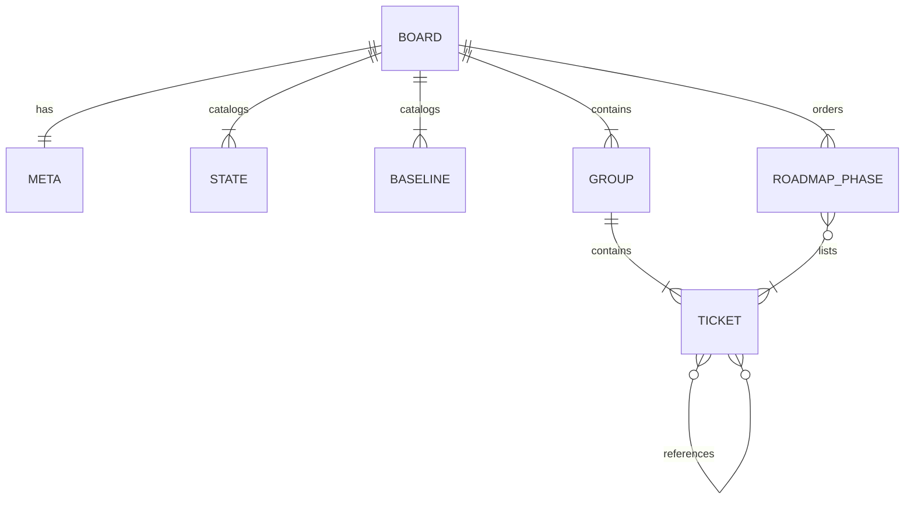
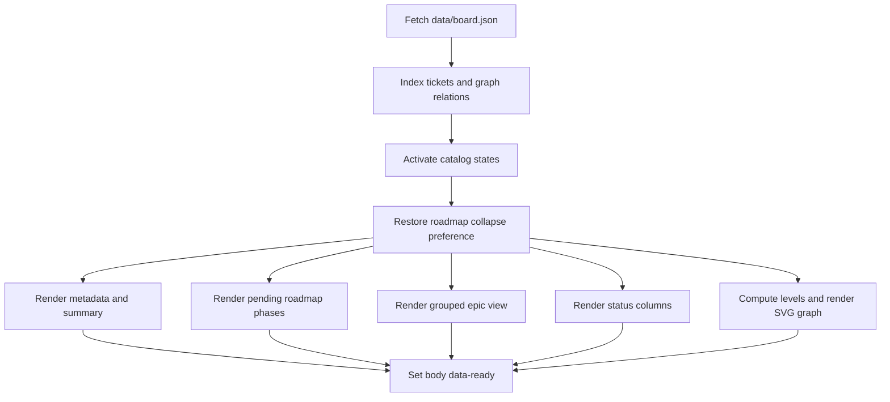
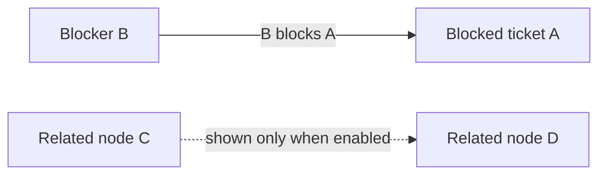

# Panel de arquitectura

## Propósito y autoridad

`arquitectura-agente/` es un sitio estático independiente en español para realizar el seguimiento de épicas y tickets de Gymnasia. Es un **espejo manual de Linear**, no una integración: no hay llamadas a la API de Linear, tokens, sincronización programada, servidor de aplicaciones ni base de datos durante la ejecución del panel. Si Linear y el panel discrepan, Linear es la fuente autorizada.

El sitio desplegado está documentado en `https://gymnasia-sable.vercel.app/`. Su anterior documentación sobre la arquitectura de agentes se trasladó a `https://maximofn.com/gymnasia-agent`; ahora el directorio contiene únicamente el panel de seguimiento.

| Ruta | Responsabilidad |
| --- | --- |
| `arquitectura-agente/data/board.json` | Datos canónicos del panel y superficie normal de actualización |
| `arquitectura-agente/index.html` | Estructura estática, paneles de pestañas, filtros, hoja de ruta y contenedores del grafo SVG |
| `arquitectura-agente/script.js` | Indexación de datos, filtrado, los tres renderizadores, disposición del grafo y estado de interacción |
| `arquitectura-agente/styles.css` | Tokens visuales, diseño adaptable y presentación del grafo |
| `arquitectura-agente/tests/board-data.test.mjs` | Pruebas estructurales y semánticas del contrato de datos mediante `node:test` |
| `arquitectura-agente/tests/board.e2e.mjs` | Comprobaciones de comportamiento en el navegador y diseño adaptable mediante Playwright |
| `arquitectura-agente/vercel.json` | Comportamiento de las URL estáticas de Vercel; sin paso de compilación |

No se admite abrir `index.html` mediante `file://`, ya que la página obtiene `data/board.json`. Utilice un servidor HTTP estático.

## Contrato de datos

El objeto raíz de `board.json` contiene seis colecciones o registros relevantes:

- `meta`: `updated` con el formato `YYYY-MM-DD`, identificador del equipo, `linearBase` HTTPS, nota explicativa e IDs de tickets opcionales en `ignore`. Los IDs ignorados se omiten deliberadamente del espejo y tampoco deben aparecer como nodos del grafo.
- `states`: catálogo ordenado de `{ id, label }`. Su orden controla las columnas de estado y el conjunto inicial de filtros de estado activos.
- `baselines`: catálogo de `{ id, label, icon }` que describe cuánto de la implementación existía antes de comenzar un ticket. Esto es distinto del `state` del flujo de trabajo.
- `groups`: secciones de primer nivel. Los grupos con `kind: "epic"` son nodos de Linear con su propio `state` y sus propias dependencias; `kind: "group"` es una agrupación local, como `otros`, sin estado ni enlace de épica de Linear.
- `groups[].tickets`: las tarjetas reales. El comportamiento requerido depende de `id`, `title`, `state`, `summary`, `dependsOn` y `related`; `baseline` y `article` HTTPS son opcionales.
- `recommendedOrder`: fases ordenadas con un `id` similar a un slug, `title`, justificación en `why` y una lista ordenada de IDs de tickets.

`dependsOn` y `related` pueden apuntar a un ticket o a una épica, pero todos los destinos deben existir en este JSON. No significan lo mismo:

- `A.dependsOn: [B]` significa que **B bloquea a A**. Por tanto, el grafo dibuja su arista dirigida desde B hasta A.
- `related` es informativo, el entorno de ejecución lo trata de forma simétrica y solo aparece en el grafo cuando el usuario activa las relaciones no bloqueantes.
- Los nodos de épicas participan en la indexación de dependencias y utilizan un tratamiento discontinuo distintivo en el grafo.
- Actualmente, un `baseline` solo es válido para los tickets de la épica de llamadas a herramientas `GYM-33`; no es un segundo estado del ticket.



*El JSON del panel contiene los catálogos, los tickets agrupados, las referencias entre nodos y una hoja de ruta con orden independiente.*

La relación de Mermaid es conceptual: las dependencias también pueden apuntar a grupos de épicas, y las pruebas construyen un único mapa de nodos a partir de todos los tickets y los grupos con `kind: "epic"`.

## Ciclo de carga, indexación y renderizado

`script.js` es una IIFE sin dependencias. `init()` obtiene `data/board.json`, lo almacena en memoria, llama a `indexData`, activa todos los estados declarados, restaura la preferencia de la hoja de ruta, renderiza todas las vistas, enlaza los eventos y marca el cuerpo como listo para la sincronización E2E. Un error de carga sustituye el mensaje de carga; no existe una alternativa almacenada en caché.

`indexData` genera los índices del entorno de ejecución:

- `tickets`: del ID del ticket a un ticket ampliado con su `group` propietario;
- `blockedBy`: del ID del nodo a los IDs de los que depende;
- `blocks`: índice inverso de dependencias;
- `relatedTo`: enlaces informativos simétricos.

La página renderiza varias proyecciones de ese estado compartido en lugar de mantener conjuntos de datos separados.



*La estructura estática solo puede utilizarse después de indexar una única carga JSON y proyectarla en todas las vistas.*

### Resumen y vista de épicas

El resumen excluye los tickets cancelados del denominador de finalización. Informa del porcentaje global de finalización, la cantidad de tickets terminados, la cantidad en curso y el trabajo activo restante.

La vista predeterminada de épicas renderiza cada grupo, el progreso del grupo y sus tickets coincidentes. Los tickets comienzan contraídos, mientras que las épicas comienzan expandidas. El estado de expansión se conserva en conjuntos en memoria durante los renderizados activados por filtros, pero no persiste entre visitas. Solo el título del ticket enlaza a `${meta.linearBase}${ticket.id}`; el identificador mostrado no es un enlace de forma intencionada.

### Vista de estados

La proyección de estados crea una columna por cada entrada de `states`, conservando el orden del catálogo. Las tarjetas de tickets se agrupan por su estado actual y utilizan el mismo predicado de búsqueda y estado que la vista de épicas. Se trata de un kanban exclusivamente visual: las tarjetas no se pueden arrastrar y ninguna acción del navegador modifica `board.json` ni Linear.

### Hoja de ruta

`recommendedOrder` se renderiza encima de las pestañas como «Por dónde seguir». Durante el renderizado, elimina los tickets cuyo estado actual es `done` o `canceled`, elimina las fases que quedan vacías y vuelve a numerar las fases visibles sin dejar huecos. Por consiguiente, la sincronización normal de estados hace que el trabajo completado desaparezca sin necesidad de editar las listas de las fases.

Las etiquetas de la hoja de ruta cambian deliberadamente los nombres del catálogo de líneas base respaldado por la fuente para evitar que un ticket abierto con el ID de línea base `done` se confunda con un ticket cerrado: `done` pasa a ser «código ya escrito», `partial` pasa a ser «código a medias» y `missing` pasa a ser «sin código». Se conserva el icono del catálogo. Un posible ID de línea base futuro y desconocido recurre al `label` propio de esa entrada del catálogo; los detalles normales del ticket siguen mostrando la etiqueta del catálogo sin cambios. Este cambio de nombre solo afecta a la presentación: el JSON sigue almacenando el ID de la línea base y la finalización del flujo de trabajo continúa dependiendo únicamente de `ticket.state`.

Un **ticket abierto nuevo dentro de una épica debe añadirse manualmente a exactamente una fase de la hoja de ruta**. Las pruebas rechazan el trabajo de épicas ausente, la pertenencia duplicada a fases, los IDs desconocidos y un orden en el que un ticket preceda a un bloqueador indicado.

La contracción de la hoja de ruta es la única preferencia de la interfaz que persiste. `gymnasia.board.roadmapCollapsed` almacena `"1"` en `localStorage`; su ausencia significa que está expandida. Las excepciones de almacenamiento, incluidas las restricciones del modo privado, hacen que el comportamiento pase a limitarse a la sesión en lugar de detener la inicialización. El encabezado contraído sigue mostrando las cantidades de fases visibles y tickets pendientes.

### Búsqueda y filtros de estado

`matchesFilters` requiere primero que el estado del ticket se encuentre en `activeStates`. Si hay texto de búsqueda, realiza una búsqueda de subcadenas sin distinguir entre mayúsculas y minúsculas en el ID, el título y el resumen del ticket. La búsqueda y los filtros de estado se combinan con semántica AND. Al cambiarlos se vuelven a renderizar las proyecciones de datos, conservando los conjuntos de expansión de tickets y épicas en memoria.

La hoja de ruta se rige por el estado abierto o cerrado, no por el campo de búsqueda ni por las etiquetas de estados activos. Sigue siendo una recomendación global en lugar de un resultado de búsqueda filtrado.

### Vistas direccionadas mediante hash

Las tres pestañas tienen valores hash estables: `#epics`, `#states` y `#deps`. La inicialización lee el hash actual, por lo que una URL directa o una recarga abre la proyección solicitada. Al hacer clic en una pestaña se llama a `setView`, que actualiza el estado ARIA de la pestaña activa, el panel activo y la visibilidad de los filtros y, a continuación, utiliza `history.replaceState` para sustituir el hash en lugar de añadirlo. Los eventos `hashchange` iniciados por el navegador pasan por la misma función. Un hash ausente o no admitido recurre a `epics` y se normaliza como `#epics`; esto selecciona una vista sin conservar el resto del estado de interacción limitado a la sesión.

## Semántica del grafo de dependencias

`computeLevels` asigna a cada nodo incluido la longitud de su **ruta de bloqueo más larga desde un nodo sin dependencias**: no tener prerrequisitos dentro del grafo implica el nivel 0; de lo contrario, el nivel es uno más que el nivel máximo de los prerrequisitos. El cálculo memorizado en profundidad solo utiliza dependencias bloqueantes cuyos extremos se encuentran en el grafo actual. También mantiene un conjunto `visiting` como mecanismo de seguridad durante la ejecución: cuando encuentra un nodo que ya está en la pila de recursión, devuelve el nivel 0 para que una entrada cíclica incorrecta no bloquee el renderizado. Este mecanismo no valida ciclos ni hace que un grafo cíclico sea semánticamente correcto; el conjunto de pruebas de datos de nodos debe rechazar esas entradas antes del despliegue.

`renderGraph` crea el SVG sin una biblioteca de grafos. El grafo incluye los tickets que participan en dependencias, además de los nodos de épicas; cuando los enlaces relacionados están activados, también se incluyen sus extremos. `graphEdges` invierte cada declaración `dependsOn` para mostrarla desde el bloqueador hasta el elemento bloqueado. Como `indexData` hace que `relatedTo` sea simétrico, los pares relacionados se emitirían dos veces; `graphEdges` canoniza cada par no ordenado mediante una clave ordenada y un conjunto `seen`, de modo que se renderiza exactamente una arista informativa discontinua por par cuando `showRelated` está activado.

Dentro de cada nivel, la disposición utiliza una pasada baricéntrica sobre los prerrequisitos ya posicionados: el valor de ordenación de un nodo es la fila media de sus bloqueadores, lo que tiende a enderezar las flechas y reducir los cruces. Los nodos sin una fila predecesora utilizable y los empates baricéntricos recurren de forma determinista al orden del grupo de origen y, después, al orden numérico de los tickets (`GYM-7` antes de `GYM-31`). A continuación, las coordenadas siguen unas dimensiones de nodo, separaciones y márgenes fijos.

Al seleccionar un nodo se alterna `state.selected`. `applySelection` resalta el nodo seleccionado y las aristas incidentes, mientras atenúa el contenido no relacionado del grafo; volver a seleccionarlo elimina el aislamiento. La sección de bloqueadores resume por separado los nodos que bloquean otros trabajos.



*Las flechas de dependencia apuntan desde el prerrequisito hasta el elemento dependiente, mientras que las relaciones no bloqueantes constituyen un contexto visual opcional.*

## Actualización segura del espejo

Para las discrepancias de estado, ejecute el asistente de Linear del repositorio desde la raíz del repositorio:

```bash
python3 .claude/skills/linear-tickets/scripts/linear.py board
python3 .claude/skills/linear-tickets/scripts/linear.py board --apply
npm run test:board
```

El primer comando termina con el estado 1 cuando existen discrepancias. `--apply` solo actualiza los estados de los tickets y `meta.updated`; informa de cambios de título, adiciones y eliminaciones, pero no los aplica. Este límite es intencionado, ya que un ticket nuevo necesita un resumen redactado por una persona y una clasificación correcta de las dependencias, relaciones y ubicación en la hoja de ruta.

Para un ticket nuevo:

1. Añádalo al array `groups[].tickets` correcto con el ID y el título exactos de Linear y un estado respaldado por el catálogo.
2. Escriba un `summary` conciso que describa en qué consiste el trabajo.
3. Coloque los verdaderos prerrequisitos en `dependsOn` y el contexto no bloqueante en `related`.
4. Añada el `baseline` opcional solo donde lo permita el contrato y el `article` opcional únicamente mediante HTTPS.
5. Si se trata de trabajo abierto dentro de una épica, colóquelo una sola vez en `recommendedOrder`, después de cualquier bloqueador abierto.
6. Ejecute la prueba de datos específica y, después, la prueba de navegador cuando puedan verse afectados el renderizado, la interacción, el CSS o el comportamiento del grafo.

No edite manualmente el DOM generado ni duplique datos en `index.html`; todo el contenido de los tickets debe estar en `board.json`.

## Pruebas y validación

### Prueba rápida del contrato

```bash
npm run test:board
# exact underlying command
node --test arquitectura-agente/tests/board-data.test.mjs
```

Este conjunto demuestra los **invariantes del grafo y de los datos directamente a partir de `board.json`**, sin navegador: integridad de los metadatos y catálogos, IDs válidos y no duplicados, estructura de los grupos, valores válidos de estado, línea base y artículo, separación de IDs ignorados, existencia de los destinos de las relaciones, ausencia de autorreferencias, aciclicidad de las dependencias, coherencia entre tickets cerrados y bloqueadores, ámbito de las líneas base y existencia, cobertura, unicidad y orden de dependencias de la hoja de ruta. En particular, esta es la prueba autorizada de que la entrada de dependencias es acíclica; que `computeLevels` devuelva 0 al volver a entrar en una recursión es solo un mecanismo de seguridad del renderizador.

### Prueba de navegador

```bash
npm run test:board:e2e
npm run test:board:e2e:headed
```

El script E2E inicia de forma predeterminada su propio servidor estático en `127.0.0.1:8123`; puede sobrescribirse mediante `BOARD_E2E_PORT`. `BOARD_E2E_HEADLESS=0` muestra Chromium.

El conjunto de Playwright demuestra **afirmaciones de renderizado, disposición e interacción en Chromium**, no la validez abstracta del JSON. Comprueba la paridad de tickets y grupos entre JSON y DOM; la visibilidad de la hoja de ruta, el filtrado de elementos cerrados, el orden de origen, la numeración contigua, la ubicación, el ARIA de contracción y la persistencia tras recargar; la ubicación de los enlaces de Linear; la expansión de tickets y épicas y su conservación entre renderizados; la búsqueda; las columnas y tarjetas de la pestaña de estados; la cantidad de aristas de dependencia; el comportamiento del control de aristas relacionadas; el resaltado al seleccionar nodos; la activación de pestañas al recorrer todas las vistas; y la ausencia de desbordamiento horizontal de toda la página a `390x844`. También falla si el navegador emite `pageerror` o `console.error`.

Estos límites de verificación son importantes:

| Afirmación | Evidencia |
| --- | --- |
| Las referencias existen, los IDs son únicos, las líneas base están respaldadas por el catálogo y limitadas a `GYM-33`, las dependencias son acíclicas y la pertenencia y el orden de la hoja de ruta son válidos | `board-data.test.mjs` sobre los datos de nodos |
| Los IDs de líneas base del catálogo solo cambian de nombre en las etiquetas de la hoja de ruta | Código fuente de `ROADMAP_BASELINE_LABEL` y `renderRoadmap`; la prueba E2E actual no verifica las cadenas exactas con los nuevos nombres |
| La selección de vistas se inicializa y sincroniza mediante `location.hash`, y los hashes no válidos se normalizan como `#epics` mediante `replaceState` | Código fuente de `setView`, `hashchange` e `init`; la prueba E2E actual ejercita la activación de pestañas, pero no verifica directamente la semántica de la URL o del historial |
| Los niveles utilizan la profundidad máxima de prerrequisitos, la recursión cíclica dispone de un mecanismo que evita bloqueos, los niveles utilizan ordenación baricéntrica con criterios deterministas para resolver empates y los enlaces relacionados simétricos se deduplican | Código fuente de `computeLevels`, `renderGraph` y `graphEdges`; la aciclicidad de los datos se demuestra por separado mediante la prueba de nodos |
| Las tarjetas, la hoja de ruta, las aristas del grafo, el control de relaciones, el resaltado de selección, el comportamiento de contracción, la contención adaptable y la ejecución sin errores en el navegador se renderizan e interactúan según lo esperado | `board.e2e.mjs` con Playwright |

Las pruebas del panel son scripts raíz, pero no están incluidas en el flujo de trabajo determinista móvil de GitHub Actions. Ejecútelas explícitamente cuando haya cambios en el panel.

## Operación local y despliegue

```bash
npx --yes serve arquitectura-agente
```

Cualquier servidor estático equivalente sirve. Vercel publica el directorio tal cual; `vercel.json` únicamente activa las URL limpias y desactiva las barras finales. Este servicio no tiene ningún comando de instalación ni compilación.

Un envío a `main` **no** despliega el panel porque la integración con Git de Vercel del repositorio está inactiva. Cuando las pruebas hayan pasado, despliegue manualmente desde la raíz del repositorio:

```bash
npm exec --yes -- vercel@latest deploy --prod --yes --cwd arquitectura-agente
```

Utilice `npm exec --` en lugar de `npx` en el entorno documentado, donde un hook reescribe `npx` de forma incompatible. Se espera que la autenticación proceda de la sesión existente de la CLI de Vercel. Verifique `/`, no `/index.html`: con `cleanUrls`, esta última dirección responde con una página de redirección.

## Límites operativos y modos de fallo

- El panel puede quedar desactualizado sin ninguna advertencia durante la ejecución, ya que la página nunca consulta Linear.
- `--apply` es deliberadamente insuficiente para tickets nuevos, renombrados o eliminados; revise su informe y edite manualmente los campos semánticos.
- Las referencias desconocidas y los ciclos romperían el significado del grafo, por lo que `npm run test:board` es la comprobación mínima para cada cambio de datos.
- El renderizado en el navegador presupone catálogos y referencias válidos; la validación se realiza durante las pruebas, no mediante un analizador de JSON en producción.
- Solo la contracción de la hoja de ruta persiste tras recargar. La expansión de tickets y épicas, la búsqueda, el nodo seleccionado del grafo, la vista, las etiquetas de estado y la selección de aristas relacionadas son estados de la sesión.
- El despliegue es manual e independiente de la aplicación web de Expo y del proceso de publicación de Android.