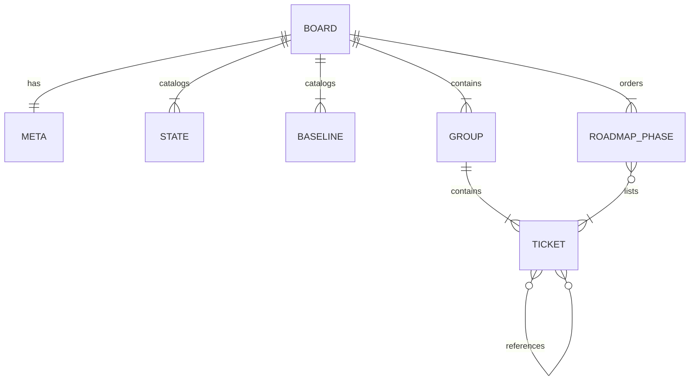
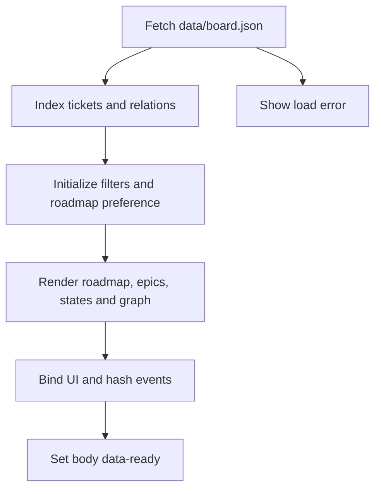
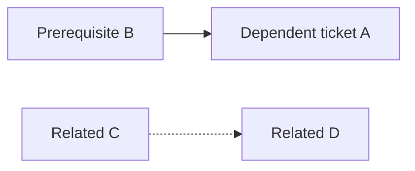

# Tablero de arquitectura y seguimiento

## Alcance y frontera arquitectónica

`arquitectura-agente/` es un sitio estático en español que muestra un espejo manual de los tickets del equipo GYM de Linear. Carga `data/board.json` en el navegador y no contiene API de Linear, token, cron, backend ni base de datos. Por tanto, Linear es la autoridad si ambos difieren; el tablero es un artefacto de seguimiento que debe actualizarse y desplegarse explícitamente.

No debe confundirse con la arquitectura ejecutable actual. El producto se ejecuta desde `apps/mobile` como cliente Expo local-first; el tablero no es importado por `App`, no conserva datos de personas usuarias y no interviene en llamadas BYOK, política firmada, catálogos ni feedback. Sus tickets pueden describir trabajo futuro, auditorías o planes históricos —por ejemplo, sobre agentes—, pero esos textos no prueban que tales planes sean componentes desplegados.

El sitio publicado indicado por su README es `https://gymnasia-sable.vercel.app/`. El contenido anterior de documentación de agentes se trasladó a `https://maximofn.com/gymnasia-agent`; el directorio actual queda limitado al tablero.

| Límite | Responsabilidad |
| --- | --- |
| `arquitectura-agente/data/board.json` | Fuente canónica del contenido y de la topología que proyecta el tablero. |
| `arquitectura-agente/index.html` | Estructura accesible estática: cabecera, hoja de ruta, pestañas, filtros y contenedores. |
| `arquitectura-agente/script.js` | Carga JSON, índices en memoria, estado de interfaz, renderizado y grafo SVG sin dependencias. |
| `arquitectura-agente/tests/` | Validación del contrato de datos y comportamiento visible en navegador. |
| `arquitectura-agente/vercel.json` | Configuración de URL estática; no hay compilación ni runtime de servidor. |

Como el navegador usa `fetch("data/board.json")`, abrir `index.html` con `file://` no es un modo admitido: hace falta un servidor HTTP estático.

## Modelo de datos y sus invariantes

El objeto raíz de `board.json` reúne:

- `meta`: fecha `updated`, equipo, prefijo HTTPS de tickets de Linear, nota y `ignore`. Un ID ignorado no puede aparecer también como nodo del tablero.
- `states`: catálogo ordenado de estados; determina los filtros iniciales y el orden de las columnas de la vista Estado.
- `baselines`: catálogo de punto de partida del código (`done`, `partial`, `missing`), independiente de `ticket.state`. Puede usarse en tickets dentro de una épica y se oculta en las tarjetas cerradas.
- `groups`: agrupaciones de primer nivel. Un `kind: "epic"` tiene ID de Linear, estado y puede declarar dependencias; `kind: "group"` es agrupación local y no tiene por qué ser una épica de Linear.
- `groups[].tickets`: trabajo mostrado, con ID, título, estado, resumen y relaciones; `baseline` y `article` HTTPS son opcionales.
- `recommendedOrder`: fases manuales con motivo y lista ordenada de IDs para responder qué trabajo pendiente abordar.



*El JSON concentra catálogos, tickets, fases y referencias; las épicas también pueden ser extremos de una referencia.*

`dependsOn` expresa bloqueo: si A declara `dependsOn: [B]`, B bloquea A y la flecha se representa B → A. `related` es contexto no bloqueante. Todo destino debe existir entre los tickets o las épicas del JSON, y no se permiten autorreferencias ni ciclos de dependencia. La prueba de datos exige además que un ticket `done` no dependa de un bloqueador todavía abierto.

La hoja de ruta es una segunda proyección ordenada, no un estado de workflow. Todos los tickets abiertos de una épica deben figurar exactamente una vez en ella; los IDs deben existir y ningún ticket puede preceder a un bloqueador que también esté planificado. Al añadir trabajo abierto a una épica, actualizar `recommendedOrder` forma parte del cambio de datos.

## Carga, estado y vistas

Al cargarse el DOM, la IIFE de `script.js` obtiene el JSON con `cache: "no-cache"`. Si la respuesta HTTP falla o el JSON no puede leerse, reemplaza el mensaje de carga por el error y no presenta datos alternativos. Si tiene éxito, inicializa todos los filtros de estado, recupera la preferencia de la hoja de ruta, indexa relaciones y renderiza las proyecciones antes de marcar `body[data-ready="true"]`.



*Una sola carga JSON alimenta todas las vistas; no hay sincronización de vuelta hacia Linear ni estado persistido de los tickets.*

`indexData` construye en memoria un mapa de tickets con su grupo propietario, el índice `blockedBy`, su inverso `blocks` y `relatedTo` simétrico. Las épicas entran en los índices de relaciones junto a los tickets. Así, vistas y etiquetas de bloqueo comparten la misma topología en vez de mantener copias de datos.

La vista **Épicas** es la predeterminada. Muestra grupos que tengan tickets que satisfagan filtros; calcula progreso sobre todos los tickets no cancelados del grupo, no sobre el resultado filtrado. Los detalles de tickets empiezan contraídos y las épicas expandidas; ambos conjuntos de expansión sobreviven a los re-renderizados de la sesión, pero no a una visita nueva. Solo los títulos enlazan a Linear.

La vista **Estado** genera una columna por cada entrada activa de `states`, en el mismo orden del catálogo. Es una proyección visual tipo kanban: no admite arrastrar tarjetas y no modifica el JSON ni Linear. La búsqueda y los chips de estado se combinan con AND: busca sin distinguir mayúsculas en ID, título y resumen, y vuelve a renderizar Épicas y Estado.

La vista activa se refleja en `#epics`, `#states` o `#deps`. `setView` actualiza ARIA, paneles y visibilidad de filtros; normaliza hashes vacíos o desconocidos a `#epics` con `history.replaceState`. Los cambios de hash del navegador pasan por el mismo control. La vista y los filtros no se guardan entre recargas.

## Hoja de ruta y preferencia persistente

«Por dónde seguir» aparece antes de las pestañas. Al renderizar, descarta tickets `done` y `canceled`, oculta las fases que quedan vacías y vuelve a numerar las visibles, por lo que actualizar estados basta para retirar trabajo terminado sin editar cada fase. Esta proyección no se filtra por búsqueda ni por chips de estado: sigue siendo una recomendación global.

Para no confundir punto de partida y cierre, sus etiquetas especiales dicen «código ya escrito», «código a medias» y «sin código», aunque el catálogo de línea base conserve sus etiquetas normales. Solo es una diferencia de presentación.

La contracción de la hoja de ruta es la única preferencia persistente: `gymnasia.board.roadmapCollapsed` guarda `"1"` en `localStorage`. Si el almacenamiento está bloqueado, la página continúa y el estado solo dura la sesión. El recuento de fases y tickets pendientes permanece en la cabecera contraída.

## Dependencias y grafo

El grafo incluye los extremos de dependencias; al activar «Mostrar también relaciones no bloqueantes», incorpora también los extremos de `related`. `graphEdges` invierte la declaración de `dependsOn` para dibujar bloqueador → bloqueado y deduplica cada par relacionado simétrico, por lo que hay una sola arista discontinua por relación informativa.

`computeLevels` coloca un nodo en el nivel de su ruta bloqueante más larga: un nodo sin prerrequisitos incluidos queda en nivel 0 y uno con dependencias queda un nivel después de su prerrequisito más profundo. Mantiene un conjunto de recursión para devolver nivel 0 ante un ciclo y evitar bloquear el renderizado; no es validación de ciclos ni hace correcto un JSON cíclico. La prueba de datos es la barrera que debe impedir esa entrada.

Dentro de un nivel, el renderizador ordena por el baricentro de las filas de bloqueadores ya posicionados para reducir cruces; sin predecesor o en empate, usa de forma determinista el orden del grupo y el número de ticket. Dibuja el SVG con dimensiones, huecos y márgenes fijos. Seleccionar un nodo, también con teclado mediante Enter o espacio, resalta sus aristas incidentes y atenúa los elementos no conectados; seleccionarlo de nuevo elimina el aislamiento. La lista de bloqueadores muestra solo nodos que bloquean más de un destino.



*Las aristas sólidas son bloqueos dirigidos; las discontinuas solo aparecen con el control de relaciones activado y no determinan el nivel.*

## Actualizar y desplegar el espejo

El asistente `linear.py board` consulta Linear y compara sus tickets con las entradas del JSON, ignorando los IDs de `meta.ignore`. Sin `--apply` termina con estado 1 cuando detecta diferencias. Con `--apply` solo sustituye estados y `meta.updated`; títulos, altas y bajas se informan para revisión humana, porque requieren resumen, agrupación, relaciones y posiblemente fase de hoja de ruta. El estado de Linear `In Review` se mapea a `in_progress`, ya que el tablero solo modela cinco columnas.

```bash
python3 .claude/skills/linear-tickets/scripts/linear.py board
python3 .claude/skills/linear-tickets/scripts/linear.py board --apply
npm run test:board
```

Para un ticket nuevo, añádalo al `groups[].tickets` adecuado con título y estado válidos, redacte el resumen, clasifique bloqueo frente a relación, y añada `article` solo si es HTTPS. Si está abierto dentro de una épica, añádalo una sola vez en `recommendedOrder` después de sus bloqueadores planificados. No duplique contenido de tickets en `index.html` ni edite el DOM generado: `board.json` es el origen.

Ejecute el sitio localmente con cualquier servidor HTTP, por ejemplo:

```bash
npx --yes serve arquitectura-agente
```

Vercel sirve el directorio sin instalación ni build; `vercel.json` habilita `cleanUrls` y desactiva `trailingSlash`. No hay workflow de GitHub Actions que ejecute las pruebas del tablero, por lo que deben invocarse explícitamente al modificarlo. El README indica despliegue manual desde la raíz:

```bash
npm exec --yes -- vercel@latest deploy --prod --yes --cwd arquitectura-agente
```

Use `npm exec --` en el entorno documentado; tras desplegar, compruebe `/`, no `/index.html`, porque las URL limpias redirigen esa última ruta.

## Pruebas enfocadas

```bash
npm run test:board
npm run test:board:e2e
npm run test:board:e2e:headed
```

`npm run test:board` ejecuta `node --test arquitectura-agente/tests/board-data.test.mjs` sin navegador ni dependencias externas. Es el control mínimo para modificaciones del JSON: valida catálogos y metadatos, IDs y grupos, estados y artículos, referencias, ausencia de ciclos, coherencia de tickets cerrados con bloqueadores, uso de línea base y cobertura, unicidad y orden de la hoja de ruta.

`npm run test:board:e2e` inicia su propio servidor HTTP en `127.0.0.1:8123` —configurable con `BOARD_E2E_PORT`— y usa Chromium mediante Playwright; `BOARD_E2E_HEADLESS=0` lo muestra. Comprueba que grupos y tickets del JSON lleguen al DOM, las reglas visibles de baseline y hoja de ruta, persistencia del plegado, enlaces a Linear, expansión, búsqueda, columnas por estado, aristas y selección del grafo, relaciones opcionales, pestañas y ausencia de desbordamiento horizontal a `390x844`. También falla ante `pageerror` o `console.error`.

Estas suites validan el artefacto estático, no el runtime de Expo ni una integración de Linear. Para validar el producto ejecutable y sus releases, consulte [Arquitectura local-first](../architecture/overview.md), [Inicio rápido](../quickstart.md) y [Build, release y estrategia de validación](../operations/build-release-and-testing.md).
