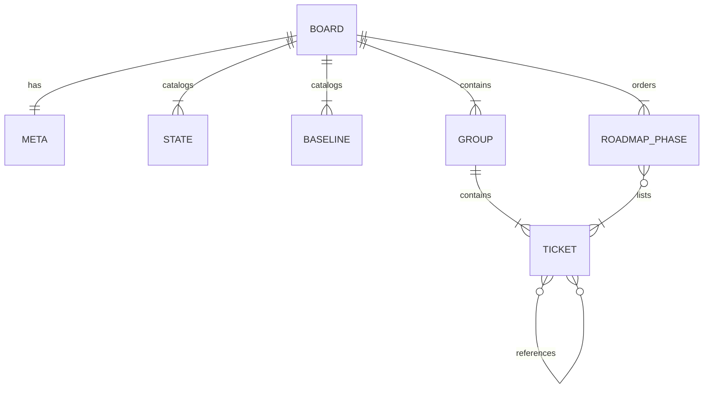
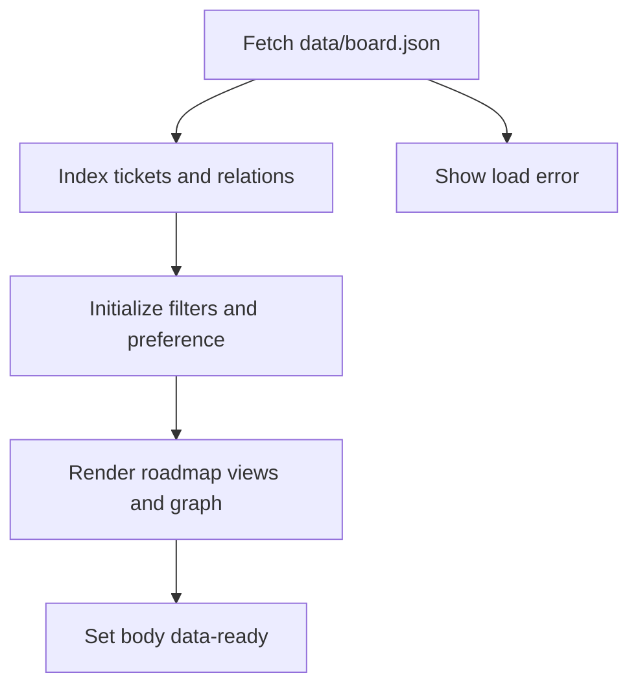
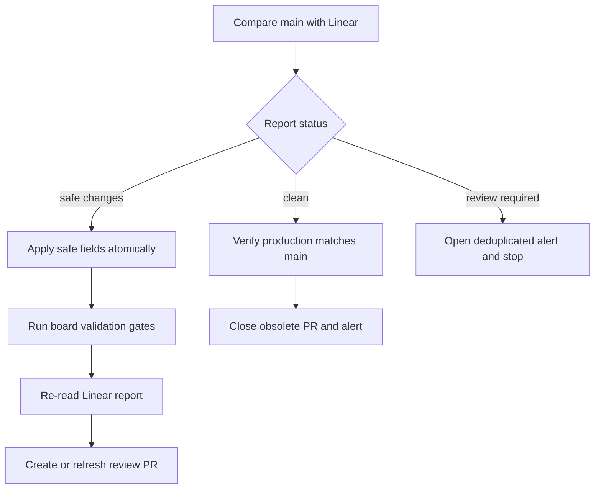
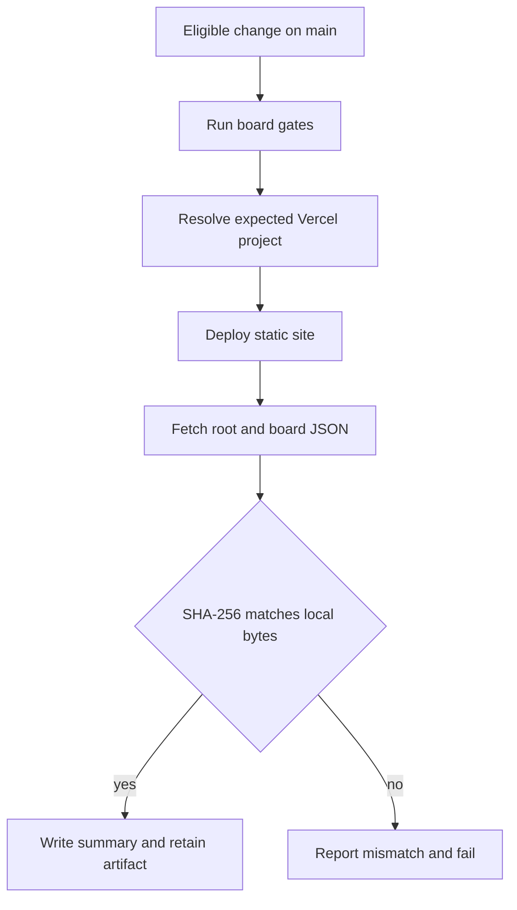

# Tablero de arquitectura

## Propósito, alcance y límite de autoridad

`arquitectura-agente/` es un sitio estático en español que presenta un espejo del trabajo planificado del equipo GYM en Linear. El navegador descarga `data/board.json` y lo proyecta localmente; no llama a Linear ni opera una API, token, backend, cron o base de datos. Si el JSON y Linear discrepan, Linear es la fuente de autoridad.

Este tablero **no es un componente del runtime de Gymnasia**. La entrada del sitio carga solamente sus recursos estáticos, mientras que la aplicación móvil se inicia por separado con Expo. Tampoco procesa datos de personas usuarias ni participa en BYOK, la política remota, catálogos, feedback o persistencia local de la app.

> **Cómo leer el contenido:** tickets, resúmenes y líneas base son planificación y, en algunos casos, una fotografía editorial de trabajo histórico. No prueban por sí mismos que una función esté implementada, integrada, desplegada o mantenida. Para describir los componentes ejecutables actuales, use la [arquitectura local-first](../architecture/overview.md) y el [inicio rápido](../quickstart.md).

| Frontera | Responsabilidad |
| --- | --- |
| `arquitectura-agente/data/board.json` | Fuente de contenido y topología de las vistas; es el único archivo de datos que modifica la conciliación automática. |
| `arquitectura-agente/index.html`, `script.js`, `styles.css` | Cascarón HTML, renderizado vanilla y presentación del sitio. |
| `.claude/skills/linear-tickets/scripts/linear.py` | Consulta Linear, clasifica la deriva y aplica exclusivamente cambios admitidos al espejo. |
| `.github/workflows/board-*.yml` | Puertas de integridad, conciliación revisable y despliegue de producción. |
| `scripts/board-automation/` | Contratos de PR, alertas deduplicadas y comprobación de producción. |

El cliente usa `fetch("data/board.json")`; abrir `index.html` mediante `file://` no es un modo de desarrollo válido. Sirva el directorio por HTTP, por ejemplo:

```bash
npx --yes serve arquitectura-agente
```

## Contrato editorial de `board.json`

El objeto raíz contiene:

- `meta`: fecha editorial `updated`, equipo, prefijo HTTPS de enlaces a Linear y `ignore`. Los IDs ignorados deben tener formato `GYM-<número>` y no pueden aparecer simultáneamente en el tablero.
- `states`: catálogo y orden de las columnas de estado.
- `baselines`: catálogo del punto de partida (`done`, `partial`, `missing`). Es distinto del estado del ticket en Linear: expresa una evaluación editorial de código ya existente.
- `groups`: agrupaciones con tickets. Un grupo `kind: "epic"` es una épica de Linear, tiene ID y estado; un `kind: "group"` es una agrupación local sin esas propiedades de Linear.
- `recommendedOrder`: fases editoriales con `id`, título, justificación y tickets recomendados.



*El JSON es una fuente única para las proyecciones del sitio, sus relaciones y la hoja de ruta editorial.*

Un ticket debe tener ID `GYM-<número>`, título y un estado del catálogo. `baseline` y `article` son opcionales, pero el artículo debe usar HTTPS. Los IDs de tickets y épicas son únicos; tanto `dependsOn` como `related` deben resolver a un ticket o épica existente y no pueden ser autorreferencias.

`dependsOn` significa «el destino bloquea al nodo que la declara»; el grafo por tanto dibuja **bloqueador → bloqueado**. `related` es únicamente contexto. El grafo de dependencias debe ser acíclico, y un nodo `done` no puede depender de otro que siga abierto. Estas reglas son de integridad del espejo, no una representación de un scheduler o workflow ejecutable del producto.

`recommendedOrder` tampoco ejecuta trabajo ni sincroniza Linear. Es una recomendación mantenida por personas: cada ticket abierto de una épica debe aparecer exactamente una vez; los bloqueadores que también están planificados deben estar antes que el ticket bloqueado. Por eso una alta o baja de inventario requiere criterio humano además de copiar el estado o título: puede necesitar grupo, resumen, relaciones y fase editorial.

## Carga y proyecciones en el navegador

Al cargar el DOM, `script.js` solicita el JSON con `cache: "no-cache"`. Tras una respuesta correcta crea índices en memoria de tickets, dependencias y relaciones; inicializa filtros y preferencia de la hoja de ruta; renderiza todas las vistas; elimina el indicador de carga y finalmente establece `body[data-ready="true"]`. Si el HTTP o el parseo fallan, muestra el error de carga y no usa datos alternativos.



*Una lectura del JSON alimenta todas las vistas; ninguna interacción escribe de vuelta a Linear.*

Las tres vistas son proyecciones de los mismos datos:

- **Épicas** es la vista inicial. Ordena tickets por número, permite plegar tickets y grupos, y calcula el progreso sobre todos los tickets no cancelados del grupo, no sobre el subconjunto filtrado.
- **Estado** crea columnas según el orden de `states`; es un kanban de lectura, sin drag-and-drop ni mutación de datos.
- **Dependencias** muestra cuellos de botella y un SVG calculado localmente. El hash de URL selecciona `#epics`, `#states` o `#deps`; un valor desconocido se normaliza a `#epics`.

La búsqueda por ID, título o resumen y los chips de estado se combinan con AND en las vistas de épicas y estado. No se aplican al grafo: en ese caso manda la topología completa. La selección de un nodo resalta las aristas adyacentes; el control opcional incorpora relaciones informativas sin eliminar dependencias.

El grafo incluye los extremos de dependencias. Sus niveles siguen el camino bloqueante más largo y las relaciones simétricas se deduplican. Un guard de recursión evita que un JSON cíclico cuelgue el navegador, pero no legitima ciclos: `npm run test:board` es la barrera que debe impedir que lleguen al sitio.

### Hoja de ruta «Por dónde seguir»

La hoja de ruta aparece antes de las pestañas. Al renderizarla se excluyen tickets `done` y `canceled`, se ocultan fases que queden vacías y se renumeran las fases visibles. Por tanto, la presentación se actualiza al cambiar estados, pero la cobertura y el orden de `recommendedOrder` siguen siendo una responsabilidad editorial protegida por tests.

Su plegado persiste bajo la clave `gymnasia.board.roadmapCollapsed` de `localStorage`. Es la única preferencia persistente porque es un bloque fijo de cabecera; si el almacenamiento está bloqueado o falla, el tablero continúa y el plegado solo dura la sesión.

## Conciliación con Linear: automatizar solo lo mecánico

`linear.py board` compara el espejo con Linear y produce un informe JSON de `schemaVersion: 1`. Separa cambios de `states`, `titles`, entradas que faltan en el tablero y entradas que faltan en Linear. Normaliza el estado remoto `In Review` como `in_progress`, ya que el espejo usa ese catálogo de cinco estados.

| Resultado | Tratamiento |
| --- | --- |
| `clean` | No hay deriva. |
| `safe_changes` | Solo cambiaron estados o títulos; puede generarse una propuesta revisable. |
| `review_required` | Hay altas o bajas de inventario; no se permite aplicar una actualización parcial. |

En comprobación humana, `board` sin aplicación termina con código 1 ante diferencias. `--format json` conserva una salida apta para automatización sin fallar solo por deriva. El legado `--apply` actualiza estados y `meta.updated`; `--apply-safe` actualiza además títulos, pero rechaza por completo la escritura si requiere revisión humana.

Antes de persistir, la aplicación segura se construye y verifica en memoria. La escritura atómica sincroniza un temporal, conserva permisos y lo reemplaza mediante `os.replace`; así evita que una interrupción deje un `board.json` parcialmente actualizado.



*Las altas y bajas se detienen antes de tocar el espejo; los cambios seguros llegan a una PR, nunca a una fusión automática.*

El workflow `board-reconcile.yml` se ejecuta por cron a los 17 minutos de cada seis horas o manualmente. Obtiene explícitamente `refs/heads/main`, en vez del estado de una rama disparadora. Ante revisión humana abre o actualiza la alerta y cierra propuestas automáticas obsoletas. Para cambios seguros instala dependencias y Chromium, aplica `--apply-safe`, vuelve a consultar Linear y exige estado `clean`, ejecuta los controles del tablero y solo entonces crea o refresca `automation/board-sync`. El push con `--force-with-lease` protege frente a sobrescribir una rama remota inesperadamente; no existe auto-merge.

La automatización conserva un único issue titulado `[board-sync] El tablero necesita atención`, identificado por marcador estable. Cierra duplicados y usa una huella SHA-256 del payload para no repetir el mismo comentario. Cuando Linear, `main` y producción vuelven a coincidir, comenta y cierra las alertas abiertas.

## Integridad, despliegue y operación

Las puertas relevantes se ejecutan así:

```bash
npm run test:linear
npm run test:board-automation
npm run test:board
npm run test:board:e2e
```

`npm run test:board` usa `node --test` sin navegador. Valida catálogos, IDs, referencias, unicidad, aciclicidad, coherencia de tickets cerrados y las reglas de cobertura, unicidad y dependencias de `recommendedOrder`.

`npm run test:board:e2e` inicia un servidor HTTP en `127.0.0.1:8123` —configurable con `BOARD_E2E_PORT`— y abre Chromium con Playwright. Comprueba que el JSON llegue a pantalla, el plegado y su persistencia, enlaces, filtros, pestañas, grafo y relaciones opcionales; además falla ante `pageerror`, `console.error` o desbordamiento horizontal a `390x844`. Estas suites validan el artefacto estático, no el runtime Expo ni una API de Linear dentro del navegador.

`board-ci.yml` se activa en PR y cambios relevantes de `main`, tiene solo `contents: read`, no recibe secretos de escritura y ejecuta las cuatro puertas. El checkout deliberadamente usa `git init` y un fetch superficial, evitando recorrer gitlinks heredados.

El despliegue normal se produce desde `main` mediante `board-deploy.yml`; su grupo de concurrencia cancela despliegues anteriores. Vuelve a ejecutar las cuatro puertas antes de usar `vercel@59.16.0`. Tras `pull --environment=production`, exige que el proyecto resuelto se llame `gymnasia` y que sus IDs de proyecto y organización coincidan con los secretos esperados. Esta comprobación reduce el riesgo de publicar accidentalmente en otro destino.



*La publicación solo se acepta cuando la URL canónica sirve el tablero esperado y los bytes publicados de `data/board.json` coinciden con `main`.*

La verificación consulta `/` y `/data/board.json` con `cache: "no-store"`, sigue redirecciones, exige el título HTML esperado y compara SHA-256 de bytes locales y remotos. Reintenta 12 veces cada 5 segundos para tolerar propagación. Conserva el commit, URL, hashes e intentos en el resumen del job y en un artefacto durante 30 días; ante fallo abre o actualiza la alerta deduplicada y falla el job.

No hay build del sitio: `vercel.json` activa `cleanUrls` y desactiva `trailingSlash`. Solo ante recuperación excepcional puede desplegarse manualmente:

```bash
npm exec --yes -- vercel@59.16.0 deploy --prod --yes --cwd arquitectura-agente
```

La vía normal sigue siendo el workflow, porque aplica las puertas, valida el proyecto de destino y verifica producción. Para comprobar la URL publicada use `/`, no `/index.html`.

## Cambio seguro del tablero

1. Trate un cambio en Linear como una discrepancia que debe conciliarse, no como una modificación directa del comportamiento de la aplicación.
2. Para cambios de título o estado, consulte primero el informe y use la ruta segura o espere la PR automática.
3. Para una alta, baja, agrupación, dependencia, resumen o fase, edite el JSON con criterio humano y mantenga sus invariantes, especialmente `recommendedOrder`.
4. Ejecute las cuatro puertas antes de proponer el cambio; el E2E requiere dependencias y Chromium instalados.
5. No use el tablero para inferir que una capacidad planificada está activa. Verifique la implementación y sus pruebas en la documentación de arquitectura y en el código del producto.
