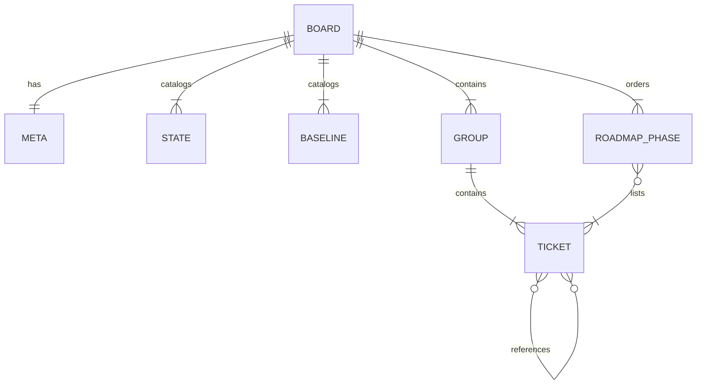
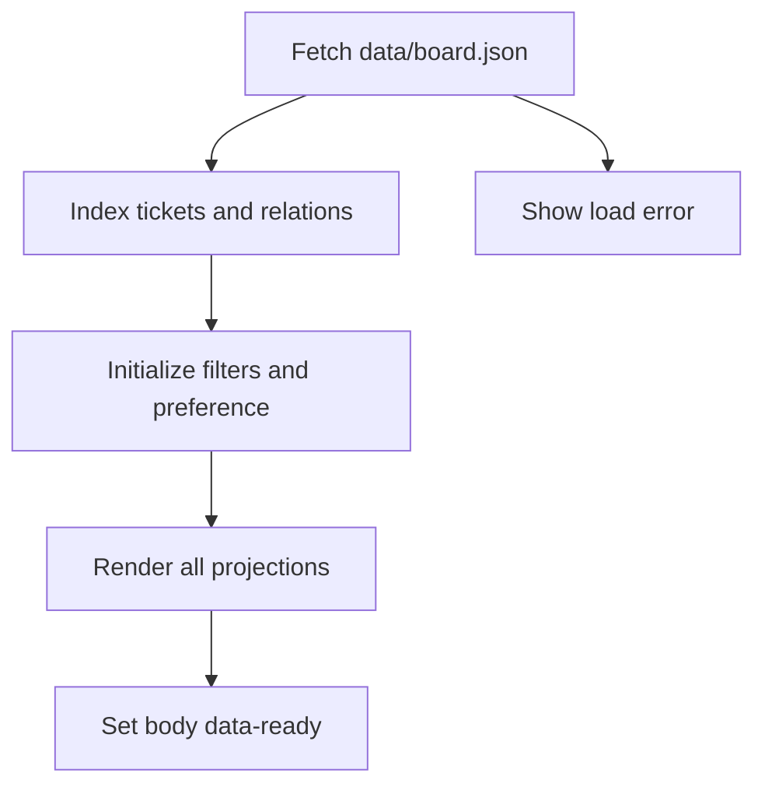
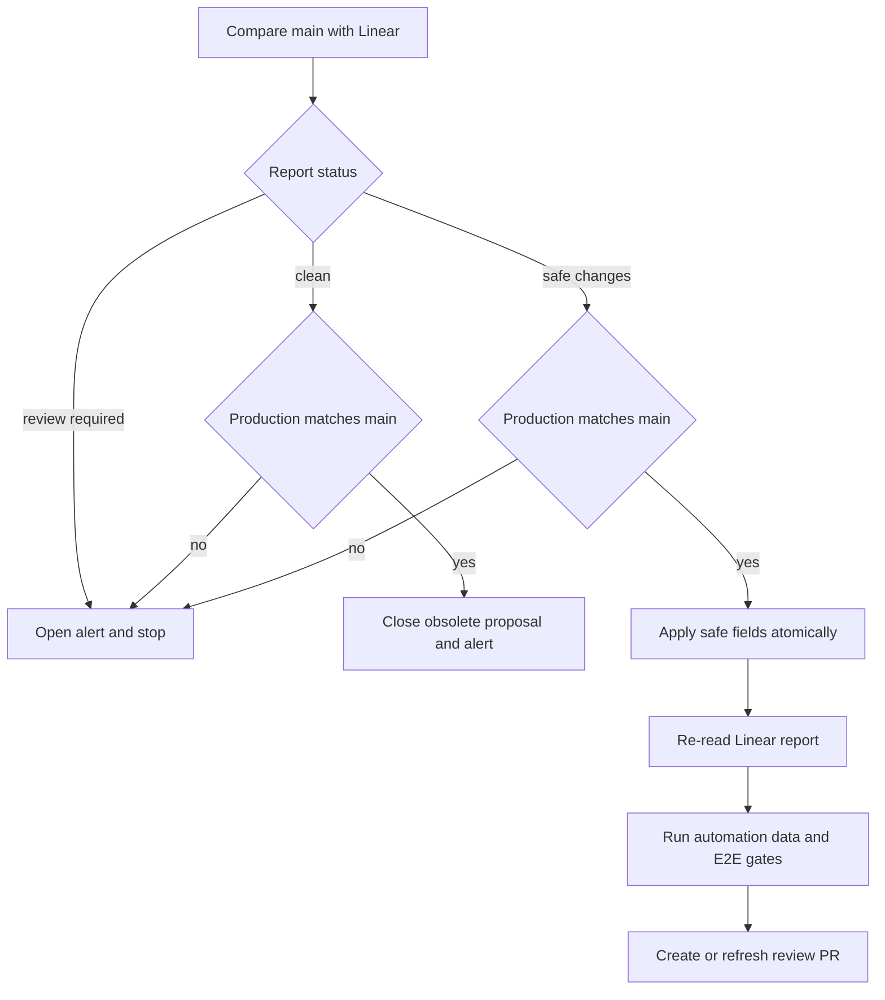
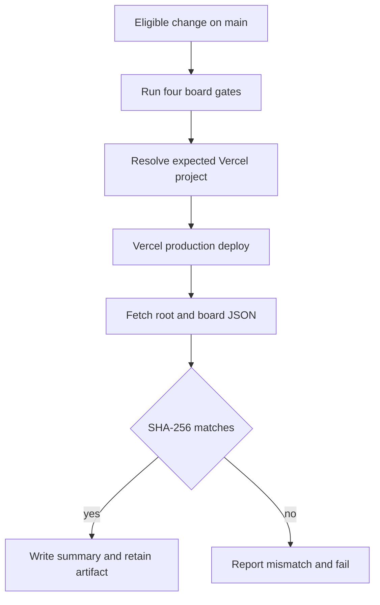

# Tablero de arquitectura

## Propósito y límite arquitectónico

`arquitectura-agente/` es una superficie de seguimiento estática, en español, publicada en <https://gymnasia-sable.vercel.app/>. El navegador carga `script.js` y obtiene `data/board.json`; no hay API de Linear, token, backend, cron ni base de datos durante la navegación. Linear es la autoridad si el espejo discrepa.

El tablero **no** es una ruta ni una dependencia del cliente Expo: `apps/mobile/index.js` registra `App`, mientras que el HTML del tablero solo incorpora sus recursos estáticos. Tampoco almacena datos de producto o personas usuarias. Sus tickets, resúmenes, líneas base y hoja de ruta son inventario de seguimiento o planes históricos; no prueban que una función esté implementada, desplegada o forme parte del runtime. Para los límites ejecutables del producto, consulte [Arquitectura local-first](../architecture/overview.md); para elegir el contrato de un cambio, consulte [Inicio rápido](../quickstart.md).

| Límite | Posee | No posee |
| --- | --- | --- |
| `arquitectura-agente/data/board.json` | Inventario, topología y orden editorial del tablero. Es el único archivo que modifica la conciliación automática. | La fuente de autoridad de tickets. |
| `index.html`, `script.js`, `styles.css` | Cascarón, proyecciones vanilla y presentación local. | Una API, autenticación o escritura hacia Linear. |
| `linear.py board` | Comparación autenticada con Linear, clasificación de deriva y aplicación segura en el checkout. | Decisiones editoriales de altas, bajas, grupos o dependencias. |
| Workflows `board-*.yml` y `scripts/board-automation/` | Gates, propuesta de PR, alertas y comprobación de producción. | Fusionar automáticamente la propuesta o ejecutar el producto móvil. |

Use un servidor HTTP para desarrollo: `fetch("data/board.json")` hace que abrir `index.html` mediante `file://` no sea un modo admitido.

## Contrato de datos y relaciones

El objeto raíz de `board.json` reúne `meta`, los catálogos `states` y `baselines`, `groups` y `recommendedOrder`. Un grupo `kind: "epic"` es una épica de Linear y tiene estado; `kind: "group"` es una agrupación local de tickets sin épica. Los tickets tienen ID, título, estado y resumen; `baseline` y `article` HTTPS son opcionales. `meta.ignore` excluye IDs deliberadamente no mostrados y no puede coincidir con un nodo del tablero.


```mermaid
erDiagram
    BOARD ||--|| META : has
    BOARD ||--|{ STATE : catalogs
    BOARD ||--|{ BASELINE : catalogs
    BOARD ||--|{ GROUP : contains
    GROUP ||--|{ TICKET : contains
    BOARD ||--|{ ROADMAP_PHASE : orders
    ROADMAP_PHASE }o--|{ TICKET : lists
    TICKET }o--o{ TICKET : references
```

*El archivo versionado concentra los datos de las vistas, las relaciones y la hoja de ruta editorial.*

`dependsOn` significa que el ID de destino bloquea al nodo que lo declara; el grafo se dibuja desde bloqueador hacia bloqueado. `related` es contexto, no bloqueo. Las referencias pueden señalar tickets o épicas, pero deben resolver, no pueden autorreferenciarse y las dependencias no pueden formar ciclos. Un ticket `done` tampoco puede depender de un bloqueador abierto.

`recommendedOrder` no ejecuta un workflow: es una recomendación editorial por fases (`id`, `title`, `why`, `tickets`). Cada ticket abierto de una épica debe figurar una sola vez y, si su bloqueador también está planificado, después de él. Por tanto, una alta o baja exige criterio humano: además de título y estado puede requerir grupo, resumen, relaciones y una ubicación en el orden.

## Carga y proyecciones del navegador

Al cargar el DOM, el cliente obtiene el JSON con `cache: "no-cache"`. Si la respuesta HTTP o el parseo fallan, conserva el mensaje de error de carga y no utiliza una copia alternativa. Si tiene éxito, crea índices en memoria de tickets, bloqueadores y relaciones; inicializa filtros y la preferencia de hoja de ruta; renderiza todas las proyecciones y solo entonces establece `body[data-ready="true"]`.


```mermaid
flowchart TD
    Fetch["Fetch data/board.json"] --> Index["Index tickets and relations"]
    Index --> Setup["Initialize filters and preference"]
    Setup --> Render["Render all projections"]
    Render --> Ready["Set body data-ready"]
    Fetch --> Failure["Show load error"]
```

*Una lectura local alimenta todas las vistas y el navegador no escribe de vuelta a Linear.*

- **Épicas** es la vista inicial. Conserva en memoria los plegados durante la sesión y calcula el progreso sobre todos los tickets no cancelados del grupo, no solo los filtrados.
- **Estado** crea columnas en el orden de `states`; es una proyección de lectura, sin arrastrar ni mutar el JSON.
- **Dependencias** usa la topología sin aplicar búsqueda ni chips de estado. El hash elige `#epics`, `#states` o `#deps`; un valor inválido se normaliza a `#epics`.
- Búsqueda por ID, título o resumen y filtros de estado se combinan con AND en Épicas y Estado.

La sección **Por dónde seguir** oculta tickets `done` y `canceled`, elimina fases vacías y vuelve a numerar las restantes. El plegado se persiste bajo `gymnasia.board.roadmapCollapsed` en `localStorage`; si el almacenamiento está bloqueado, la página continúa y la preferencia solo dura la sesión.

El grafo incluye los extremos de dependencias y, si se activa el control, relaciones informativas. Su nivel deriva de la ruta más larga de prerrequisitos; las relaciones simétricas se deduplican. Una guarda de recursión evita que un JSON cíclico bloquee el renderizado, pero no lo acepta: la aciclicidad es una invariante validada antes de publicar.

## Conciliación con Linear

`python3 .claude/skills/linear-tickets/scripts/linear.py board` consulta hasta 250 tickets del equipo y produce un informe estable con `schemaVersion: 1`. Separa cambios de `states` y `titles` de inventario ausente en el tablero (`missingFromBoard`) o en Linear (`missingFromLinear`). `meta.ignore` queda fuera de la comparación y el estado Linear `In Review` se representa como `in_progress`, porque el tablero solo posee esas cinco columnas.

| Estado del informe | Significado y tratamiento |
| --- | --- |
| `clean` | No hay deriva. La automatización puede cerrar una propuesta o alerta obsoleta. |
| `safe_changes` | Solo varían estados o títulos. Puede generarse una propuesta revisable. |
| `review_required` | Hay altas o bajas de inventario. Se detiene antes de cualquier escritura parcial. |

Con `--format json`, la comparación entrega el informe incluso con deriva. Sin opciones de aplicación y en formato humano, `board` termina con código 1 si encuentra diferencias. El legado `--apply` aplica estados; `--apply-safe` aplica estados, títulos y `meta.updated`, pero rechaza por completo la escritura si hay altas o bajas. Las sustituciones se realizan y verifican primero en memoria; después, la escritura atómica sincroniza el temporal, conserva permisos y reemplaza el archivo mediante `os.replace`.


```mermaid
flowchart TD
    Audit["Compare main with Linear"] --> Classify{"Report status"}
    Classify -->|"clean"| VerifyClean{"Production matches main"}
    Classify -->|"safe changes"| VerifySafe{"Production matches main"}
    Classify -->|"review required"| Alert["Open alert and stop"]
    VerifyClean -->|"yes"| Healthy["Close obsolete proposal and alert"]
    VerifyClean -->|"no"| Alert
    VerifySafe -->|"yes"| Apply["Apply safe fields atomically"]
    VerifySafe -->|"no"| Alert
    Apply --> Recheck["Re-read Linear report"]
    Recheck --> Gates["Run automation data and E2E gates"]
    Gates --> Proposal["Create or refresh review PR"]
```

*La producción debe coincidir con `main` antes de dar por sana la conciliación o preparar una propuesta; las altas y bajas nunca se convierten en un diff automático.*

`board-reconcile.yml` se ejecuta a los 17 minutos de cada seis horas o manualmente, parte explícitamente de `refs/heads/main` y cancela ejecuciones solapadas. Para `review_required`, abre o actualiza la alerta, cierra PRs automáticas obsoletas y falla. Para `safe_changes`, instala dependencias y Chromium, aplica `--apply-safe`, exige una segunda lectura `clean`, ejecuta las puertas y crea o actualiza `automation/board-sync`. El push usa `--force-with-lease`; no hay `auto-merge` ni `gh pr merge`.

La automatización usa un único issue marcado como `[board-sync] El tablero necesita atención`: localiza el marcador estable, cierra duplicados y evita repetir el mismo comentario con una huella SHA-256 del payload. Cuando Linear, `main` y producción vuelven a coincidir, comenta y cierra las alertas abiertas.

## Gates y publicación estática

`board-ci.yml` se activa en pull requests y cambios relevantes de `main`. Tiene únicamente `contents: read`, no recibe secretos de escritura y ejecuta, tras `npm ci` y la instalación de Chromium:

```bash
npm run test:linear
npm run test:board-automation
npm run test:board
npm run test:board:e2e
```

El workflow de despliegue se activa con cambios publicables en `main` o manualmente. Serializa producción en el grupo `board-production`, vuelve a ejecutar las cuatro puertas y resuelve con `vercel@59.16.0 pull --environment=production` el proyecto esperado: nombre `gymnasia`, `VERCEL_PROJECT_ID` y `VERCEL_ORG_ID` deben coincidir antes de desplegar.


```mermaid
flowchart TD
    Main["Eligible change on main"] --> Gates["Run four board gates"]
    Gates --> Resolve["Resolve expected Vercel project"]
    Resolve --> Deploy["Vercel production deploy"]
    Deploy --> Verify["Fetch root and board JSON"]
    Verify --> Hash{"SHA-256 matches"}
    Hash -->|"yes"| Evidence["Write summary and retain artifact"]
    Hash -->|"no"| Alert["Report mismatch and fail"]
```

*Producción solo se considera válida cuando la URL canónica sirve el tablero esperado y los bytes de `data/board.json` coinciden con `main`.*

La comprobación pide `/` y `/data/board.json` con `cache: "no-store"`, sigue redirecciones, comprueba el título HTML y compara SHA-256 de los bytes locales y remotos. Reintenta 12 veces cada 5 segundos para tolerar propagación. El resultado incluye hashes, commit, URL e intentos; se resume en el job y se conserva como artefacto 30 días. Una discrepancia abre o actualiza la alerta deduplicada y hace fallar el workflow.

No hay build: `vercel.json` activa `cleanUrls` y desactiva `trailingSlash`. La recuperación manual excepcional es:

```bash
npm exec --yes -- vercel@59.16.0 deploy --prod --yes --cwd arquitectura-agente
```

La vía normal es el workflow, porque aplica gates, valida el proyecto concreto y comprueba producción. Para una verificación manual, solicite `/`, no `/index.html`.

## Pruebas enfocadas y cambios seguros

`npm run test:board` usa `node --test` sin navegador para validar el contrato del JSON: catálogos, IDs, referencias, duplicados, ciclos, estados de tickets cerrados y cobertura/orden de `recommendedOrder`. `npm run test:board:e2e` levanta un servidor HTTP en `127.0.0.1:8123` —configurable con `BOARD_E2E_PORT`— y usa Playwright/Chromium para comprobar que el JSON se proyecta en pantalla, plegados, enlaces, filtros, pestañas, grafo, relaciones opcionales, errores de página y ausencia de desbordamiento a `390x844`.

Al modificar el tablero, mantenga esta secuencia:

1. Compare con Linear y clasifique la deriva; no trate una alta o baja como cambio de estado.
2. Edite manualmente el inventario editorial cuando haga falta: grupo, resumen, relaciones y fase de la hoja de ruta.
3. Ejecute las cuatro puertas anteriores. Instale dependencias y Chromium antes de la E2E si corresponde.
4. Deje que la PR de conciliación o la PR humana sea revisada; la publicación ocurre desde `main`.

Estas pruebas, workflows y datos validan una superficie estática y su cadena de publicación. No validan el cliente Expo, sus proveedores, persistencia, política firmada ni servicios de producto; esos contratos se documentan y prueban por separado.
