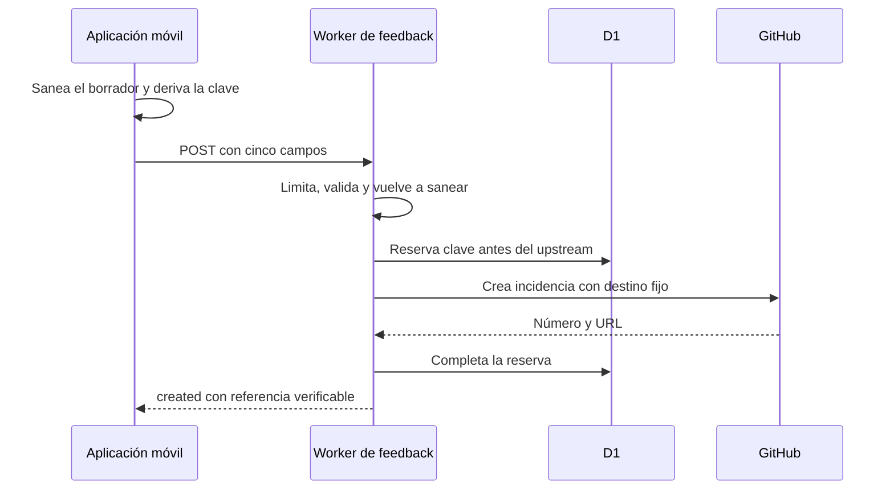

# Worker de feedback e incidencias verificables

`apps/feedback-worker` es la excepción remota, deliberadamente limitada, de una aplicación local-first. Recibe propuestas de funcionalidad, alimentos, ejercicios y denuncias de respuestas de IA que la persona usuaria ha confirmado; las transforma en incidencias de un repositorio privado de GitHub. No es backend de producto: no gestiona cuentas, entrenamientos, dieta, chat ni el estado local de la aplicación. Su razón de existir es aislar una credencial de escritura de GitHub, que no puede residir en una aplicación distribuida.

La app puede funcionar sin este servicio. Cuando el canal no está configurado, se apaga o falla, el resultado de envío es discriminado como no disponible, rechazado o error; solo un resultado `created` permite afirmar que existe una incidencia. Consulte [Entorno del agente](../agent/runtime.md) para el uso de herramientas y [Estado local y copias de seguridad](../mobile/local-state-and-backup.md) para los datos que siguen siendo responsabilidad del cliente.

## Contrato y flujo de confianza

El único endpoint de escritura es `POST /feedback/issues`; `GET /health` responde `{ "ok": true }`. Las rutas restantes devuelven `404`, el método incorrecto en la ruta de escritura devuelve `405`, y `OPTIONS` entrega las cabeceras CORS solo al origen incluido en `ALLOWED_ORIGINS`. Las respuestas llevan `cache-control: no-store`.

El cuerpo tiene esquema cerrado y contiene exactamente cinco claves: `schema_version`, `kind`, `title`, `summary` e `idempotency_key`. La versión actual es `1`; los tipos admitidos son `feature`, `food`, `exercise` y `report`. El título queda limitado a 120 caracteres; el resumen a 4.000, salvo `report`, que admite 16.000. Las claves adicionales, una versión o tipo desconocidos, una clave de idempotencia inválida o incoherente con `kind`, y texto que quede vacío tras sanear se rechazan. Una entrada desmesurada —más de cuatro veces el límite— se rechaza como `too_long`; el exceso razonable se normaliza y trunca.



*Flujo de creación cubierto por el contrato: el cliente propone contenido confirmado; el Worker conserva las decisiones privilegiadas y devuelve una referencia solo tras verificar la respuesta del upstream.*

La fuente de verdad de los límites y las claves admitidas es `apps/feedback-worker/src/contract.ts`. `apps/mobile/agent/feedbackIssues.ts` replica el contrato para preparar el borrador y `apps/mobile/agent/feedbackClient.ts` transmite solo esas cinco claves. `feedbackContract.contract.test.ts` comprueba paridad de versión, ruta, tipos, límites y claves. Al extender el contrato hay que actualizar ambos extremos y la prueba de paridad, no añadir campos tolerados silenciosamente.

## Estados observables y éxito verificable

El Worker devuelve estos estados HTTP relevantes:

| HTTP | Cuerpo o significado |
| --- | --- |
| `201` | `created` con `number`, `url` y `deduplicated: false` tras una creación nueva. |
| `200` | `created` con una referencia existente y `deduplicated: true`. |
| `400` | `rejected` por esquema, campo desconocido o contenido vacío. |
| `403` | Petición sin el encabezado compartido correcto cuando esa opción está configurada. |
| `413` | `rejected` por contenido desmesurado. |
| `429` | `rejected` por rate limit o por una reserva de la misma clave aún en curso; incluye espera de reintento. |
| `502` | `error` con `upstream_failed`; no expone el estado ni el detalle de GitHub. |
| `503` | `unavailable` por interruptor apagado o por falta de la sal de rate limiting. |

El adaptador móvil traduce estas respuestas a `FeedbackIssueOutcome`, incluyendo errores de transporte y de tiempo de espera. Para aceptar un `2xx` como `created`, exige un número entero positivo y una URL que empiece por `https://github.com/`; una respuesta malformada, incluso `2xx`, es `malformed_response`. Después, las presentaciones para agente y usuario solo declaran registro en la variante `created`. La prueba de pipeline recorre proveedor simulado, tool, ejecutor y cliente HTTP para proteger esta propiedad de extremo a extremo.

## Autoridad, idempotencia y límites de abuso

El cliente decide únicamente `kind`, `title` y `summary`; el Worker fija el repositorio mediante `GITHUB_REPO` y deriva el prefijo de título y las etiquetas mediante `ISSUE_PRESENTATION`. El adaptador de GitHub construye internamente la ruta y usa solo `POST` para crear y `PATCH` para redactar. Por tanto, esta interfaz no es un proxy genérico: no permite elegir repositorio, etiquetas, ruta, método ni modificar incidencias arbitrarias.

La clave de idempotencia se deriva de forma determinista del borrador saneado en el cliente. Antes de llamar a GitHub, D1 crea una reserva `pending`; una repetición de una reserva completada devuelve su número y URL, y una reserva en vuelo recibe `429` para reintentar sin duplicar. Tras la creación se promociona a `created`; si GitHub falla, se libera la reserva para permitir un reintento. Además, D1 deduplica por hash de `kind`, título y resumen durante 24 horas, incluso si la clave cambia. La tabla `issues` conserva esa reserva, estado, hash, referencia y momento de creación; no guarda el cuerpo del feedback.

El endpoint anónimo limita por un identificador HMAC-SHA-256 derivado de `cf-connecting-ip`: cinco solicitudes por minuto y 30 por día. `RATE_LIMIT_SALT` es obligatorio; si falta, el endpoint se cierra con `503` en lugar de almacenar una IP en claro. Los contadores D1 se podan antes de que alcancen 48 horas, tanto en el trigger programado como de forma oportunista tras una creación. Este control es de coste de abuso, no de identidad de usuario.

`APP_SHARED_SECRET` es opcional y, si existe, se comprueba en `x-gymnasia-app`. Cualquier secreto embebido en la app es ofuscación, no un control de autenticidad: puede extraerse del artefacto distribuido y no demuestra que la petición proceda de una instalación legítima. No se debe inventar una garantía de origen a partir de ese encabezado.

## Saneamiento y privacidad

El cliente sanea antes de crear el borrador y el Worker vuelve a hacerlo antes de persistir o enviar a GitHub. Ambos normalizan Unicode, eliminan controles, normalizan espacios, conservan como máximo dos saltos de línea en bloques y truncan sin partir pares suplentes. También sustituyen patrones reconocibles de credenciales por marcadores redactados. Es una defensa en profundidad para patrones conocidos, no una garantía de detectar todos los secretos.

Para propuestas ordinarias, los formateadores generan solo campos visibles del formulario y no conversación literal ni estructuras internas. Una denuncia `report` se forma a partir de la vista previa confirmada: motivo, detalles opcionales, pregunta anterior, respuesta denunciada y contexto técnico limitado. El formateador no acepta el hilo completo ni accede al almacenamiento de credenciales. La app solo permite denunciar respuestas finales visibles: excluye mensajes de identidad de IA, errores técnicos, respuestas en streaming y mensajes vacíos.

No registre, copie en documentación ni use en pruebas operativas contenido de feedback o denuncias. Las pruebas usan datos sintéticos y verifican, entre otras propiedades, que el saneado sea idempotente, que no deje secretos reconocibles y que el esquema no acepte campos extra.

## Retención de denuncias

Las migraciones crean `issues` y `requests`; la segunda añade `redacted_at` e índice para retención. El cron configurado en `wrangler.jsonc` se ejecuta cada hora y, en paralelo con la poda de contadores, procesa denuncias creadas hace al menos 30 días. Selecciona las más antiguas en lotes de 40, sustituye el cuerpo remoto por un aviso neutro de contenido eliminado y solo entonces escribe `redacted_at` en D1.

El orden es un invariante: si el `PATCH` remoto falla, la marca local queda vacía y el siguiente cron vuelve a intentarlo. La redacción conserva la referencia técnica de la incidencia, pero elimina el texto de pregunta y respuesta. Cambiar este ciclo exige revisar migración, consulta de selección, redacción de GitHub y pruebas de fallo/reintento.

## Configuración, despliegue y validación

`wrangler.jsonc` declara el punto de entrada, el binding `DB`, las variables públicas `GITHUB_REPO`, `ALLOWED_ORIGINS` y `FEEDBACK_ENABLED`, el cron, la ruta y observabilidad. `GITHUB_TOKEN` y `RATE_LIMIT_SALT` son secretos del Worker y se cargan con `wrangler secret put`; no pertenecen al repositorio, al bundle de la app ni a esta página. `FEEDBACK_ENABLED:false` permite apagar la escritura sin publicar una nueva aplicación.

La configuración Expo deja el endpoint vacío en desarrollo para que las pruebas y el trabajo local no escriban en el receptor real. Staging y producción usan el endpoint configurado; por ello, un cambio de URL o contrato que alcance una aplicación distribuida requiere la frontera de release correspondiente. Consulte [Compilación, publicación y pruebas](../operations/build-release-and-testing.md) y [Gobernanza de políticas de prompts](../operations/prompt-policy-governance.md) para esos procedimientos.

Para cambios de código, ejecute:

```bash
npm --workspace apps/feedback-worker run test
```

La suite del Worker usa un doble de D1 y `fetch` simulado, sin red ni credenciales, y cubre handler, esquema, saneamiento y fuzzing. Los casos focales incluyen CORS, rutas y métodos, respuesta upstream sin referencia, liberación tras fallo, idempotencia, deduplicación por contenido, rate limit con identificador pseudonimizado, interruptor, secreto opcional y retención. En móvil, ejecute también la prueba de contrato indicada en el frontmatter y las pruebas de `feedbackClient` y `feedbackPipeline` cuando cambie la traducción de estados o el camino de la tool.

Para cambios de persistencia o retención, aplique primero la migración remota y después despliegue:

```bash
npm --workspace apps/feedback-worker run migrate:remote
npm --workspace apps/feedback-worker run deploy
```

Compruebe el endpoint de salud sin enviar contenido real ni revelar configuración. Un despliegue que cambie secretos, D1, cron, CORS, ruta o contrato debe validarse también en el entorno publicado; las pruebas unitarias no sustituyen esa comprobación.
