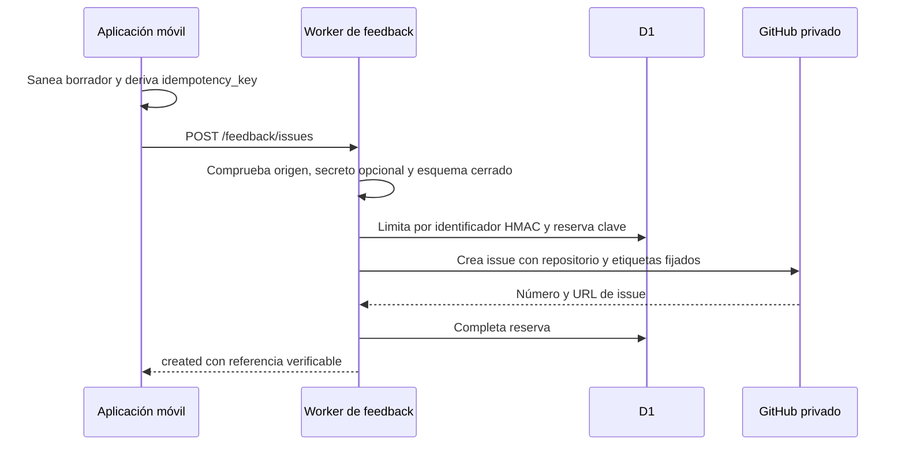

# Worker de feedback e incidencias verificables

`apps/feedback-worker` es un Worker de Cloudflare y la excepción acotada al diseño local-first: recibe propuestas de funcionalidad, alimentos, ejercicios y denuncias de respuestas de IA para crear incidencias en un repositorio privado. No posee entrenamientos, dieta, chat ni cuentas de Gymnasia; la [arquitectura de ejecución](../architecture/overview.md) sigue siendo un cliente local-first. Existe porque una credencial de escritura de GitHub no puede estar en una aplicación estática.

El cliente móvil concentra el contrato y el saneado previo en `apps/mobile/agent/feedbackIssues.ts`; el Worker lo vuelve a validar y aplica las decisiones privilegiadas. Esta frontera sustituye a los antiguos escritores directos/no-op y permite que el resultado de `create_feature_issue` sea verificable desde el [entorno del agente](../agent/runtime.md).

## Flujo y límites de confianza

*La aplicación decide solo `kind`, título, resumen y clave de idempotencia; el servidor conserva la autoridad sobre el destino y la presentación de GitHub.*

`src/index.ts::fetch` expone `GET /health` y `POST /feedback/issues`; rechaza otras rutas, métodos y claves ajenas al esquema. `src/contract.ts` fija la versión `1`, los cuatro tipos y los máximos: título de 120 caracteres; resumen de 4.000, o 16.000 para `report`. El cliente replica esos valores y `feedbackContract.contract.test.ts` falla si divergen. No cambie uno de los contratos sin el otro ni sin esa prueba de paridad.

## Invariantes que condicionan cambios

- **Éxito verificable:** `createGitHubIssue` debe devolver número positivo y URL de GitHub; un 2xx sin referencia se convierte en `502 upstream_failed`. No vuelva a presentar una creación como correcta solo por no recibir una excepción.
- **Idempotencia antes del upstream:** `buildIdempotencyKey` deriva una clave estable del borrador saneado. `handleCreateIssue` reserva en D1 antes de llamar a GitHub; una repetición devuelve la referencia existente y una reserva en curso devuelve `429` con reintento. La deduplicación por hash de contenido complementa la clave.
- **Autoridad del servidor:** `ISSUE_PRESENTATION` elige prefijo y etiquetas; `GITHUB_REPO` proviene del entorno. El esquema cerrado no admite que el cliente inyecte repositorio, etiquetas, URL ni método.
- **Privacidad por duplicado:** `redactFeedbackSecrets` en el cliente y `redactSecrets` en el Worker eliminan patrones de credenciales antes de transmitir/persistir. Las denuncias pueden contener únicamente la vista previa explícita (pregunta anterior, respuesta denunciada, motivo y contexto técnico), nunca el hilo completo, razonamiento interno ni claves.
- **Disponibilidad degradable:** `FEEDBACK_ENABLED === "false"` devuelve `503 unavailable`; la aplicación debe comunicar indisponibilidad, sin afectar el resto de sus datos locales.

## Abuso, retención y operación

`handleCreateIssue` convierte `cf-connecting-ip` en un HMAC SHA-256 antes de consultar D1. `RATE_LIMIT_RULES` permite 5 solicitudes/minuto y 30/día; la sal ausente cierra el endpoint con `503`, en vez de registrar IP en claro. `APP_SHARED_SECRET` es opcional y solo eleva el coste de abuso: al estar en la app no es autenticación fuerte.

El cron de `wrangler.jsonc` corre cada hora. `scheduled` ejecuta en paralelo la poda de contadores y `redactExpiredReports`: selecciona hasta 40 denuncias de 30 días, redacta primero el cuerpo remoto de GitHub y solo después marca `redacted_at` en D1. Si GitHub falla, el registro queda pendiente para el siguiente cron. Esta secuencia protege la retención; no marque el registro antes de comprobar la redacción remota.

La configuración pública vive en `apps/feedback-worker/wrangler.jsonc`: ruta, binding D1, orígenes permitidos, interruptor y cron. `GITHUB_TOKEN` y `RATE_LIMIT_SALT` son secretos de Worker: configúrelos con `wrangler secret put`, no los copie a archivos ni a la wiki. El README documenta despliegue, apagado y comprobaciones de retención; úselo como guía operativa, pero valide cualquier cambio contra `src/index.ts` y las pruebas.

## Cómo cambiar con seguridad

| Cambio | Empezar en | Superficie completa | Validación mínima |
|---|---|---|---|
| Añadir campo, tipo o límite | `src/contract.ts`, `src/schema.ts`, `agent/feedbackIssues.ts` | Contrato Worker, réplica móvil, formateador/saneado y `feedbackContract.contract.test.ts` | Prueba de contrato móvil y `npm --workspace apps/feedback-worker run test` |
| Cambiar creación/deduplicación | `src/index.ts::handleCreateIssue`, `src/storage.ts` | Reserva, liberación tras fallo upstream, respuesta y migraciones D1 si cambian datos | Prueba Worker; añadir caso de repetición, reserva en curso y fallo/reintento |
| Cambiar denuncia o privacidad | `agent/feedbackIssues.ts::formatAiResponseReport`, `src/sanitize.ts` | Saneado en ambos lados, límites de `report`, retención y texto que llega a GitHub | Pruebas de saneado, contrato y handler; inspección manual sin usar datos reales |
| Cambiar retención | `src/index.ts::redactExpiredReports`, `src/github.ts`, migraciones | Migración remota antes del despliegue, cron, redacción remota y marca local | Prueba Worker; después `migrate:remote` y despliegue son condicionales |

Las pruebas internas prueban corrección del handler, esquema, saneado, límites, idempotencia, CORS y fuzzing sin red. Si se modifica la configuración publicada, D1, secretos, cron o el contrato consumido por un APK, la corrección interna no basta: aplique la migración necesaria y despliegue el Worker; compruebe `GET /health` sin revelar secretos. La compilación de un APK de producción es condicional cuando cambia `app.config.ts`, la URL del endpoint o el contrato de cliente consumido por la aplicación distribuida.

## Navegación para agentes

Consulte [Entorno del agente](../agent/runtime.md) al modificar el uso de `create_feature_issue` o la comunicación de resultados al modelo; consulte [Compilación, publicación y pruebas](../operations/build-release-and-testing.md) para la frontera de APK y despliegue. La [evidencia de ejecución de OpenWiki](../operations/runtime-behavior.md) pertenece a otra automatización y no mide este Worker.