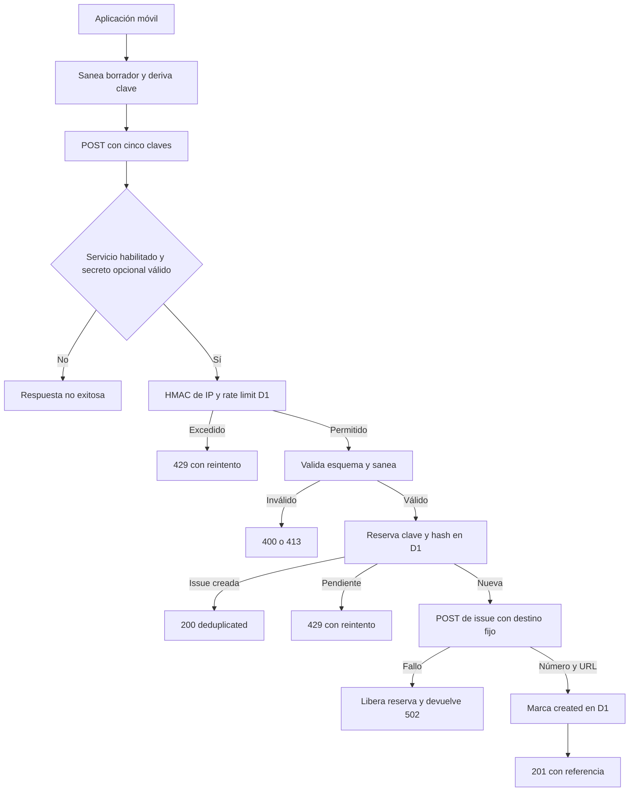

# Worker de feedback e incidencias verificables

`apps/feedback-worker` es la excepción remota, deliberadamente pequeña, de una aplicación local-first. Recibe propuestas confirmadas de funcionalidad, alimentos y ejercicios, además de denuncias de respuestas de IA, y las transforma en issues de GitHub. No es un backend de producto: no posee cuentas, entrenamientos, dieta, chat ni el estado local. Su función es aislar la credencial de escritura de GitHub, que no puede distribuirse dentro de la app.

El Worker es **opcional**. Si no hay endpoint configurado, el servicio está desactivado, se agota el tiempo de espera o falla la red, el cliente y las tools devuelven un resultado no exitoso; el chat y el resto de la app continúan. Solo el resultado `created`, respaldado por un número positivo y una URL de `https://github.com/`, permite comunicar que se registró una incidencia. Véanse [Entorno del agente](../agent/runtime.md) y [Estado local y copias de seguridad](../mobile/local-state-and-backup.md) para los límites entre esta integración y el estado de la app.

## Contrato público y límites de autoridad

El receptor expone `POST /feedback/issues` y `GET /health`, que devuelve `{ "ok": true }`. Rutas distintas devuelven `404` y otro método sobre la ruta de escritura, `405`. `OPTIONS` devuelve `204`; las cabeceras CORS de permiso solo se añaden cuando `Origin` figura en `ALLOWED_ORIGINS`. Todas las respuestas incluyen `cache-control: no-store` y `vary: Origin`.

El cuerpo de `POST` es un esquema cerrado de exactamente cinco claves:

```jsonc
{
  "schema_version": 1,
  "kind": "feature" | "food" | "exercise" | "report",
  "title": "string, 1..120",
  "summary": "string, 1..4000 (1..16000 para report)",
  "idempotency_key": "v1:<kind>:<16 hex>"
}
```

Una clave extra, una versión, tipo o clave inválidos, una clave cuyo tipo no coincida con `kind`, o texto vacío tras el saneado se rechazan. El servicio rechaza como `too_long` un título o resumen de más de cuatro veces su límite; el exceso menor se normaliza y trunca. `apps/feedback-worker/src/contract.ts` es la fuente de verdad. La réplica móvil en `apps/mobile/agent/feedbackIssues.ts` y `feedbackContract.contract.test.ts` anclan ruta, versión, tipos, límites y las cinco claves: extender el contrato requiere modificar ambos extremos y esa prueba, no aceptar campos de forma silenciosa.

El cliente solo propone `kind`, `title` y `summary`. El Worker fija el repositorio con `GITHUB_REPO` y traduce el tipo a prefijo y etiquetas con `ISSUE_PRESENTATION`; el adaptador construye internamente las rutas de GitHub. Por ello no es un proxy de GitHub: una petición no puede seleccionar repositorio, etiquetas, método, ruta ni editar una issue arbitraria.

## Creación: validación, límite e idempotencia



*La propuesta local solo sale tras la confirmación de usuario; el Worker toma las decisiones privilegiadas y no filtra los detalles del upstream al fallo.*

La app sanea el borrador y calcula una clave determinista a partir de `kind`, título y resumen. El Worker vuelve a normalizar y redactar antes de generar el hash de contenido y hablar con GitHub. Una reserva `pending` en D1 se crea antes de la llamada remota: una repetición de una reserva completada retorna su número y URL, y una repetición mientras está en vuelo recibe `429` y debe reintentar. Si GitHub falla, se borra la reserva pendiente para permitirlo. Además, un hash de contenido creado en las últimas 24 horas se deduplica aunque llegue otra clave.

La tabla `issues` retiene clave, tipo, hash, estado `pending` o `created`, referencia de la issue y fecha; no guarda el título ni el resumen del feedback. La referencia se completa después de una respuesta útil del upstream. El Worker considera útil un número entero positivo y una URL no vacía; el cliente aplica la comprobación adicional de que la URL comience por `https://github.com/` antes de devolver `created`.

## Resultados, cliente y errores no filtrantes

| HTTP del Worker | Resultado |
| --- | --- |
| `201` | `created` nuevo con `number`, `url` y `deduplicated: false`. |
| `200` | `created` deduplicado con la referencia ya almacenada. |
| `400` | `rejected` por esquema, claves extra o contenido vacío. |
| `403` | Rechazo cuando `APP_SHARED_SECRET` está configurado y falta o no coincide `x-gymnasia-app`. |
| `413` | `rejected` por entrada desmesurada. |
| `429` | `rejected` por rate limit o una reserva de la misma clave en curso; incluye `retry-after`. |
| `502` | `error` con `upstream_failed`; no revela estado ni detalle de GitHub. |
| `503` | `unavailable` con el interruptor apagado o sin sal de rate limit. |

`createFeedbackIssueClient` limita su petición a 15 segundos y distingue `timeout` de `transport`. Convierte `503` en `unavailable`, los rechazos HTTP en `rejected` y otros fallos en `error`. Incluso ante un `2xx`, un cuerpo sin número positivo o URL válida para GitHub resulta en `malformed_response`, no en creación. Las funciones de presentación para modelo y usuario solo afirman registro en la rama `created`; las demás informan que no se creó nada u ofrecen reintentar. Esto evita que una caída del Worker rompa un turno de chat o produzca una confirmación falsa.

## Antiabuso y secreto compartido

El endpoint es anónimo y no tiene una prueba criptográfica de que la petición provenga de una instalación legítima: un valor incluido en un artefacto distribuido puede extraerse. `APP_SHARED_SECRET` es opcional; si se configura, se compara con `x-gymnasia-app`, pero es una barrera de ofuscación, no autenticación de usuario ni prueba de origen.

Para elevar el coste de abuso, el Worker toma `cf-connecting-ip`, calcula un HMAC SHA-256 con `RATE_LIMIT_SALT` y persiste únicamente el identificador hexadecimal derivado. Aplica cinco solicitudes por minuto y treinta por día en D1. Si falta la sal, falla cerrado con `503` en vez de guardar una IP en claro. Los contadores se eliminan desde los 47 horas en el cron horario —para que su vida efectiva no supere 48 horas— y también de forma oportunista tras una creación. Este límite mide coste de abuso, no identidad.

No documente ni introduzca valores de `GITHUB_TOKEN`, `RATE_LIMIT_SALT` ni `APP_SHARED_SECRET` en el repositorio, el bundle o una guía. La configuración pública puede declarar el destino, los orígenes y el interruptor; los secretos se cargan en el entorno del Worker.

## Saneamiento, minimización y retención

Cliente y Worker normalizan Unicode NFC, eliminan controles, recortan y normalizan espacios, limitan los bloques a dos saltos consecutivos y truncan sin partir pares suplentes. También sustituyen patrones conocidos de tokens de GitHub, proveedores de IA, JWT y cabeceras Bearer por marcadores redactados. Es defensa en profundidad frente a patrones reconocibles, no garantía de detectar cualquier secreto.

Las propuestas ordinarias se forman solo con campos visibles del formulario, sin conversación literal ni estructuras internas. Una denuncia `report` usa la vista previa confirmada: motivo, detalles opcionales, pregunta anterior, respuesta denunciada y contexto técnico limitado. El formateador no acepta el hilo completo ni accede al almacenamiento de credenciales; solo se pueden denunciar respuestas finales visibles, no mensajes de identidad, errores técnicos, streaming ni mensajes vacíos.

La retención se aplica exclusivamente a `report`. El cron de `wrangler.jsonc` se ejecuta cada hora y, junto con la poda de contadores, selecciona denuncias creadas hace 30 días o más, ordenadas por antigüedad y en lotes de 40. Hace `PATCH` del cuerpo remoto a una nota neutral y solo entonces escribe `redacted_at` en D1. Si el `PATCH` falla, no marca el registro y el cron lo reintenta. Se conservan número, URL y título remoto para trazabilidad, no el texto de la pregunta y respuesta.

## Configuración, despliegue y pruebas

`wrangler.jsonc` declara `src/index.ts`, el binding D1 `DB`, el cron, la ruta, observabilidad y las variables no secretas `GITHUB_REPO`, `ALLOWED_ORIGINS` y `FEEDBACK_ENABLED`. El valor `FEEDBACK_ENABLED:false` permite apagar la escritura sin publicar una aplicación nueva. La configuración Expo deja el endpoint de desarrollo vacío y staging y producción usan el mismo receptor; `FEEDBACK_API_BASE_URL` tiene prioridad para apuntar un build a otro destino durante las pruebas. Antes de crear el cliente, `resolveFeedbackEndpoint` elimina barras finales y rechaza una URL sin `https`, o con credenciales, consulta o fragmento; solo admite `http` para `localhost` o `127.0.0.1` en desarrollo. Por tanto, cambiar URL o contrato distribuido requiere el proceso de release correspondiente y verificar el inventario de destinos de red.

Para preparar el servicio se crea D1, se aplican migraciones y se cargan los secretos mediante Wrangler; una credencial de GitHub debe ser de cuenta técnica, con mínimo privilegio para el único repositorio receptor. Para cambiar persistencia o retención, la migración remota debe aplicarse antes del despliegue:

```bash
npm --workspace apps/feedback-worker run migrate:remote
npm --workspace apps/feedback-worker run deploy
```

La suite no usa red ni credenciales: emplea un doble de D1 y `fetch` simulado. Cubre esquema cerrado, saneamiento y propiedades con fuzzing, CORS, métodos y rutas, secreto opcional, interruptor, HMAC pseudonimizado, límites, idempotencia, deduplicación de contenido, liberación tras fallo de GitHub, ausencia de éxito ante una referencia inválida y retención con reintento. Ejecute:

```bash
npm --workspace apps/feedback-worker run test
```

Al cambiar la frontera móvil, ejecute también la prueba de contrato indicada en el frontmatter y `feedbackClient`/`feedbackPipeline`: esta última reproduce proveedor, tool, ejecutor y cliente HTTP para asegurar que un error remoto o una respuesta malformada nunca confirme una issue.
