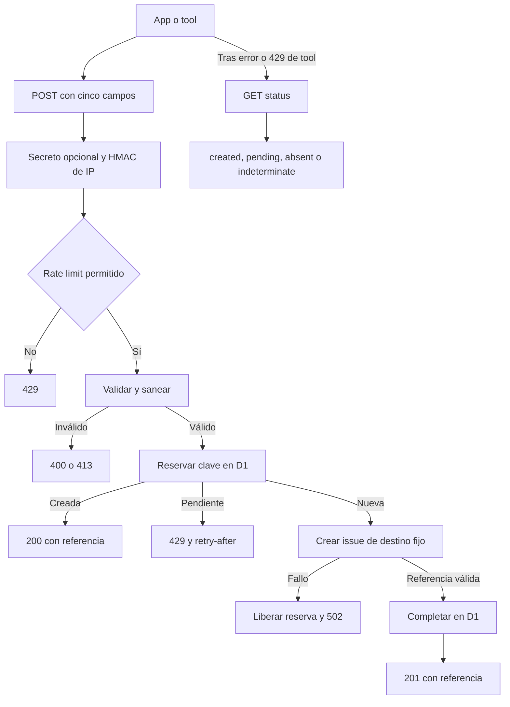

# Worker de feedback e incidencias verificables

`apps/feedback-worker` es la excepción remota, deliberadamente acotada, de la aplicación local-first. Recibe propuestas de funcionalidad, alimentos y ejercicios, y denuncias de respuestas de IA, para crear issues en GitHub. No es un backend de producto: no posee cuentas, conversación, entrenamientos ni estado de la app. Aísla la credencial de escritura de GitHub, que no puede distribuirse en el cliente.

El canal es **opcional**. Si la app no tiene un endpoint válido o el Worker responde `unavailable`, la herramienta devuelve un resultado no exitoso y el chat sigue funcionando. Una creación solo puede comunicarse cuando existe una referencia verificable: número entero positivo y URL que empieza por `https://github.com/`.

## Superficie HTTP y autoridad

El Worker atiende:

- `GET /health`, que responde `{ "ok": true }`.
- `POST /feedback/issues`, para crear o recuperar una incidencia.
- `GET /feedback/issues/status?idempotency_key=…`, para reconciliar una operación de tool de identidad larga.
- `OPTIONS`, que devuelve `204` y solo añade permisos CORS cuando `Origin` pertenece a `ALLOWED_ORIGINS`.

Las rutas desconocidas responden `404` y los métodos incompatibles `405`. Todas las respuestas JSON llevan `cache-control: no-store` y `vary: Origin`. La consulta de estado comparte CORS, el interruptor y el secreto opcional con la escritura, pero no consume rate limit.

El cliente solo propone `kind`, `title` y `summary`. El servidor fija `GITHUB_REPO`, construye la ruta y método de GitHub, y traduce cada tipo a un prefijo y etiquetas mediante `ISSUE_PRESENTATION`. Por tanto, el endpoint no es un proxy de GitHub: una petición no puede elegir repositorio, etiquetas, ruta, método ni editar una issue existente.

## Contrato de escritura cerrado

El cuerpo de `POST` contiene exactamente cinco claves:

```jsonc
{
  "schema_version": 1,
  "kind": "feature" | "food" | "exercise" | "report",
  "title": "string, 1..120",
  "summary": "string, 1..4000 (1..16000 para report)",
  "idempotency_key": "v1:<kind>:<16 o 64 hex>"
}
```

`apps/feedback-worker/src/contract.ts` es la fuente de verdad y `apps/mobile/agent/feedbackIssues.ts` replica sus constantes; `feedbackContract.contract.test.ts` ancla versión, rutas, tipos, límites y claves. Las claves de 16 hexadecimales son deterministas a partir del contenido saneado de formularios o denuncias. Las tools usan una identidad de operación de 64 hexadecimales, que permite consultar el resultado del mismo intento. El endpoint de estado solo acepta esta segunda forma.

El esquema rechaza campos extra, versión o tipo inválido, tipos que no coinciden con el prefijo de la clave y texto vacío tras sanear. Si `title` o `summary` llega con más de cuatro veces su límite se rechaza como `too_long`; el exceso menor se normaliza y trunca. Los campos extra no se ignoran: impedirlos evita que se conviertan en un canal de datos no confirmados por la persona usuaria.

## Creación, idempotencia y reconciliación



*La reserva durable ocurre antes de la llamada a GitHub; la consulta evita afirmar o repetir automáticamente una operación ambigua.*

Antes de llamar a GitHub, D1 inserta una reserva `pending`. Una repetición con la misma clave devuelve la referencia ya completada (`200`, `deduplicated: true`) o recibe `429` si la reserva sigue en vuelo. Si GitHub falla, el Worker elimina la reserva pendiente, para que un reintento explícito sea posible. También deduplica contenido cuyo hash coincide con una issue creada en las últimas 24 horas, aunque la clave sea distinta.

La tabla `issues` conserva la clave, tipo, hash de contenido, estado, referencia y fecha; no persiste el título ni el resumen. GitHub debe devolver un número positivo y una URL no vacía para completar la reserva; un `2xx` sin esos datos es un fallo upstream (`502`), no una creación.

Para una clave de operación válida, la consulta devuelve `404 {status:"absent"}`, `202 {status:"pending"}` o `200 {status:"created", number, url}`. En el cliente móvil, `submitIssue` consulta ese estado tras un resultado `error` o un `429` cuando recibió `operationId`: recupera una referencia creada, traduce una reserva pendiente a `operation_pending`, y conserva el resultado original si el estado es ausente o indeterminado. No hay un segundo `POST` automático en esa rama.

## Resultados y fallo no filtrante

| HTTP | Resultado observable |
| --- | --- |
| `201` | `created` nuevo con número, URL y `deduplicated: false`. |
| `200` | `created` deduplicado con referencia almacenada. |
| `400` | `rejected` por esquema, campos desconocidos o contenido vacío. |
| `403` | Rechazo si se configuró `APP_SHARED_SECRET` y no coincide `x-gymnasia-app`. |
| `413` | `rejected` por entrada desmesurada. |
| `429` | `rejected/rate_limited`, tanto por límite como por una reserva pendiente; incluye `retry-after`. |
| `502` | `error/upstream_failed`, sin exponer el estado de GitHub. |
| `503` | `unavailable` si el interruptor está apagado o falta `RATE_LIMIT_SALT`. |

El cliente limita cada solicitud a 15 segundos, clasifica abortos como `timeout` y otros fallos de transporte como `transport`. También rechaza un `2xx` cuyo cuerpo no contenga una referencia verificable como `malformed_response`. Los textos para el modelo y para la persona usuaria solo afirman registro en la variante `created`; las pruebas del pipeline comprueban que un fallo remoto o una respuesta malformada no interrumpe el turno del chat ni confirma una issue.

## Abuso, secreto y privacidad

El endpoint es anónimo: `APP_SHARED_SECRET` es una comparación opcional del encabezado `x-gymnasia-app`. Como el valor se distribuye con la app, es ofuscación que eleva el coste de abuso, no autenticación fuerte de usuario ni prueba criptográfica de origen.

Antes de validar el cuerpo, el Worker calcula un HMAC SHA-256 de `cf-connecting-ip` con `RATE_LIMIT_SALT` y persiste solo ese identificador hexadecimal. D1 aplica cinco solicitudes por minuto y treinta por día. Si falta la sal, el endpoint falla cerrado con `503` en lugar de guardar IP en claro. El cron horario poda contadores desde las 47 horas para que su vida efectiva no supere 48 horas, y una creación también intenta esa poda de manera oportunista.

Cliente y Worker normalizan Unicode NFC, eliminan caracteres de control, ajustan espacios y saltos de línea, truncan sin partir pares suplentes y redactan patrones conocidos de tokens, JWT y encabezados Bearer. Es defensa en profundidad, no una garantía de detectar toda credencial posible.

Las propuestas ordinarias se construyen únicamente con campos visibles del formulario. Una denuncia `report` contiene la vista previa confirmada: motivo, detalles opcionales, pregunta anterior, respuesta denunciada y contexto técnico limitado. El formateador no acepta el hilo completo ni credenciales; solo permite denunciar respuestas finales visibles, no mensajes de identidad, errores técnicos, streaming o mensajes vacíos.

## Retención de denuncias

El `scheduled` handler se ejecuta cada hora y hace en paralelo la poda de contadores y la retención. Para `report`, selecciona por antigüedad hasta 40 issues creadas hace al menos 30 días con `redacted_at` nulo. Para cada una hace `PATCH` del cuerpo remoto a `REDACTED_REPORT_BODY`; solo después escribe `redacted_at` en D1. Un fallo de GitHub deja el registro seleccionable para el próximo cron. La operación conserva la referencia de issue y una nota neutral, no el cuerpo denunciado.

## Configuración y despliegue

`wrangler.jsonc` declara el entrypoint `src/index.ts`, binding D1 `DB`, cron, dominio, observabilidad y las variables públicas `GITHUB_REPO`, `ALLOWED_ORIGINS` y `FEEDBACK_ENABLED`. Los secretos `GITHUB_TOKEN` y `RATE_LIMIT_SALT` se cargan mediante Wrangler; `APP_SHARED_SECRET` es opcional. Use una credencial de cuenta técnica con mínimo privilegio para el repositorio receptor y no incluya secretos en el repositorio, bundle ni documentación.

La configuración Expo deja el endpoint vacío en development y configura el mismo receptor para staging y production. `FEEDBACK_API_BASE_URL` tiene prioridad sobre esos valores; `resolveFeedbackEndpoint` acepta HTTPS y, solo en development, HTTP a `localhost` o `127.0.0.1`, sin credenciales, consulta ni fragmento. Esto permite apuntar explícitamente a `wrangler dev` sin convertir una URL manipulada en configuración válida.

Aplique migraciones antes de desplegar cambios de persistencia o retención:

```bash
npm --workspace apps/feedback-worker run migrate:remote
npm --workspace apps/feedback-worker run deploy
```

## Validación enfocada

La suite del Worker corre con Vitest, un doble de D1 y `fetch` simulado; no necesita red ni credenciales. Cubre rutas, CORS, esquema cerrado, saneamiento, rate limit, secreto opcional, idempotencia, deduplicación, reconciliación, referencias inválidas y retención. El fuzzing comprueba propiedades de normalización, truncado, redacción y validación.

```bash
npm --workspace apps/feedback-worker run test
npx vitest run --config apps/mobile/vitest.config.mts apps/mobile/agent/feedbackContract.contract.test.ts apps/mobile/agent/feedbackClient.test.ts apps/mobile/agent/feedbackPipeline.test.ts
```

Al ampliar el contrato, cambie primero el Worker y compruebe `/health`; después distribuya la app. El Worker acepta las claves heredadas de 16 hexadecimales, pero la app nueva depende del endpoint de estado para reconciliar operaciones de tool y falla cerrado si no está disponible.
