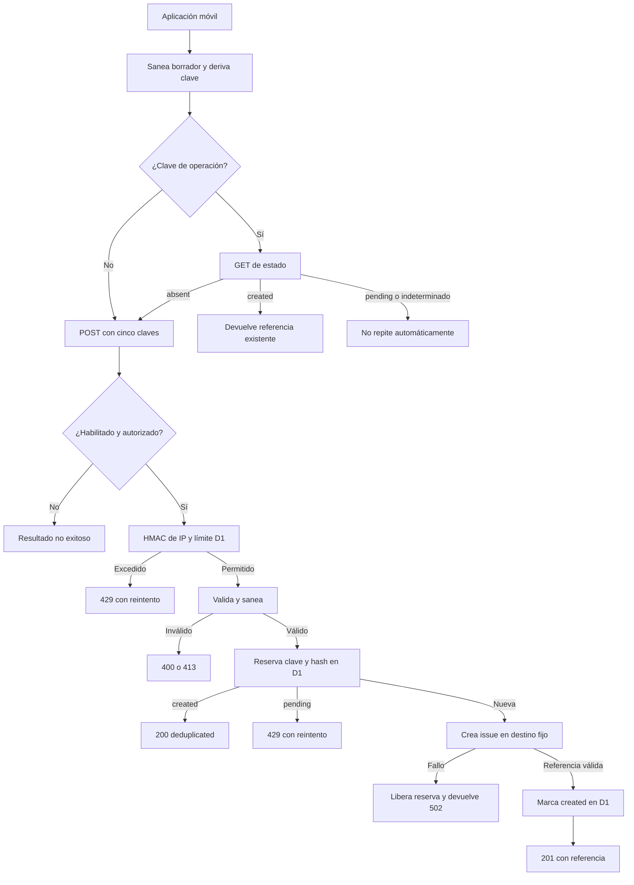

# Worker de feedback e incidencias verificables

`apps/feedback-worker` es el receptor remoto, deliberadamente acotado, para propuestas confirmadas de funcionalidad, alimentos y ejercicios, y para denuncias de respuestas de IA. Es la frontera que mantiene la credencial de escritura de GitHub fuera de la app: no posee cuentas, conversaciones, entrenamientos ni estado local.

El Worker es **opcional**. Si no hay endpoint, el servicio está apagado, vence el tiempo de espera o falla la red, el cliente devuelve un resultado no exitoso y el chat continúa. Solo comunica una incidencia registrada cuando recibe una referencia verificable: número entero positivo y URL que empieza por `https://github.com/`. Véanse [Entorno del agente](../agent/runtime.md) y [Arquitectura](../architecture/overview.md) para el límite entre esta integración y el producto local-first.

## Contrato y límites de autoridad

El receptor expone `POST /feedback/issues`, `GET /feedback/issues/status?idempotency_key=…` y `GET /health`, que responde `{ "ok": true }`. `OPTIONS` responde `204`; las cabeceras CORS de permiso solo se incluyen si `Origin` figura en `ALLOWED_ORIGINS`. Todas las respuestas incluyen `cache-control: no-store` y `vary: Origin`. Las rutas distintas devuelven `404` y los métodos no admitidos, `405`.

El `POST` admite un esquema cerrado, versión 1, con exactamente cinco claves:

```jsonc
{
  "schema_version": 1,
  "kind": "feature" | "food" | "exercise" | "report",
  "title": "string, 1..120",
  "summary": "string, 1..4000 (1..16000 para report)",
  "idempotency_key": "v1:<kind>:<16 o 64 hex>"
}
```

El Worker rechaza claves extra, versión o tipo inválidos, una clave cuya clase no coincide con `kind`, y texto vacío tras normalizar. Rechaza como `too_long` una entrada de más de cuatro veces el límite; el exceso menor se sanea y trunca. `apps/feedback-worker/src/contract.ts` es la fuente de verdad y `apps/mobile/agent/feedbackIssues.ts` replica los valores. `feedbackContract.contract.test.ts` ancla versión, rutas, tipos, límites y las cinco claves; ampliar el contrato exige modificar ambos extremos y esa prueba, nunca aceptar campos desconocidos silenciosamente.

Las claves de 16 hexadecimales identifican borradores derivados de su contenido. Las tools usan una identidad de operación de 64 hexadecimales; solo esa forma larga se acepta en la consulta de estado. El cliente no elige repositorio, etiquetas, ruta ni método: el Worker toma `GITHUB_REPO`, asigna prefijo y etiquetas con `ISSUE_PRESENTATION`, y el adaptador construye el único `POST` permitido a GitHub.

## Recorrido de creación y reconciliación


```mermaid
flowchart TD
    App["Aplicación móvil"] --> Draft["Sanea borrador y deriva clave"]
    Draft --> Operation{"¿Clave de operación?"}
    Operation -->|"Sí"| Status["GET de estado"]
    Operation -->|"No"| Post["POST con cinco claves"]
    Status -->|"created"| Existing["Devuelve referencia existente"]
    Status -->|"pending o indeterminado"| Stop["No repite automáticamente"]
    Status -->|"absent"| Post
    Post --> Gate{"¿Habilitado y autorizado?"}
    Gate -->|"No"| Unavailable["Resultado no exitoso"]
    Gate -->|"Sí"| Limit["HMAC de IP y límite D1"]
    Limit -->|"Excedido"| Limited["429 con reintento"]
    Limit -->|"Permitido"| Validate["Valida y sanea"]
    Validate -->|"Inválido"| Rejected["400 o 413"]
    Validate -->|"Válido"| Reserve["Reserva clave y hash en D1"]
    Reserve -->|"created"| Duplicate["200 deduplicated"]
    Reserve -->|"pending"| Pending["429 con reintento"]
    Reserve -->|"Nueva"| GitHub["Crea issue en destino fijo"]
    GitHub -->|"Fallo"| Release["Libera reserva y devuelve 502"]
    GitHub -->|"Referencia válida"| Complete["Marca created en D1"]
    Complete --> Created["201 con referencia"]
```

*Flujo cliente–Worker–GitHub: la escritura privilegiada ocurre solo después de validación y una reserva durable.*

La app normaliza y redacta el borrador antes de enviarlo; el Worker vuelve a hacerlo y calcula el hash de contenido saneado. D1 reserva la clave antes de llamar a GitHub. Una repetición de una reserva completada devuelve la misma referencia sin crear otra issue; una repetición mientras está pendiente recibe `429`. Ante un fallo upstream, el Worker elimina la reserva pendiente para que un reintento explícito sea posible. También devuelve una creación existente cuando encuentra el mismo hash de contenido creado durante las últimas 24 horas, aunque la clave sea diferente.

La persistencia de `issues` conserva la clave, el tipo, el hash, el estado `pending` o `created`, la referencia y fechas; no conserva título ni resumen. La respuesta de GitHub debe traer número positivo y URL no vacía: un `2xx` malformado se trata como fallo upstream, se libera la reserva y se responde `502` sin filtrar el estado ni el detalle de GitHub.

Para una clave larga, la consulta de estado devuelve `404 absent`, `202 pending` o `200 created` con la referencia. Está protegida por el mismo secreto opcional y CORS, pero no consume límite de tasa ni crea una reserva. El cliente consulta ese estado tras errores de transporte o timeout y tras `error` o `rate_limited` de una operación: recupera una creación duradera, informa `operation_pending` para una reserva en vuelo y, en los demás casos, conserva el fallo. Una respuesta `2xx` sin referencia verificable es `malformed_response`, no `created`.

## Resultados y degradación controlada

| HTTP del Worker | Resultado observable |
| --- | --- |
| `201` | `created` nuevo con `number`, `url` y `deduplicated: false`. |
| `200` | `created` deduplicado con referencia previamente almacenada. |
| `400` | `rejected` por esquema, campos extra o contenido vacío. |
| `403` | Rechazo si `APP_SHARED_SECRET` está configurado y `x-gymnasia-app` falta o no coincide. |
| `413` | `rejected` por entrada desmesurada. |
| `429` | `rejected` por límite de tasa o reserva en curso; incluye `retry-after`. |
| `502` | `error` con `upstream_failed`, sin detalles de GitHub. |
| `503` | `unavailable` porque el interruptor está apagado o falta la sal de rate limit. |

`createFeedbackIssueClient` usa un timeout de 15 segundos y distingue `timeout` de `transport`. Sus mapeadores convierten respuestas HTTP, cuerpos no JSON y referencias inválidas en uniones discriminadas; la presentación para modelo y usuario solo afirma que se registró una issue en la rama `created`. Por ello el canal no puede abortar un turno de chat ni transformar una confirmación HTTP ambigua en una confirmación de producto.

## Privacidad, secreto y abuso

El endpoint es anónimo. `APP_SHARED_SECRET` es una comprobación opcional del encabezado `x-gymnasia-app`, pero un secreto distribuido en el APK puede extraerse: es ofuscación y no autenticación fuerte, de usuario ni prueba de origen.

Para elevar el coste de abuso, el Worker toma `cf-connecting-ip`, calcula un HMAC SHA-256 con `RATE_LIMIT_SALT` y solo persiste el identificador hexadecimal derivado. D1 aplica cinco solicitudes por minuto y treinta por día. Si no hay sal, falla cerrado con `503` en vez de persistir una IP en claro. El cron horario y la limpieza oportunista eliminan contadores desde las 47 horas, de modo que su vida efectiva no supere 48 horas. El límite mide coste de abuso, no identidad.

Cliente y Worker normalizan Unicode NFC, eliminan controles, recortan espacios y bloques, truncan sin dividir pares suplentes y redactan patrones conocidos de tokens de GitHub, proveedores de IA, JWT y encabezados Bearer. Es defensa en profundidad para patrones reconocibles, no una garantía de detectar cualquier secreto.

Las propuestas ordinarias solo contienen campos visibles del formulario. Una denuncia `report` se forma con la vista previa confirmada: motivo, detalles opcionales, pregunta anterior, respuesta denunciada y contexto técnico limitado. El formateador no acepta el hilo completo ni consulta credenciales; solo permite denunciar respuestas finales visibles, no mensajes de identidad, errores técnicos, streaming ni mensajes vacíos.

La retención se aplica exclusivamente a `report`. En cada ejecución horaria, el cron selecciona por antigüedad hasta 40 denuncias creadas hace al menos 30 días, sustituye el cuerpo remoto por una nota neutral mediante `PATCH` y solo entonces escribe `redacted_at` en D1. Si el `PATCH` falla, deja el registro sin marcar para reintentarlo. Se conservan título, número y URL para trazabilidad, no el texto denunciado.

## Configuración, despliegue y pruebas

`wrangler.jsonc` declara la entrada `src/index.ts`, el binding D1 `DB`, un cron horario, observabilidad y las variables no secretas `GITHUB_REPO`, `ALLOWED_ORIGINS` y `FEEDBACK_ENABLED`. `FEEDBACK_ENABLED:false` apaga la escritura sin publicar la app. `GITHUB_TOKEN`, `RATE_LIMIT_SALT` y, si se usa, `APP_SHARED_SECRET` se cargan como secretos de Wrangler y no deben entrar en el repositorio ni en el bundle. La credencial de GitHub debe ser de una cuenta técnica con el mínimo privilegio para el único repositorio receptor.

Expo no configura endpoint para development; staging y production usan el mismo receptor. `FEEDBACK_API_BASE_URL` tiene prioridad como override, incluido el uso de `wrangler dev`. Por tanto, cambiar URL o contrato distribuido debe seguir el proceso de release, y el override local no debe apuntar accidentalmente al receptor real.

Antes de desplegar un cambio de persistencia o retención, aplique la migración remota:

```bash
npm --workspace apps/feedback-worker run migrate:remote
npm --workspace apps/feedback-worker run deploy
```

Despliegue primero el Worker y compruebe `/health` antes de distribuir una app que consulte `/feedback/issues/status`. El Worker sigue aceptando claves cortas de clientes antiguos; una app nueva que no encuentra el endpoint de estado falla cerrado y no duplica una issue.

La suite Vitest no usa red ni credenciales: emplea un doble de D1 y `fetch` simulado. Cubre handler, rutas y CORS, esquema cerrado, saneamiento, propiedades fuzz con `fast-check`, secreto opcional, HMAC y límites, idempotencia, deduplicación, reconciliación de estados, fallos upstream y redacción con reintento. Ejecute:

```bash
npm --workspace apps/feedback-worker run test
```

Al modificar la frontera móvil, ejecute también la prueba de contrato indicada en el frontmatter anterior del repositorio y las pruebas `feedbackClient` y `feedbackPipeline`; estas verifican que proveedor, tool, ejecutor y cliente HTTP nunca confirmen una incidencia después de un error remoto o una referencia malformada.
