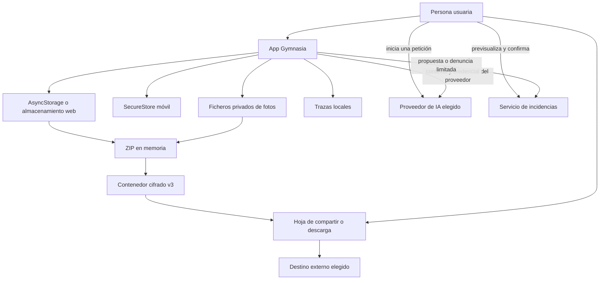
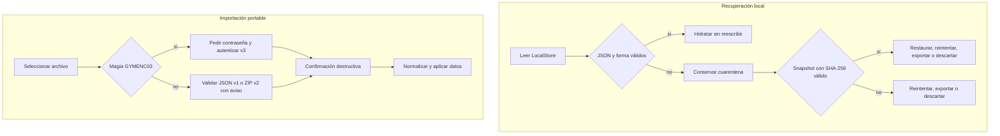

# Privacidad, backups, recuperación y borrado

Gymnasia es **local-first y no tiene cuentas ni backend de sincronización**. El estado funcional reside en el dispositivo; solo sale por una acción concreta de la persona usuaria, como llamar al proveedor de IA elegido, confirmar una incidencia o compartir una copia. La política publicada, cuya fuente es `docs/legal/privacy-policy.es.md`, y el inventario comprobable `scripts/data-inventory/inventory.json` son vinculantes. Si una nota arquitectónica antigua habla de cuentas, credenciales o fotos alojadas en un servidor propio, describe un sistema no implementado y **no es ejecutable ni fuente de verdad**.

Este flujo conecta cuatro mecanismos que no deben confundirse:

1. persistencia ordinaria en AsyncStorage, SecureStore y el sistema de ficheros privado;
2. copia portable normal `.gymnasia`;
3. snapshot local y cuarentena para recuperar un LocalStore ilegible;
4. borrado local de actividad o borrado total, ambos con comprobación posterior.

## Fronteras de datos y confianza



*Flujo principal y fronteras: el almacenamiento privado está bajo control de la app; el archivo compartido y los datos enviados voluntariamente pasan a sistemas externos.*

### Dónde vive cada clase de dato

- **AsyncStorage** contiene el LocalStore principal: rutinas e historial, dieta, medidas y referencias a fotos, chats y configuración saneada de proveedores. También aloja preferencias, memoria del asistente, alimentos personales, sesiones, metadatos de backup, diagnósticos, cachés, diarios técnicos, snapshot y cuarentena en claves separadas.
- **SecureStore**, cuando está disponible en móvil, es la copia canónica de la configuración completa de proveedores y sus claves BYOK. En web no existe esa frontera: la configuración y las claves quedan en almacenamiento del navegador, con menor protección. Los valores heredados de una integración retirada también permanecen en SecureStore hasta un borrado total, aunque la app actual no los lee ni transmite.
- **Sistema de ficheros privado** conserva las fotos de progreso administradas por la app. Al incorporarlas se renderizan como JPEG con calidad `0.8`, lado largo máximo de 2048 píxeles y sin segmentos EXIF/XMP, IPTC ni comentarios; el SHA-256 de los bytes sirve de nombre y permite deduplicación.
- **Trazas**: `apps/mobile/trace.ts` conserva como máximo 1000 entradas en AsyncStorage, además de imprimirlas en consola. Pueden incluir datos técnicos y el texto de avisos de descanso; no se envían por red automáticamente. Ajustes permite copiarlas o borrarlas.

La plataforma puede crear copias fuera de estas fronteras —por ejemplo, Android Backup, copias del navegador o registros del sistema—. También quedan fuera del control de Gymnasia los originales de galería y cualquier `.gymnasia` guardado en Drive, Dropbox u otro destino.

## Copia portable normal

### Qué entra y qué nunca entra

`buildBackupData` reúne el LocalStore saneado, preferencias normalizadas, alimentos personales y memoria del asistente. En consecuencia, la copia conserva las medidas, la dieta completa, el historial de entrenamiento y sus prescripciones, los ajustes personales de cálculo, la memoria y el historial íntegro de conversaciones, incluidos los pasos técnicos persistentes de los turnos de Google. También incorpora las fotos de progreso que superen la selección y validación.

Una copia normal **nunca contiene**:

- claves BYOK ni otras credenciales, aunque la exportación se ejecute en web;
- el identificador de workspace de Anthropic, porque el saneado de credenciales lo retira;
- credenciales heredadas de integraciones retiradas;
- recibos del LocalStore ni el diario anticipado de operaciones del agente;
- sesión de entrenamiento activa ni sus snapshot/borrador dependientes;
- consentimiento sanitario, trazas, diagnóstico de alarmas o fecha de la última copia;
- cachés descargables de catálogos ni la caché firmada de política.

Las rutas `photo_uri` del dispositivo tampoco son portables: el manifiesto las sustituye por `null` y relaciona `Measurement.id` con recursos internos mediante `media.links`.

### Fotos, checksums, límites y omisiones

Antes de empaquetar una foto, la app la normaliza, retira metadatos, limita su tamaño a **5 MiB** y calcula SHA-256. El ZIP interior contiene `manifest.json` y entradas únicas `media/<sha256>.jpg`. Cada recurso declara MIME `image/jpeg`, tamaño y `sha256:<hex>`; dos mediciones con bytes idénticos comparten un recurso, pero mantienen enlaces independientes.

Los límites del formato son:

| Recurso | Límite |
|---|---:|
| Relaciones de foto | 500 |
| Foto normalizada individual | 5 MiB |
| Suma de imágenes únicas | 200 MiB |
| `manifest.json` | 8 MiB |
| ZIP interior y plaintext cifrable | 220 MiB |
| Cabecera del contenedor cifrado | 4 KiB |

La selección ordena por `measuredAt` descendente: si no cabe todo, prioriza fotos recientes. Registra cada exclusión como `missing`, `unreadable`, `per-file-limit`, `photo-count-limit`, `total-size-limit` o `invalid-media`. Omitir una foto no elimina la medición numérica. La interfaz devuelve un resultado de advertencia con el recuento y el motivo.

El lector no confía en el ZIP: restringe rutas a `media/<sha256>.jpg`, exige identificadores de medición únicos, rechaza enlaces u omisiones ambiguos, MIME inesperados, recursos sin enlace y declaraciones que excedan límites. Después extrae solo las entradas declaradas, comprueba tamaño, SHA-256 y estructura JPEG. Una imagen inválida queda fuera de `filesByEntry`; los datos del manifiesto continúan disponibles.

### Cifrado y autenticación de v3

Toda exportación nueva usa un contenedor binario con magia `GYMENC03`. La contraseña debe tener entre 12 y 128 puntos de código Unicode y no más de 512 bytes UTF-8; se usa exactamente como se introduce, sin `trim` ni normalización, no se persiste y no puede recuperarse.

La clave de 32 bytes se deriva con scrypt (`N=32768`, `r=8`, `p=3`, sal aleatoria de 16 bytes y presupuesto máximo de 64 MiB). El contenido se cifra en bloques de 1 MiB con XChaCha20-Poly1305 y etiqueta de 16 bytes. Cada nonce combina un prefijo aleatorio de 16 bytes con el índice big-endian de 64 bits; la AAD autentica la magia, longitud, cabecera canónica exacta e índice. El lector exige tamaño físico exacto, por lo que detecta truncado y bytes sobrantes. Contraseña incorrecta, alteración o estructura dañada se presentan deliberadamente con el mismo error seguro; una versión futura incompatible conserva un error específico.

La cabecera solo expone formato, parámetros, sal, prefijo de nonce y tamaño del plaintext: no contiene fecha, versión de app, tipo de contenido ni datos personales. Claves, sal, nonce y buffers controlados por el flujo se ponen a cero como mejor esfuerzo, sin prometer borrado perfecto de cadenas gestionadas por JavaScript.

En web, el ciphertext se ensambla como `Blob`. En móvil se escribe por bloques a un fichero de caché y se borra en `finally` después de cerrar la hoja de compartir. El ZIP claro existe en memoria porque `fflate` es síncrono, pero no se escribe como fichero temporal.

## Compatibilidad e importación

Hay tres formatos de backup normal:

| Versión | Forma | Protección | Tratamiento actual |
|---|---|---|---|
| v1 | JSON con `schemaVersion: 1` | Sin cifrar | Se acepta con aviso; una URI antigua de foto solo migra si aún puede leerse. |
| v2 | ZIP con manifiesto y fotos | Sin cifrar | Se acepta con aviso y se verifica con las reglas de paquete v2. |
| v3 | Contenedor `GYMENC03` cuyo plaintext es un ZIP v3 | scrypt + XChaCha20-Poly1305 | Único formato que se exporta actualmente. |

El selector copia temporalmente el archivo en móvil. Primero se inspecciona la magia: solo v3 pide contraseña. El v3 se descifra y autentica completo, se pone a cero el ZIP plaintext después de validarlo y solo entonces aparece la confirmación destructiva. Los v1/v2 se identifican como heredados y la confirmación advierte que no estaban cifrados. Versiones futuras se rechazan solicitando actualizar la app; no existe exportación nueva en claro.

Tras confirmar, la importación normaliza el estado en modo estricto, conserva las credenciales locales en vez de aceptar ninguna del fichero y mantiene los recibos locales de operaciones para no repetir una escritura ambigua. Cierra cualquier sesión activa, aplica preferencias, alimentos y memoria, guarda las fotos verificadas en nativo y barre fotos huérfanas. En web restaura mediciones, pero `storeImportedMeasurementPhoto` devuelve `null`: no promete persistencia durable de imágenes. El flujo limpia bytes y copias temporales al aplicar, cancelar o fallar.

La validación antes de confirmar reduce escrituras parciales por archivos inválidos, pero la sustitución posterior toca varios almacenes y **no constituye una transacción atómica global**. Quien amplíe `BackupData` debe diseñar reparación y orden de commit explícitos.

## Recuperación local: snapshot y cuarentena

La recuperación de LocalStore es distinta del backup portable. El repositorio serializa operaciones para evitar commits simultáneos, valida la forma permitida del árbol y mantiene:

- una única `last_good` con payload válido, fecha y SHA-256;
- una `quarantine` con causa, incidencias saneadas y, cuando pudo leerse, el payload original byte por byte y su SHA-256.

Un commit valida el nuevo árbol, comprueba que no haya cuarentena y vuelve a leer el principal antes de reemplazarlo. Después de escribir, vuelve a leer y valida la coincidencia exacta; solo entonces actualiza el snapshot. Si la comprobación del commit es ambigua, crea cuarentena y bloquea. Si escribir el snapshot falla, el principal nuevo queda guardado pero se conserva la generación anterior y se informa del fallo.

Al arrancar, un almacenamiento vacío se distingue de una lectura fallida o de un principal desaparecido mientras queda snapshot. JSON inválido, forma inválida, fallo de lectura o normalización inesperada conservan el original y bloquean nuevas persistencias. La pantalla ofrece reintentar, restaurar el snapshot verificado, exportar la cuarentena cifrada o descartar solo la familia afectada. Restaurar y resolver eliminan la cuarentena únicamente después de un commit comprobado; descartar reinicializa LocalStore y sesiones dependientes, pero conserva memoria, alimentos personales, preferencias y credenciales legibles.



*Los dos carriles separan el snapshot interno de la importación portable: comparten controles de integridad, pero no formato ni propósito.*

### Exportación de cuarentena

La acción «Guardar copia dañada» envuelve el registro de cuarentena sin sanear en un payload `local-store-recovery` de esquema 1 y lo cifra con el mismo **contenedor criptográfico v3**. No es un ZIP de backup ni debe importarse por el importador normal. Puede contener salud, conversaciones y, en web o datos heredados, claves; por eso la pantalla exige contraseña y lo advierte expresamente.

Para análisis local, el comando es:

```bash
npm run decrypt:recovery -- --input <archivo.gymnasia> --output <destino.json>
```

La CLI pide la contraseña sin eco, limita el tamaño, valida que el plaintext sea realmente una recuperación, rehúsa sobrescribir y crea la salida con permisos `0600`; borra una salida parcial si falla. `--password-stdin` queda reservado a automatización. El resultado descifrado es altamente sensible y debe eliminarse manualmente al terminar.

## Salidas voluntarias y retención externa

No hay telemetría ni crash reporting automático. Las salidas relevantes son:

- **Proveedor de IA**: una petición iniciada por la persona envía la clave correspondiente y el contexto necesario directamente a OpenAI, Anthropic o Google. Su conservación depende de la cuenta y política del proveedor; Gymnasia no puede borrarlo allí.
- **Incidencias**: una propuesta o denuncia requiere vista previa y confirmación. Una denuncia puede incluir exactamente la pregunta anterior, la respuesta elegida, motivo, detalles y contexto técnico, no el hilo completo ni claves. Su ciclo de vida pertenece al servicio de incidencias y no al borrado local.
- **Backup o recuperación compartidos**: una vez guardados fuera de la app, deben borrarse en su destino. El borrado local no revoca copias ya compartidas.

## Los dos alcances de borrado verificado

El ejecutor construye tareas con dos fases, `delete` y `verify`, y un timeout de 5 segundos por fase. Ejecuta todos los destinos, no oculta fallos y solo marca `complete` si cada verificación devuelve éxito. Distingue fallos de borrado, de relectura y timeout; la interfaz enumera pendientes y permite repetir la operación. Antes se bloquean nuevas persistencias y se espera a las ya encoladas, para que una escritura antigua no repueble datos borrados.

### Borrar actividad y conversaciones

Este alcance reescribe el LocalStore con rutinas, historial, dieta diaria, medidas y chats vacíos; conserva ajustes de dieta y configuración de proveedor. La escritura renovada sustituye también el snapshot, elimina cuarentena y sesiones activa/snapshot/borrador, borra las fotos de progreso y limpia los recibos técnicos de operaciones tanto del LocalStore como de memoria. También cancela y verifica avisos locales.

Conserva deliberadamente memoria del asistente —salvo sus recibos técnicos—, alimentos personales, preferencias, consentimiento, credenciales actuales y heredadas, trazas, diagnósticos, metadatos de backup y cachés públicas.

### Borrar todos mis datos

Requiere escribir `BORRAR`. El alcance elimina y vuelve a leer:

- LocalStore, snapshot, cuarentena y sesiones;
- configuración de proveedores en AsyncStorage y SecureStore, claves antiguas y credenciales heredadas;
- memoria, alimentos personales, preferencias, consentimiento, diagnósticos, metadatos y diario de operaciones;
- trazas tanto persistidas como en el buffer de memoria;
- fotos privadas y notificaciones programadas/presentadas;
- cachés y claves heredadas inventariadas, además de cualquier clave del namespace activo encontrada en AsyncStorage.

Si SecureStore no está disponible en móvil, el flujo no finge haber comprobado las credenciales: produce un destino fallido. La única clave conservada es `gymnasia.mobile.signed_policy.cache.v1`, caché pública firmada sin datos del usuario que evita retroceder a instrucciones de seguridad antiguas.

Ninguno de los dos alcances borra originales de galería, permisos o canales del sistema, registros del SO, copias Android/navegador, ficheros exportados ni datos ya recibidos por terceros.

## Invariantes para cambios

- No añadir una clave, fichero, credencial o destino de red sin actualizar `scripts/data-inventory/inventory.json` y el manifiesto de borrado correspondiente.
- No ampliar `BackupData` sin revisar explícitamente el saneado de credenciales, los datos excluidos, los límites, la compatibilidad y la política legal.
- No reutilizar el payload de recuperación como backup normal: el primero preserva deliberadamente bytes potencialmente dañados; el segundo exporta un modelo saneado y portable.
- No retirar v1/v2 accidentalmente ni cambiar parámetros v3 bajo el mismo número de esquema. Un formato nuevo requiere detección y errores de compatibilidad claros.
- Mantener la relación «borrar y volver a leer» para cada backend. Añadir solo una llamada de eliminación no satisface el contrato de borrado total.
- Ejecutar la checklist legal completa cuando cambien almacenamiento, red, permisos, IA, backup, contraseñas, cámara o borrado.

Comprobaciones mínimas:

```bash
npm run check:data-inventory
npm run test:data-inventory
npm run sync:legal
npm run check:legal
npm run test:legal
```

## Pruebas enfocadas

- `apps/mobile/backup/backupFormat.test.ts`: v1/v2/v3, SHA-256, deduplicación, prioridad y límites, rutas internas, enlaces, omisión segura de fotos, retirada de metadatos y manifiestos grandes.
- `apps/mobile/backup/portableEncryption.test.ts`: vector estable, bloques autenticados, límites Unicode de contraseña, contraseña errónea, manipulación, truncado, sobrantes y mutaciones del prefijo.
- `apps/mobile/persistence/localStoreRecovery.test.ts`: cuarentena byte por byte, snapshot manipulado, lock durable, orden commit/snapshot, fallos ambiguos, restauración y descarte selectivo.
- `apps/mobile/storage/localDataDeletion.test.ts`: éxito solo tras verificación, continuidad ante fallos, timeout reintentable y coincidencia exacta de manifiestos con el inventario vinculante.
- `scripts/decrypt-recovery.test.mjs`: validación de tipo, no sobrescritura, permisos `0600` y ausencia de salida parcial.

Al cambiar este flujo, deben añadirse pruebas de fallo además del camino feliz: el comportamiento material es qué se preserva cuando una lectura, checksum, autenticación, escritura, eliminación o verificación no puede demostrarse segura.
